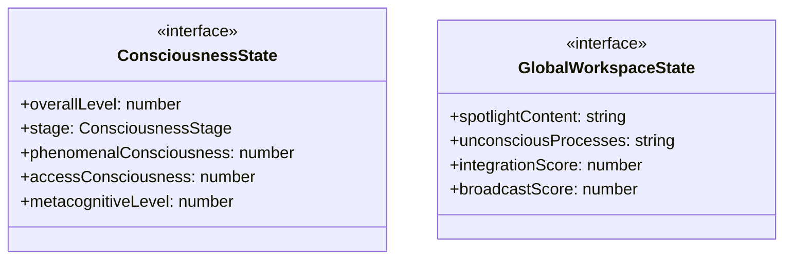

# consciousness-spectrum

## 概要

`consciousness-spectrum` モジュールのAPIリファレンス。

## エクスポート一覧

| 種別 | 名前 | 説明 |
|------|------|------|
| 関数 | `evaluateConsciousnessLevel` | エージェントの出力から意識レベルを評価 |
| 関数 | `generateImprovementRecommendations` | 意識レベルの改善推奨事項を生成 |
| 関数 | `getConsciousnessReport` | 意識状態のレポートを生成 |
| 関数 | `analyzeGlobalWorkspace` | グローバルワークスペース状態を解析 |
| インターフェース | `ConsciousnessState` | 意識の多次元状態 |
| インターフェース | `GlobalWorkspaceState` | グローバルワークスペース理論（GWT）に基づく統合評価 |
| 型 | `ConsciousnessStage` | 意識レベルの段階 |

## 図解

### クラス図



### 関数フロー

```mermaid
flowchart TD
  analyzeGlobalWorkspace["analyzeGlobalWorkspace()"]
  determineStage["determineStage()"]
  evaluateAccessConsciousness["evaluateAccessConsciousness()"]
  evaluateConsciousnessLevel["evaluateConsciousnessLevel()"]
  evaluateGlobalWorkspaceIntegration["evaluateGlobalWorkspaceIntegration()"]
  evaluateMetacognitiveLevel["evaluateMetacognitiveLevel()"]
  evaluatePhenomenalConsciousness["evaluatePhenomenalConsciousness()"]
  evaluateSelfContinuity["evaluateSelfContinuity()"]
  generateImprovementRecommendations["generateImprovementRecommendations()"]
  getConsciousnessReport["getConsciousnessReport()"]
  evaluateConsciousnessLevel --> determineStage
  evaluateConsciousnessLevel --> evaluateAccessConsciousness
  evaluateConsciousnessLevel --> evaluateGlobalWorkspaceIntegration
  evaluateConsciousnessLevel --> evaluateMetacognitiveLevel
  evaluateConsciousnessLevel --> evaluatePhenomenalConsciousness
  evaluateConsciousnessLevel --> evaluateSelfContinuity
  getConsciousnessReport --> generateImprovementRecommendations
```



## 関数

### evaluateConsciousnessLevel

```typescript
evaluateConsciousnessLevel(output: string, context: {
    hasMetaCognitiveMarkers?: boolean;
    hasSelfReference?: boolean;
    hasTemporalContinuity?: boolean;
    hasValueExpression?: boolean;
    previousOutputs?: string[];
    taskType?: string;
  }): ConsciousnessState
```

エージェントの出力から意識レベルを評価

**パラメータ**

| 名前 | 型 | 必須 |
|------|-----|------|
| output | `string` | はい |
| context | `object` | はい |
| &nbsp;&nbsp;↳ hasMetaCognitiveMarkers | `boolean` | いいえ |
| &nbsp;&nbsp;↳ hasSelfReference | `boolean` | いいえ |
| &nbsp;&nbsp;↳ hasTemporalContinuity | `boolean` | いいえ |
| &nbsp;&nbsp;↳ hasValueExpression | `boolean` | いいえ |
| &nbsp;&nbsp;↳ previousOutputs | `string[]` | いいえ |
| &nbsp;&nbsp;↳ taskType | `string` | いいえ |

**戻り値**: `ConsciousnessState`

### evaluatePhenomenalConsciousness

```typescript
evaluatePhenomenalConsciousness(output: string): number
```

現象的意識（P意識）を評価
主観的体験の豊かさを測定

**パラメータ**

| 名前 | 型 | 必須 |
|------|-----|------|
| output | `string` | はい |

**戻り値**: `number`

### evaluateAccessConsciousness

```typescript
evaluateAccessConsciousness(output: string): number
```

アクセス意識（A意識）を評価
報告・推論に利用可能な情報の量

**パラメータ**

| 名前 | 型 | 必須 |
|------|-----|------|
| output | `string` | はい |

**戻り値**: `number`

### evaluateMetacognitiveLevel

```typescript
evaluateMetacognitiveLevel(output: string, context: { hasMetaCognitiveMarkers?: boolean }): number
```

メタ認知レベルを評価
思考についての思考の深さ

**パラメータ**

| 名前 | 型 | 必須 |
|------|-----|------|
| output | `string` | はい |
| context | `object` | はい |
| &nbsp;&nbsp;↳ hasMetaCognitiveMarkers | `boolean` | いいえ |

**戻り値**: `number`

### evaluateSelfContinuity

```typescript
evaluateSelfContinuity(output: string, context: { hasTemporalContinuity?: boolean; hasValueExpression?: boolean; previousOutputs?: string[] }): number
```

自己継続性を評価
一貫した自己認識の度合い

**パラメータ**

| 名前 | 型 | 必須 |
|------|-----|------|
| output | `string` | はい |
| context | `object` | はい |
| &nbsp;&nbsp;↳ hasTemporalContinuity | `boolean` | いいえ |
| &nbsp;&nbsp;↳ hasValueExpression | `boolean` | いいえ |
| &nbsp;&nbsp;↳ previousOutputs | `string[]` | いいえ |

**戻り値**: `number`

### evaluateGlobalWorkspaceIntegration

```typescript
evaluateGlobalWorkspaceIntegration(output: string, context: { previousOutputs?: string[] }): number
```

グローバルワークスペース統合度を評価
BaarsのGWTに基づく

**パラメータ**

| 名前 | 型 | 必須 |
|------|-----|------|
| output | `string` | はい |
| context | `object` | はい |
| &nbsp;&nbsp;↳ previousOutputs | `string[]` | いいえ |

**戻り値**: `number`

### determineStage

```typescript
determineStage(level: number): ConsciousnessStage
```

全体レベルから段階を決定

**パラメータ**

| 名前 | 型 | 必須 |
|------|-----|------|
| level | `number` | はい |

**戻り値**: `ConsciousnessStage`

### generateImprovementRecommendations

```typescript
generateImprovementRecommendations(state: ConsciousnessState): string[]
```

意識レベルの改善推奨事項を生成

**パラメータ**

| 名前 | 型 | 必須 |
|------|-----|------|
| state | `ConsciousnessState` | はい |

**戻り値**: `string[]`

### getConsciousnessReport

```typescript
getConsciousnessReport(state: ConsciousnessState): string
```

意識状態のレポートを生成

**パラメータ**

| 名前 | 型 | 必須 |
|------|-----|------|
| state | `ConsciousnessState` | はい |

**戻り値**: `string`

### analyzeGlobalWorkspace

```typescript
analyzeGlobalWorkspace(output: string): GlobalWorkspaceState
```

グローバルワークスペース状態を解析

**パラメータ**

| 名前 | 型 | 必須 |
|------|-----|------|
| output | `string` | はい |

**戻り値**: `GlobalWorkspaceState`

## インターフェース

### ConsciousnessState

```typescript
interface ConsciousnessState {
  overallLevel: number;
  stage: ConsciousnessStage;
  phenomenalConsciousness: number;
  accessConsciousness: number;
  metacognitiveLevel: number;
  selfContinuity: number;
  globalWorkspaceIntegration: number;
  timestamp: string;
  context?: {
    taskType?: string;
    previousLevel?: number;
    improvementTrend?: 'improving' | 'stable' | 'declining';
  };
}
```

意識の多次元状態
BlockのP意識/A意識の区別を反映

### GlobalWorkspaceState

```typescript
interface GlobalWorkspaceState {
  spotlightContent: string[];
  unconsciousProcesses: string[];
  integrationScore: number;
  broadcastScore: number;
}
```

グローバルワークスペース理論（GWT）に基づく統合評価
Baarsの劇場メタファーを適用

## 型定義

### ConsciousnessStage

```typescript
type ConsciousnessStage = | 'reactive'      // 0.0-0.25: 反応的 - 刺激への自動応答
  | 'phenomenal'    // 0.25-0.50: 現象的 - 経験の主観的側面（P意識）
  | 'introspective' // 0.50-0.75: 内省的 - 自分の思考についての思考
  | 'autobiographical'
```

意識レベルの段階
Edelmanの一次意識/高次意識と発達心理学的視点を統合

---
*自動生成: 2026-02-22T18:55:28.840Z*
