# context-engineering

## 概要

`context-engineering` モジュールのAPIリファレンス。

## エクスポート一覧

| 種別 | 名前 | 説明 |
|------|------|------|
| 関数 | `estimateTokens` | テキストトークン数推定 |
| 関数 | `estimateContextItemTokens` | コンテキストトークン数推定 |
| 関数 | `optimizeContextWindow` | コンテキストウィンドウを最適化する |
| 関数 | `detectSemanticBoundaries` | テキストから意味的な境界を検出する |
| 関数 | `chunkText` | テキストを指定された設定で分割する |
| 関数 | `extractStateSummary` | 出力テキストから状態サマリーを抽出する |
| 関数 | `formatStateSummary` | 状態サマリーをフォーマット |
| 関数 | `createContextItem` | コンテキストアイテムを作成する |
| 関数 | `mergeContextItems` | 複数のコンテキストアイテムを結合する |
| 関数 | `calculateUtilization` | コンテキストの利用率を計算する |
| インターフェース | `ContextItem` | コンテキストアイテム |
| インターフェース | `ContextWindowConfig` | コンテキストウィンドウの設定 |
| インターフェース | `OptimizedContext` | 最適化されたコンテキスト情報 |
| インターフェース | `TrimmedItem` | トリムされたアイテムの情報を表すインターフェース |
| インターフェース | `SemanticBoundary` | 意味的な境界情報を表すインターフェース |
| インターフェース | `TextChunk` | 分割されたテキストチャンクを表すインターフェース |
| インターフェース | `ChunkingConfig` | テキスト分割設定を定義するインターフェース |
| インターフェース | `StateSummary` | ワーキングメモリの状態概要 |
| インターフェース | `EvidenceSummary` | エビデンス概要 |
| インターフェース | `SummaryExtractionConfig` | 要約抽出設定 |
| 型 | `ContextPriority` | コンテキストの優先度レベル |
| 型 | `ContextCategory` | コンテキストのカテゴリ種別 |
| 型 | `BoundaryType` | テキストの境界種別を定義する型 |

## 図解

### クラス図

```mermaid
classDiagram
  class ContextItem {
    <<interface>>
    +id: string
    +content: string
    +priority: ContextPriority
    +tokenEstimate: number
    +category: ContextCategory
  }
  class ContextWindowConfig {
    <<interface>>
    +maxTokens: number
    +reservedTokens: number
    +priorityWeights: Record_ContextPriori
    +categoryLimits: Partial_Record_Conte
    +preserveOrder: boolean
  }
  class OptimizedContext {
    <<interface>>
    +items: ContextItem
    +totalTokens: number
    +budget: number
    +utilizationRatio: number
    +trimmedItems: TrimmedItem
  }
  class TrimmedItem {
    <<interface>>
    +item: ContextItem
    +reason: budget_exceeded_c
    +originalTokens: number
    +preservedTokens: number
  }
  class SemanticBoundary {
    <<interface>>
    +position: number
    +type: BoundaryType
    +confidence: number
    +metadata: Record_string_unknow
  }
  class TextChunk {
    <<interface>>
    +id: string
    +content: string
    +tokenEstimate: number
    +boundaries: SemanticBoundary
    +priority: ContextPriority
  }
  class ChunkingConfig {
    <<interface>>
    +maxChunkTokens: number
    +minChunkTokens: number
    +overlapTokens: number
    +respectBoundaries: boolean
    +boundaryTypes: BoundaryType
  }
  class StateSummary {
    <<interface>>
    +id: string
    +timestamp: number
    +carriedForward: string
    +pendingTasks: string
    +decisions: string
  }
  class EvidenceSummary {
    <<interface>>
    +claim: string
    +evidence: string
    +source: string
    +confidence: number
    +contradicted: boolean
  }
  class SummaryExtractionConfig {
    <<interface>>
    +maxCarriedForward: number
    +maxPendingTasks: number
    +maxDecisions: number
    +maxBlockers: number
    +maxAssumptions: number
  }
```



### 関数フロー

```mermaid
flowchart TD
  addOverlapToChunks["addOverlapToChunks()"]
  calculateItemScore["calculateItemScore()"]
  calculateUtilization["calculateUtilization()"]
  chunkText["chunkText()"]
  createContextItem["createContextItem()"]
  detectSemanticBoundaries["detectSemanticBoundaries()"]
  detectSemanticGaps["detectSemanticGaps()"]
  determineChunkPriority["determineChunkPriority()"]
  estimateContextItemTokens["estimateContextItemTokens()"]
  estimateTokens["estimateTokens()"]
  extractStateSummary["extractStateSummary()"]
  findChunkBoundaries["findChunkBoundaries()"]
  formatStateSummary["formatStateSummary()"]
  mergeContextItems["mergeContextItems()"]
  optimizeContextWindow["optimizeContextWindow()"]
  summarizeItem["summarizeItem()"]
  addOverlapToChunks --> estimateTokens
  calculateUtilization --> estimateContextItemTokens
  chunkText --> addOverlapToChunks
  chunkText --> detectSemanticBoundaries
  chunkText --> determineChunkPriority
  chunkText --> estimateTokens
  chunkText --> findChunkBoundaries
  createContextItem --> estimateTokens
  detectSemanticBoundaries --> detectSemanticGaps
  estimateContextItemTokens --> estimateTokens
  findChunkBoundaries --> estimateTokens
  mergeContextItems --> createContextItem
  mergeContextItems --> summarizeItem
  optimizeContextWindow --> calculateItemScore
  optimizeContextWindow --> estimateContextItemTokens
  optimizeContextWindow --> estimateTokens
  optimizeContextWindow --> summarizeItem
```



## 関数

### estimateTokens

```typescript
estimateTokens(text: string): number
```

テキストトークン数推定

**パラメータ**

| 名前 | 型 | 必須 |
|------|-----|------|
| text | `string` | はい |

**戻り値**: `number`

### estimateContextItemTokens

```typescript
estimateContextItemTokens(item: ContextItem): number
```

コンテキストトークン数推定

**パラメータ**

| 名前 | 型 | 必須 |
|------|-----|------|
| item | `ContextItem` | はい |

**戻り値**: `number`

### optimizeContextWindow

```typescript
optimizeContextWindow(items: ContextItem[], config: ContextWindowConfig): OptimizedContext
```

コンテキストウィンドウを最適化する

**パラメータ**

| 名前 | 型 | 必須 |
|------|-----|------|
| items | `ContextItem[]` | はい |
| config | `ContextWindowConfig` | はい |

**戻り値**: `OptimizedContext`

### calculateItemScore

```typescript
calculateItemScore(item: ContextItem, config: ContextWindowConfig, categoryTokens: Map<ContextCategory, number>): number
```

Calculate score for an item (higher = more important to keep)

**パラメータ**

| 名前 | 型 | 必須 |
|------|-----|------|
| item | `ContextItem` | はい |
| config | `ContextWindowConfig` | はい |
| categoryTokens | `Map<ContextCategory, number>` | はい |

**戻り値**: `number`

### summarizeItem

```typescript
summarizeItem(item: ContextItem): string
```

Summarize a context item to preserve key information

**パラメータ**

| 名前 | 型 | 必須 |
|------|-----|------|
| item | `ContextItem` | はい |

**戻り値**: `string`

### detectSemanticBoundaries

```typescript
detectSemanticBoundaries(text: string): SemanticBoundary[]
```

テキストから意味的な境界を検出する

**パラメータ**

| 名前 | 型 | 必須 |
|------|-----|------|
| text | `string` | はい |

**戻り値**: `SemanticBoundary[]`

### detectSemanticGaps

```typescript
detectSemanticGaps(text: string, existingBoundaries: SemanticBoundary[]): SemanticBoundary[]
```

Detect semantic gaps where topic shifts occur

**パラメータ**

| 名前 | 型 | 必須 |
|------|-----|------|
| text | `string` | はい |
| existingBoundaries | `SemanticBoundary[]` | はい |

**戻り値**: `SemanticBoundary[]`

### chunkText

```typescript
chunkText(text: string, config: ChunkingConfig): TextChunk[]
```

テキストを指定された設定で分割する

**パラメータ**

| 名前 | 型 | 必須 |
|------|-----|------|
| text | `string` | はい |
| config | `ChunkingConfig` | はい |

**戻り値**: `TextChunk[]`

### findChunkBoundaries

```typescript
findChunkBoundaries(text: string, boundaries: SemanticBoundary[], maxTokens: number, minTokens: number, preserveCodeBlocks: boolean, preserveMarkdownSections: boolean): Array<{ position: number; reason: string }>
```

Find optimal positions to split into chunks

**パラメータ**

| 名前 | 型 | 必須 |
|------|-----|------|
| text | `string` | はい |
| boundaries | `SemanticBoundary[]` | はい |
| maxTokens | `number` | はい |
| minTokens | `number` | はい |
| preserveCodeBlocks | `boolean` | はい |
| preserveMarkdownSections | `boolean` | はい |

**戻り値**: `Array<{ position: number; reason: string }>`

### determineChunkPriority

```typescript
determineChunkPriority(content: string): ContextPriority
```

Determine priority for a chunk based on content

**パラメータ**

| 名前 | 型 | 必須 |
|------|-----|------|
| content | `string` | はい |

**戻り値**: `ContextPriority`

### addOverlapToChunks

```typescript
addOverlapToChunks(chunks: TextChunk[], overlapTokens: number): void
```

Add overlap content between adjacent chunks

**パラメータ**

| 名前 | 型 | 必須 |
|------|-----|------|
| chunks | `TextChunk[]` | はい |
| overlapTokens | `number` | はい |

**戻り値**: `void`

### extractStateSummary

```typescript
extractStateSummary(text: string, previousSummary?: StateSummary, config: SummaryExtractionConfig): StateSummary
```

出力テキストから状態サマリーを抽出する

**パラメータ**

| 名前 | 型 | 必須 |
|------|-----|------|
| text | `string` | はい |
| previousSummary | `StateSummary` | いいえ |
| config | `SummaryExtractionConfig` | はい |

**戻り値**: `StateSummary`

### formatStateSummary

```typescript
formatStateSummary(summary: StateSummary): string
```

状態サマリーをフォーマット

**パラメータ**

| 名前 | 型 | 必須 |
|------|-----|------|
| summary | `StateSummary` | はい |

**戻り値**: `string`

### createContextItem

```typescript
createContextItem(content: string, category: ContextCategory, priority: ContextPriority, options: {
    id?: string;
    source?: string;
    metadata?: Record<string, unknown>;
  }): ContextItem
```

コンテキストアイテムを作成する

**パラメータ**

| 名前 | 型 | 必須 |
|------|-----|------|
| content | `string` | はい |
| category | `ContextCategory` | はい |
| priority | `ContextPriority` | はい |
| options | `object` | はい |
| &nbsp;&nbsp;↳ id | `string` | いいえ |
| &nbsp;&nbsp;↳ source | `string` | いいえ |
| &nbsp;&nbsp;↳ metadata | `Record<string, unknown>` | いいえ |

**戻り値**: `ContextItem`

### mergeContextItems

```typescript
mergeContextItems(items: ContextItem[], strategy: "concat" | "summarize" | "priority-first"): ContextItem
```

複数のコンテキストアイテムを結合する

**パラメータ**

| 名前 | 型 | 必須 |
|------|-----|------|
| items | `ContextItem[]` | はい |
| strategy | `"concat" | "summarize" | "priority-first"` | はい |

**戻り値**: `ContextItem`

### calculateUtilization

```typescript
calculateUtilization(items: ContextItem[], maxTokens: number): {
  usedTokens: number;
  maxTokens: number;
  utilizationRatio: number;
  categoryBreakdown: Record<ContextCategory, number>;
  priorityBreakdown: Record<ContextPriority, number>;
}
```

コンテキストの利用率を計算する

**パラメータ**

| 名前 | 型 | 必須 |
|------|-----|------|
| items | `ContextItem[]` | はい |
| maxTokens | `number` | はい |

**戻り値**: `{
  usedTokens: number;
  maxTokens: number;
  utilizationRatio: number;
  categoryBreakdown: Record<ContextCategory, number>;
  priorityBreakdown: Record<ContextPriority, number>;
}`

## インターフェース

### ContextItem

```typescript
interface ContextItem {
  id: string;
  content: string;
  priority: ContextPriority;
  tokenEstimate: number;
  category: ContextCategory;
  timestamp: number;
  source?: string;
  metadata?: Record<string, unknown>;
}
```

コンテキストアイテム

### ContextWindowConfig

```typescript
interface ContextWindowConfig {
  maxTokens: number;
  reservedTokens: number;
  priorityWeights: Record<ContextPriority, number>;
  categoryLimits: Partial<Record<ContextCategory, number>>;
  preserveOrder: boolean;
  enableSummarization: boolean;
}
```

コンテキストウィンドウの設定

### OptimizedContext

```typescript
interface OptimizedContext {
  items: ContextItem[];
  totalTokens: number;
  budget: number;
  utilizationRatio: number;
  trimmedItems: TrimmedItem[];
  summaryGenerated: boolean;
  warnings: string[];
}
```

最適化されたコンテキスト情報

### TrimmedItem

```typescript
interface TrimmedItem {
  item: ContextItem;
  reason: "budget-exceeded" | "category-limit" | "low-priority" | "duplicate";
  originalTokens: number;
  preservedTokens: number;
}
```

トリムされたアイテムの情報を表すインターフェース

### SemanticBoundary

```typescript
interface SemanticBoundary {
  position: number;
  type: BoundaryType;
  confidence: number;
  metadata?: Record<string, unknown>;
}
```

意味的な境界情報を表すインターフェース

### TextChunk

```typescript
interface TextChunk {
  id: string;
  content: string;
  tokenEstimate: number;
  boundaries: SemanticBoundary[];
  priority: ContextPriority;
  metadata: {
    startPosition: number;
    endPosition: number;
    hasCodeBlock: boolean;
    hasMarkdownHeadings: boolean;
    lineCount: number;
  };
}
```

分割されたテキストチャンクを表すインターフェース

### ChunkingConfig

```typescript
interface ChunkingConfig {
  maxChunkTokens: number;
  minChunkTokens: number;
  overlapTokens: number;
  respectBoundaries: boolean;
  boundaryTypes: BoundaryType[];
  preserveCodeBlocks: boolean;
  preserveMarkdownSections: boolean;
}
```

テキスト分割設定を定義するインターフェース

### StateSummary

```typescript
interface StateSummary {
  id: string;
  timestamp: number;
  carriedForward: string[];
  pendingTasks: string[];
  decisions: string[];
  blockers: string[];
  assumptions: string[];
  evidence: EvidenceSummary[];
  confidence: number;
}
```

ワーキングメモリの状態概要

### EvidenceSummary

```typescript
interface EvidenceSummary {
  claim: string;
  evidence: string;
  source: string;
  confidence: number;
  contradicted: boolean;
}
```

エビデンス概要

### SummaryExtractionConfig

```typescript
interface SummaryExtractionConfig {
  maxCarriedForward: number;
  maxPendingTasks: number;
  maxDecisions: number;
  maxBlockers: number;
  maxAssumptions: number;
  maxEvidence: number;
  minConfidence: number;
}
```

要約抽出設定

## 型定義

### ContextPriority

```typescript
type ContextPriority = "critical" | "high" | "medium" | "low" | "optional"
```

コンテキストの優先度レベル

### ContextCategory

```typescript
type ContextCategory = | "task-instruction"    // The main task/request
  | "system-prompt"       // System-level instructions
  | "execution-rules"     // Execution guidelines
  | "file-content"        // File contents being analyzed
  | "conversation"        // Conversation history
  | "agent-output"        // Output from other agents
  | "verification-result" // Verification outputs
  | "working-memory"      // Current working state
  | "skill-content"       // Skill-related content
  | "reference-doc"       // Reference documentation
  | "error-context"
```

コンテキストのカテゴリ種別

### BoundaryType

```typescript
type BoundaryType = | "paragraph"      // Paragraph break
  | "section"        // Section heading
  | "code-block"     // Code block boundary
  | "list-end"       // End of list
  | "dialogue-turn"  // Speaker change in dialogue
  | "topic-shift"    // Detected topic change
  | "file-boundary"  // File change
  | "agent-output"   // Agent output boundary
  | "semantic-gap"
```

テキストの境界種別を定義する型

### ScoredItem

```typescript
type ScoredItem = ContextItem & { score: number; trimmed: boolean }
```

---
*自動生成: 2026-02-18T18:06:17.501Z*
