# context-engineering

## 概要

`context-engineering` モジュールのAPIリファレンス。

## エクスポート一覧

| 種別 | 名前 | 説明 |
|------|------|------|
| 関数 | `estimateTokens` | Estimate token count for text |
| 関数 | `estimateContextItemTokens` | Estimate tokens for a context item |
| 関数 | `optimizeContextWindow` | Manage context window with priority-based trimming |
| 関数 | `detectSemanticBoundaries` | Detect semantic boundaries in text |
| 関数 | `chunkText` | Chunk text based on semantic boundaries |
| 関数 | `extractStateSummary` | Extract state summary from output text |
| 関数 | `formatStateSummary` | Format state summary for inclusion in context |
| 関数 | `createContextItem` | Create a context item from text content |
| 関数 | `mergeContextItems` | Merge multiple context items intelligently |
| 関数 | `calculateUtilization` | Calculate context window utilization |
| インターフェース | `ContextItem` | Content item with metadata for context management |
| インターフェース | `ContextWindowConfig` | Configuration for context window management |
| インターフェース | `OptimizedContext` | Result of context window optimization |
| インターフェース | `TrimmedItem` | Information about trimmed content |
| インターフェース | `SemanticBoundary` | Semantic boundary for chunking |
| インターフェース | `TextChunk` | Chunk result from text splitting |
| インターフェース | `ChunkingConfig` | Configuration for chunking |
| インターフェース | `StateSummary` | State summary for working memory |
| インターフェース | `EvidenceSummary` | Summary of evidence collected |
| インターフェース | `SummaryExtractionConfig` | Configuration for state summary extraction |
| 型 | `ContextPriority` | Priority levels for context content |
| 型 | `ContextCategory` | Categories for context content |
| 型 | `BoundaryType` | Types of semantic boundaries |

## 図解

### クラス図

```mermaid
classDiagram
  class ContextItem {
    <<interface>>
    +id: string
    +content: string
    +priority: ContextPriority
    +tokenEstimate: number
    +category: ContextCategory
  }
  class ContextWindowConfig {
    <<interface>>
    +maxTokens: number
    +reservedTokens: number
    +priorityWeights: Record<ContextPrioritynumber>
    +categoryLimits: Partial<Record<ContextCategorynumber>>
    +preserveOrder: boolean
  }
  class OptimizedContext {
    <<interface>>
    +items: ContextItem[]
    +totalTokens: number
    +budget: number
    +utilizationRatio: number
    +trimmedItems: TrimmedItem[]
  }
  class TrimmedItem {
    <<interface>>
    +item: ContextItem
    +reason: budgetexceededcategorylimitlowpriorityduplicate
    +originalTokens: number
    +preservedTokens: number
  }
  class SemanticBoundary {
    <<interface>>
    +position: number
    +type: BoundaryType
    +confidence: number
    +metadata: Record<stringunknown>
  }
  class TextChunk {
    <<interface>>
    +id: string
    +content: string
    +tokenEstimate: number
    +boundaries: SemanticBoundary[]
    +priority: ContextPriority
  }
  class ChunkingConfig {
    <<interface>>
    +maxChunkTokens: number
    +minChunkTokens: number
    +overlapTokens: number
    +respectBoundaries: boolean
    +boundaryTypes: BoundaryType[]
  }
  class StateSummary {
    <<interface>>
    +id: string
    +timestamp: number
    +carriedForward: string[]
    +pendingTasks: string[]
    +decisions: string[]
  }
  class EvidenceSummary {
    <<interface>>
    +claim: string
    +evidence: string
    +source: string
    +confidence: number
    +contradicted: boolean
  }
  class SummaryExtractionConfig {
    <<interface>>
    +maxCarriedForward: number
    +maxPendingTasks: number
    +maxDecisions: number
    +maxBlockers: number
    +maxAssumptions: number
  }
```



### 関数フロー


## 関数

### estimateTokens

```typescript
estimateTokens(text: string): number
```

Estimate token count for text
This is a simple heuristic; for accuracy, use a proper tokenizer

**パラメータ**

| 名前 | 型 | 必須 |
|------|-----|------|
| text | `string` | はい |

**戻り値**: `number`

### estimateContextItemTokens

```typescript
estimateContextItemTokens(item: ContextItem): number
```

Estimate tokens for a context item

**パラメータ**

| 名前 | 型 | 必須 |
|------|-----|------|
| item | `ContextItem` | はい |

**戻り値**: `number`

### optimizeContextWindow

```typescript
optimizeContextWindow(items: ContextItem[], config: ContextWindowConfig): OptimizedContext
```

Manage context window with priority-based trimming

**パラメータ**

| 名前 | 型 | 必須 |
|------|-----|------|
| items | `ContextItem[]` | はい |
| config | `ContextWindowConfig` | はい |

**戻り値**: `OptimizedContext`

### calculateItemScore

```typescript
calculateItemScore(item: ContextItem, config: ContextWindowConfig, categoryTokens: Map<ContextCategory, number>): number
```

Calculate score for an item (higher = more important to keep)

**パラメータ**

| 名前 | 型 | 必須 |
|------|-----|------|
| item | `ContextItem` | はい |
| config | `ContextWindowConfig` | はい |
| categoryTokens | `Map<ContextCategory, number>` | はい |

**戻り値**: `number`

### summarizeItem

```typescript
summarizeItem(item: ContextItem): string
```

Summarize a context item to preserve key information

**パラメータ**

| 名前 | 型 | 必須 |
|------|-----|------|
| item | `ContextItem` | はい |

**戻り値**: `string`

### detectSemanticBoundaries

```typescript
detectSemanticBoundaries(text: string): SemanticBoundary[]
```

Detect semantic boundaries in text

**パラメータ**

| 名前 | 型 | 必須 |
|------|-----|------|
| text | `string` | はい |

**戻り値**: `SemanticBoundary[]`

### detectSemanticGaps

```typescript
detectSemanticGaps(text: string, existingBoundaries: SemanticBoundary[]): SemanticBoundary[]
```

Detect semantic gaps where topic shifts occur

**パラメータ**

| 名前 | 型 | 必須 |
|------|-----|------|
| text | `string` | はい |
| existingBoundaries | `SemanticBoundary[]` | はい |

**戻り値**: `SemanticBoundary[]`

### chunkText

```typescript
chunkText(text: string, config: ChunkingConfig): TextChunk[]
```

Chunk text based on semantic boundaries

**パラメータ**

| 名前 | 型 | 必須 |
|------|-----|------|
| text | `string` | はい |
| config | `ChunkingConfig` | はい |

**戻り値**: `TextChunk[]`

### findChunkBoundaries

```typescript
findChunkBoundaries(text: string, boundaries: SemanticBoundary[], maxTokens: number, minTokens: number, preserveCodeBlocks: boolean, preserveMarkdownSections: boolean): Array<{ position: number; reason: string }>
```

Find optimal positions to split into chunks

**パラメータ**

| 名前 | 型 | 必須 |
|------|-----|------|
| text | `string` | はい |
| boundaries | `SemanticBoundary[]` | はい |
| maxTokens | `number` | はい |
| minTokens | `number` | はい |
| preserveCodeBlocks | `boolean` | はい |
| preserveMarkdownSections | `boolean` | はい |

**戻り値**: `Array<{ position: number; reason: string }>`

### determineChunkPriority

```typescript
determineChunkPriority(content: string): ContextPriority
```

Determine priority for a chunk based on content

**パラメータ**

| 名前 | 型 | 必須 |
|------|-----|------|
| content | `string` | はい |

**戻り値**: `ContextPriority`

### addOverlapToChunks

```typescript
addOverlapToChunks(chunks: TextChunk[], overlapTokens: number): void
```

Add overlap content between adjacent chunks

**パラメータ**

| 名前 | 型 | 必須 |
|------|-----|------|
| chunks | `TextChunk[]` | はい |
| overlapTokens | `number` | はい |

**戻り値**: `void`

### extractStateSummary

```typescript
extractStateSummary(text: string, previousSummary?: StateSummary, config: SummaryExtractionConfig): StateSummary
```

Extract state summary from output text

**パラメータ**

| 名前 | 型 | 必須 |
|------|-----|------|
| text | `string` | はい |
| previousSummary | `StateSummary` | いいえ |
| config | `SummaryExtractionConfig` | はい |

**戻り値**: `StateSummary`

### formatStateSummary

```typescript
formatStateSummary(summary: StateSummary): string
```

Format state summary for inclusion in context

**パラメータ**

| 名前 | 型 | 必須 |
|------|-----|------|
| summary | `StateSummary` | はい |

**戻り値**: `string`

### createContextItem

```typescript
createContextItem(content: string, category: ContextCategory, priority: ContextPriority, options: {
    id?: string;
    source?: string;
    metadata?: Record<string, unknown>;
  }): ContextItem
```

Create a context item from text content

**パラメータ**

| 名前 | 型 | 必須 |
|------|-----|------|
| content | `string` | はい |
| category | `ContextCategory` | はい |
| priority | `ContextPriority` | はい |
| options | `{
    id?: string;
    source?: string;
    metadata?: Record<string, unknown>;
  }` | はい |

**戻り値**: `ContextItem`

### mergeContextItems

```typescript
mergeContextItems(items: ContextItem[], strategy: "concat" | "summarize" | "priority-first"): ContextItem
```

Merge multiple context items intelligently

**パラメータ**

| 名前 | 型 | 必須 |
|------|-----|------|
| items | `ContextItem[]` | はい |
| strategy | `"concat" | "summarize" | "priority-first"` | はい |

**戻り値**: `ContextItem`

### calculateUtilization

```typescript
calculateUtilization(items: ContextItem[], maxTokens: number): {
  usedTokens: number;
  maxTokens: number;
  utilizationRatio: number;
  categoryBreakdown: Record<ContextCategory, number>;
  priorityBreakdown: Record<ContextPriority, number>;
}
```

Calculate context window utilization

**パラメータ**

| 名前 | 型 | 必須 |
|------|-----|------|
| items | `ContextItem[]` | はい |
| maxTokens | `number` | はい |

**戻り値**: `{
  usedTokens: number;
  maxTokens: number;
  utilizationRatio: number;
  categoryBreakdown: Record<ContextCategory, number>;
  priorityBreakdown: Record<ContextPriority, number>;
}`

## インターフェース

### ContextItem

```typescript
interface ContextItem {
  id: string;
  content: string;
  priority: ContextPriority;
  tokenEstimate: number;
  category: ContextCategory;
  timestamp: number;
  source?: string;
  metadata?: Record<string, unknown>;
}
```

Content item with metadata for context management

### ContextWindowConfig

```typescript
interface ContextWindowConfig {
  maxTokens: number;
  reservedTokens: number;
  priorityWeights: Record<ContextPriority, number>;
  categoryLimits: Partial<Record<ContextCategory, number>>;
  preserveOrder: boolean;
  enableSummarization: boolean;
}
```

Configuration for context window management

### OptimizedContext

```typescript
interface OptimizedContext {
  items: ContextItem[];
  totalTokens: number;
  budget: number;
  utilizationRatio: number;
  trimmedItems: TrimmedItem[];
  summaryGenerated: boolean;
  warnings: string[];
}
```

Result of context window optimization

### TrimmedItem

```typescript
interface TrimmedItem {
  item: ContextItem;
  reason: "budget-exceeded" | "category-limit" | "low-priority" | "duplicate";
  originalTokens: number;
  preservedTokens: number;
}
```

Information about trimmed content

### SemanticBoundary

```typescript
interface SemanticBoundary {
  position: number;
  type: BoundaryType;
  confidence: number;
  metadata?: Record<string, unknown>;
}
```

Semantic boundary for chunking

### TextChunk

```typescript
interface TextChunk {
  id: string;
  content: string;
  tokenEstimate: number;
  boundaries: SemanticBoundary[];
  priority: ContextPriority;
  metadata: {
    startPosition: number;
    endPosition: number;
    hasCodeBlock: boolean;
    hasMarkdownHeadings: boolean;
    lineCount: number;
  };
}
```

Chunk result from text splitting

### ChunkingConfig

```typescript
interface ChunkingConfig {
  maxChunkTokens: number;
  minChunkTokens: number;
  overlapTokens: number;
  respectBoundaries: boolean;
  boundaryTypes: BoundaryType[];
  preserveCodeBlocks: boolean;
  preserveMarkdownSections: boolean;
}
```

Configuration for chunking

### StateSummary

```typescript
interface StateSummary {
  id: string;
  timestamp: number;
  carriedForward: string[];
  pendingTasks: string[];
  decisions: string[];
  blockers: string[];
  assumptions: string[];
  evidence: EvidenceSummary[];
  confidence: number;
}
```

State summary for working memory

### EvidenceSummary

```typescript
interface EvidenceSummary {
  claim: string;
  evidence: string;
  source: string;
  confidence: number;
  contradicted: boolean;
}
```

Summary of evidence collected

### SummaryExtractionConfig

```typescript
interface SummaryExtractionConfig {
  maxCarriedForward: number;
  maxPendingTasks: number;
  maxDecisions: number;
  maxBlockers: number;
  maxAssumptions: number;
  maxEvidence: number;
  minConfidence: number;
}
```

Configuration for state summary extraction

## 型定義

### ContextPriority

```typescript
type ContextPriority = "critical" | "high" | "medium" | "low" | "optional"
```

Priority levels for context content

### ContextCategory

```typescript
type ContextCategory = | "task-instruction"    // The main task/request
  | "system-prompt"       // System-level instructions
  | "execution-rules"     // Execution guidelines
  | "file-content"        // File contents being analyzed
  | "conversation"        // Conversation history
  | "agent-output"        // Output from other agents
  | "verification-result" // Verification outputs
  | "working-memory"      // Current working state
  | "skill-content"       // Skill-related content
  | "reference-doc"       // Reference documentation
  | "error-context"
```

Categories for context content

### BoundaryType

```typescript
type BoundaryType = | "paragraph"      // Paragraph break
  | "section"        // Section heading
  | "code-block"     // Code block boundary
  | "list-end"       // End of list
  | "dialogue-turn"  // Speaker change in dialogue
  | "topic-shift"    // Detected topic change
  | "file-boundary"  // File change
  | "agent-output"   // Agent output boundary
  | "semantic-gap"
```

Types of semantic boundaries

### ScoredItem

```typescript
type ScoredItem = ContextItem & { score: number; trimmed: boolean }
```

---
*自動生成: 2026-02-17T22:24:18.906Z*
