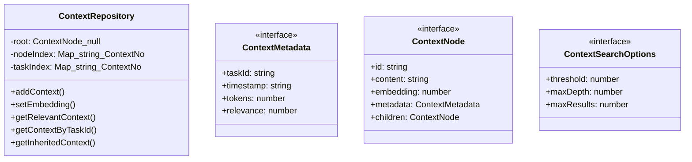
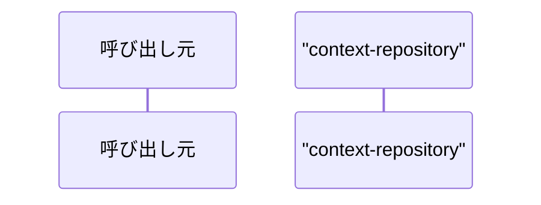

# context-repository

## 概要

`context-repository` モジュールのAPIリファレンス。

## エクスポート一覧

| 種別 | 名前 | 説明 |
|------|------|------|
| クラス | `ContextRepository` | 階層的Context Repository |
| インターフェース | `ContextMetadata` | コンテキストノードのメタデータ |
| インターフェース | `ContextNode` | 階層的コンテキストノード |
| インターフェース | `ContextSearchOptions` | コンテキスト検索オプション |

## 図解

### クラス図



### シーケンス図



## 関数

### estimateTokens

```typescript
estimateTokens(content: string): number
```

トークン数を推定
簡易実装: 文字数 / 4

**パラメータ**

| 名前 | 型 | 必須 |
|------|-----|------|
| content | `string` | はい |

**戻り値**: `number`

### cosineSimilarity

```typescript
cosineSimilarity(a: number[], b: number[]): number
```

コサイン類似度を計算

**パラメータ**

| 名前 | 型 | 必須 |
|------|-----|------|
| a | `number[]` | はい |
| b | `number[]` | はい |

**戻り値**: `number`

### generateSummary

```typescript
async generateSummary(content: string, targetTokens: number): Promise<string>
```

要約を生成（スタブ実装）

**パラメータ**

| 名前 | 型 | 必須 |
|------|-----|------|
| content | `string` | はい |
| targetTokens | `number` | はい |

**戻り値**: `Promise<string>`

### traverse

```typescript
traverse(node: ContextNode): void
```

**パラメータ**

| 名前 | 型 | 必須 |
|------|-----|------|
| node | `ContextNode` | はい |

**戻り値**: `void`

### collectAncestors

```typescript
collectAncestors(current: ContextNode): void
```

**パラメータ**

| 名前 | 型 | 必須 |
|------|-----|------|
| current | `ContextNode` | はい |

**戻り値**: `void`

### calculateDepth

```typescript
calculateDepth(node: ContextNode, depth: number): void
```

**パラメータ**

| 名前 | 型 | 必須 |
|------|-----|------|
| node | `ContextNode` | はい |
| depth | `number` | はい |

**戻り値**: `void`

## クラス

### ContextRepository

階層的Context Repository
DynTaskMAS論文のSACMSコンポーネントを実装

**プロパティ**

| 名前 | 型 | 可視性 |
|------|-----|--------|
| root | `ContextNode | null` | private |
| nodeIndex | `Map<string, ContextNode>` | private |
| taskIndex | `Map<string, ContextNode>` | private |

**メソッド**

| 名前 | シグネチャ |
|------|------------|
| addContext | `addContext(taskId, content, parentTaskId): ContextNode` |
| setEmbedding | `setEmbedding(taskId, embedding): void` |
| getRelevantContext | `getRelevantContext(queryEmbedding, threshold): ContextNode[]` |
| getContextByTaskId | `getContextByTaskId(taskId): ContextNode | undefined` |
| getInheritedContext | `getInheritedContext(taskId): ContextNode[]` |
| compressContext | `compressContext(node, targetTokens): Promise<string>` |
| size | `size(): number` |
| getRoot | `getRoot(): ContextNode | null` |
| clear | `clear(): void` |
| getStats | `getStats(): {
    totalNodes: number;
    totalTokens: number;
    maxDepth: number;
    avgTokensPerNode: number;
  }` |

## インターフェース

### ContextMetadata

```typescript
interface ContextMetadata {
  taskId: string;
  timestamp: string;
  tokens: number;
  relevance: number;
}
```

コンテキストノードのメタデータ

### ContextNode

```typescript
interface ContextNode {
  id: string;
  content: string;
  embedding?: number[];
  metadata: ContextMetadata;
  children: ContextNode[];
}
```

階層的コンテキストノード

### ContextSearchOptions

```typescript
interface ContextSearchOptions {
  threshold?: number;
  maxDepth?: number;
  maxResults?: number;
}
```

コンテキスト検索オプション

---
*自動生成: 2026-02-24T17:08:02.632Z*
