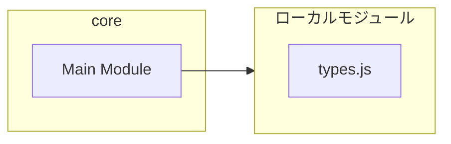
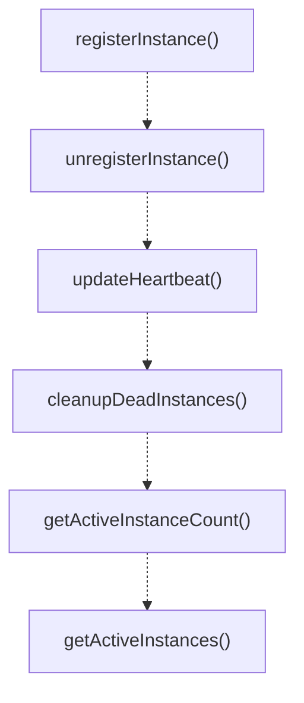

# core

## 概要

`core` モジュールのAPIリファレンス。

## インポート

```typescript
import { existsSync, readdirSync, readFileSync... } from 'node:fs';
import { join } from 'node:path';
import { pid } from 'node:process';
import { CoordinatorConfig, CoordinatorState, DEFAULT_CONFIG... } from './types.js';
```

## エクスポート一覧

| 種別 | 名前 | 説明 |
|------|------|------|
| 関数 | `registerInstance` | Register this pi instance and start heartbeat. |
| 関数 | `unregisterInstance` | Unregister this pi instance. |
| 関数 | `updateHeartbeat` | Update heartbeat for this instance. |
| 関数 | `cleanupDeadInstances` | Remove dead instance lock files. |
| 関数 | `getActiveInstanceCount` | Get count of active pi instances. |
| 関数 | `getActiveInstances` | Get list of active instances. |
| 関数 | `getMyParallelLimit` | Get parallelism limit for this instance. |
| 関数 | `getDynamicParallelLimit` | Get dynamic parallel limit based on workload distr |
| 関数 | `getCoordinatorStatus` | Get detailed status for debugging. |
| 関数 | `isCoordinatorInitialized` | Check if coordinator is initialized. |
| 関数 | `getTotalMaxLlm` | Get total max LLM from config. |
| 関数 | `getEnvOverrides` | Environment variable overrides. |

## 図解

### 依存関係図



### 関数フロー



## 関数

### registerInstance

```typescript
registerInstance(sessionId: string, cwd: string, configOverrides?: Partial<CoordinatorConfig>): void
```

Register this pi instance and start heartbeat.
Must be called once at startup.

**パラメータ**

| 名前 | 型 | 必須 |
|------|-----|------|
| sessionId | `string` | はい |
| cwd | `string` | はい |
| configOverrides | `Partial<CoordinatorConfig>` | いいえ |

**戻り値**: `void`

### unregisterInstance

```typescript
unregisterInstance(): void
```

Unregister this pi instance.
Should be called on graceful shutdown.

**戻り値**: `void`

### updateHeartbeat

```typescript
updateHeartbeat(): void
```

Update heartbeat for this instance.

**戻り値**: `void`

### cleanupDeadInstances

```typescript
cleanupDeadInstances(): void
```

Remove dead instance lock files.
Called periodically during heartbeat.

**戻り値**: `void`

### getActiveInstanceCount

```typescript
getActiveInstanceCount(): number
```

Get count of active pi instances.

**戻り値**: `number`

### getActiveInstances

```typescript
getActiveInstances(): InstanceInfo[]
```

Get list of active instances.

**戻り値**: `InstanceInfo[]`

### getMyParallelLimit

```typescript
getMyParallelLimit(): number
```

Get parallelism limit for this instance.

Formula: floor(totalMaxLlm / activeInstanceCount)

**戻り値**: `number`

### getDynamicParallelLimit

```typescript
getDynamicParallelLimit(myPendingTasks: number): number
```

Get dynamic parallel limit based on workload distribution.

This implements a simple load-balancing strategy:
- Instances with higher workload get fewer slots
- Instances with lower workload get more slots
- Total slots never exceed totalMaxLlm

**パラメータ**

| 名前 | 型 | 必須 |
|------|-----|------|
| myPendingTasks | `number` | はい |

**戻り値**: `number`

### getCoordinatorStatus

```typescript
getCoordinatorStatus(): {
  registered: boolean;
  myInstanceId: string | null;
  activeInstanceCount: number;
  myParallelLimit: number;
  config: CoordinatorConfig | null;
  instances: InstanceInfo[];
}
```

Get detailed status for debugging.

**戻り値**: `{
  registered: boolean;
  myInstanceId: string | null;
  activeInstanceCount: number;
  myParallelLimit: number;
  config: CoordinatorConfig | null;
  instances: InstanceInfo[];
}`

### isCoordinatorInitialized

```typescript
isCoordinatorInitialized(): boolean
```

Check if coordinator is initialized.

**戻り値**: `boolean`

### getTotalMaxLlm

```typescript
getTotalMaxLlm(): number
```

Get total max LLM from config.

**戻り値**: `number`

### getEnvOverrides

```typescript
getEnvOverrides(): Partial<CoordinatorConfig>
```

Environment variable overrides.

PI_TOTAL_MAX_LLM: Total max parallel LLM calls across all instances
PI_HEARTBEAT_INTERVAL_MS: Heartbeat interval in milliseconds
PI_HEARTBEAT_TIMEOUT_MS: Time before instance is considered dead

**戻り値**: `Partial<CoordinatorConfig>`

---
*自動生成: 2026-02-17T21:48:27.668Z*
