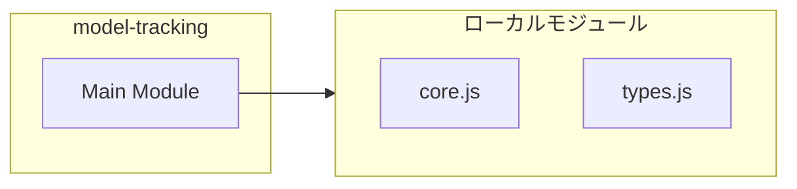
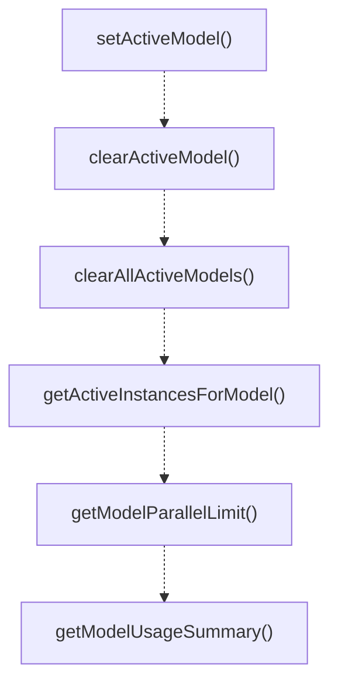
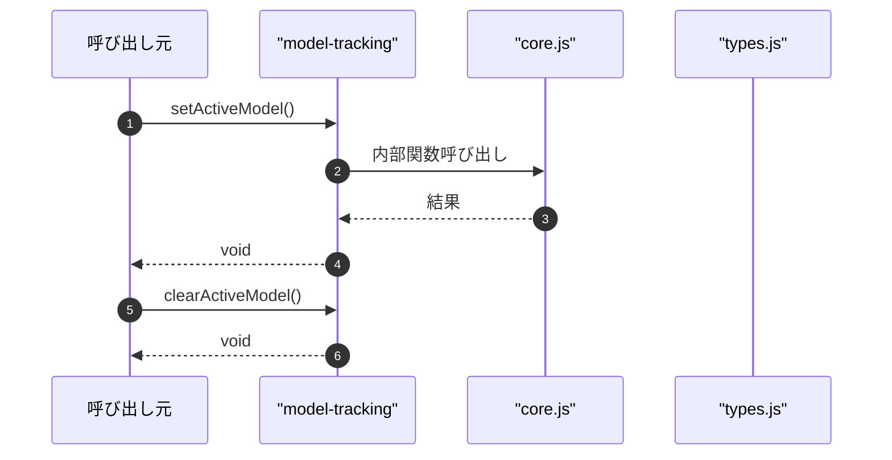

# model-tracking

## 概要

`model-tracking` モジュールのAPIリファレンス。

## インポート

```typescript
import { existsSync, readFileSync, writeFileSync } from 'node:fs';
import { join } from 'node:path';
import { getActiveInstances } from './core.js';
import { InstanceInfo, INSTANCES_DIR, state } from './types.js';
```

## エクスポート一覧

| 種別 | 名前 | 説明 |
|------|------|------|
| 関数 | `setActiveModel` | Update the active model for this instance. |
| 関数 | `clearActiveModel` | Clear an active model for this instance. |
| 関数 | `clearAllActiveModels` | Clear all active models for this instance. |
| 関数 | `getActiveInstancesForModel` | Get count of active instances using a specific mod |
| 関数 | `getModelParallelLimit` | Get the effective parallel limit for a specific mo |
| 関数 | `getModelUsageSummary` | Get a summary of model usage across instances. |

## 図解

### 依存関係図



### 関数フロー



### シーケンス図



## 関数

### matchesModelPattern

```typescript
matchesModelPattern(pattern: string, model: string): boolean
```

Simple pattern matching for model names.

**パラメータ**

| 名前 | 型 | 必須 |
|------|-----|------|
| pattern | `string` | はい |
| model | `string` | はい |

**戻り値**: `boolean`

### setActiveModel

```typescript
setActiveModel(provider: string, model: string): void
```

Update the active model for this instance.
Call this when starting to use a specific model.

**パラメータ**

| 名前 | 型 | 必須 |
|------|-----|------|
| provider | `string` | はい |
| model | `string` | はい |

**戻り値**: `void`

### clearActiveModel

```typescript
clearActiveModel(provider: string, model: string): void
```

Clear an active model for this instance.
Call this when done using a specific model.

**パラメータ**

| 名前 | 型 | 必須 |
|------|-----|------|
| provider | `string` | はい |
| model | `string` | はい |

**戻り値**: `void`

### clearAllActiveModels

```typescript
clearAllActiveModels(): void
```

Clear all active models for this instance.

**戻り値**: `void`

### getActiveInstancesForModel

```typescript
getActiveInstancesForModel(provider: string, model: string): number
```

Get count of active instances using a specific model.

**パラメータ**

| 名前 | 型 | 必須 |
|------|-----|------|
| provider | `string` | はい |
| model | `string` | はい |

**戻り値**: `number`

### getModelParallelLimit

```typescript
getModelParallelLimit(provider: string, model: string, baseLimit: number): number
```

Get the effective parallel limit for a specific model.
This accounts for other instances using the same model.

**パラメータ**

| 名前 | 型 | 必須 |
|------|-----|------|
| provider | `string` | はい |
| model | `string` | はい |
| baseLimit | `number` | はい |

**戻り値**: `number`

### getModelUsageSummary

```typescript
getModelUsageSummary(): {
  models: Array<{
    provider: string;
    model: string;
    instanceCount: number;
  }>;
  instances: InstanceInfo[];
}
```

Get a summary of model usage across instances.

**戻り値**: `{
  models: Array<{
    provider: string;
    model: string;
    instanceCount: number;
  }>;
  instances: InstanceInfo[];
}`

---
*自動生成: 2026-02-17T22:24:18.910Z*
