# types

## 概要

`types` モジュールのAPIリファレンス。

## インポート

```typescript
import { existsSync, mkdirSync, readFileSync } from 'node:fs';
import { homedir } from 'node:os';
import { join } from 'node:path';
import { pid } from 'node:process';
```

## エクスポート一覧

| 種別 | 名前 | 説明 |
|------|------|------|
| 関数 | `setCoordinatorState` | Set coordinator state. Only for use by core module |
| 関数 | `setStealingStats` | Set stealing stats. Only for use by work-stealing  |
| 関数 | `ensureDirs` | - |
| 関数 | `generateInstanceId` | - |
| 関数 | `parseLockFile` | - |
| 関数 | `isInstanceAlive` | - |
| 関数 | `loadConfig` | - |
| インターフェース | `ActiveModelInfo` | - |
| インターフェース | `InstanceInfo` | - |
| インターフェース | `CoordinatorConfig` | - |
| インターフェース | `CoordinatorState` | - |
| インターフェース | `StealableQueueEntry` | - |
| インターフェース | `BroadcastQueueState` | - |
| インターフェース | `DistributedLock` | - |
| インターフェース | `StealingStats` | - |
| インターフェース | `StealingStatsInternal` | - |

## 図解

### クラス図

```mermaid
classDiagram
  class ActiveModelInfo {
    <<interface>>
    +provider: string
    +model: string
    +since: string
  }
  class InstanceInfo {
    <<interface>>
    +instanceId: string
    +pid: number
    +sessionId: string
    +startedAt: string
    +lastHeartbeat: string
  }
  class CoordinatorConfig {
    <<interface>>
    +totalMaxLlm: number
    +heartbeatIntervalMs: number
    +heartbeatTimeoutMs: number
  }
  class CoordinatorState {
    <<interface>>
    +myInstanceId: string
    +mySessionId: string
    +myStartedAt: string
    +config: CoordinatorConfig
    +heartbeatTimer: ReturnType<typeofsetInterval>
  }
  class StealableQueueEntry {
    <<interface>>
    +id: string
    +toolName: string
    +priority: string
    +instanceId: string
    +enqueuedAt: string
  }
  class BroadcastQueueState {
    <<interface>>
    +instanceId: string
    +timestamp: string
    +pendingTaskCount: number
    +avgLatencyMs: number
    +activeOrchestrations: number
  }
  class DistributedLock {
    <<interface>>
    +lockId: string
    +acquiredAt: number
    +expiresAt: number
    +resource: string
  }
  class StealingStats {
    <<interface>>
    +totalAttempts: number
    +successfulSteals: number
    +failedAttempts: number
    +successRate: number
    +avgLatencyMs: number
  }
  class StealingStatsInternal {
    <<interface>>
    +totalAttempts: number
    +successfulSteals: number
    +failedAttempts: number
    +lastAttemptAt: numbernull
    +lastSuccessAt: numbernull
  }
```



### 関数フロー


### シーケンス図


## 関数

### setCoordinatorState

```typescript
setCoordinatorState(newState: CoordinatorState | null): void
```

Set coordinator state. Only for use by core module.

**パラメータ**

| 名前 | 型 | 必須 |
|------|-----|------|
| newState | `CoordinatorState | null` | はい |

**戻り値**: `void`

### setStealingStats

```typescript
setStealingStats(newStats: StealingStatsInternal): void
```

Set stealing stats. Only for use by work-stealing module.

**パラメータ**

| 名前 | 型 | 必須 |
|------|-----|------|
| newStats | `StealingStatsInternal` | はい |

**戻り値**: `void`

### ensureDirs

```typescript
ensureDirs(): void
```

**戻り値**: `void`

### generateInstanceId

```typescript
generateInstanceId(sessionId: string): string
```

**パラメータ**

| 名前 | 型 | 必須 |
|------|-----|------|
| sessionId | `string` | はい |

**戻り値**: `string`

### parseLockFile

```typescript
parseLockFile(filename: string): InstanceInfo | null
```

**パラメータ**

| 名前 | 型 | 必須 |
|------|-----|------|
| filename | `string` | はい |

**戻り値**: `InstanceInfo | null`

### isInstanceAlive

```typescript
isInstanceAlive(info: InstanceInfo, nowMs: number, timeoutMs: number): boolean
```

**パラメータ**

| 名前 | 型 | 必須 |
|------|-----|------|
| info | `InstanceInfo` | はい |
| nowMs | `number` | はい |
| timeoutMs | `number` | はい |

**戻り値**: `boolean`

### loadConfig

```typescript
loadConfig(): CoordinatorConfig
```

**戻り値**: `CoordinatorConfig`

## インターフェース

### ActiveModelInfo

```typescript
interface ActiveModelInfo {
  provider: string;
  model: string;
  since: string;
}
```

### InstanceInfo

```typescript
interface InstanceInfo {
  instanceId: string;
  pid: number;
  sessionId: string;
  startedAt: string;
  lastHeartbeat: string;
  cwd: string;
  activeModels: ActiveModelInfo[];
  pendingTaskCount?: number;
  avgLatencyMs?: number;
  lastTaskCompletedAt?: string;
}
```

### CoordinatorConfig

```typescript
interface CoordinatorConfig {
  totalMaxLlm: number;
  heartbeatIntervalMs: number;
  heartbeatTimeoutMs: number;
}
```

### CoordinatorState

```typescript
interface CoordinatorState {
  myInstanceId: string;
  mySessionId: string;
  myStartedAt: string;
  config: CoordinatorConfig;
  heartbeatTimer?: ReturnType<typeof setInterval>;
}
```

### StealableQueueEntry

```typescript
interface StealableQueueEntry {
  id: string;
  toolName: string;
  priority: string;
  instanceId: string;
  enqueuedAt: string;
  estimatedDurationMs?: number;
  estimatedRounds?: number;
}
```

### BroadcastQueueState

```typescript
interface BroadcastQueueState {
  instanceId: string;
  timestamp: string;
  pendingTaskCount: number;
  avgLatencyMs?: number;
  activeOrchestrations: number;
  stealableEntries: StealableQueueEntry[];
}
```

### DistributedLock

```typescript
interface DistributedLock {
  lockId: string;
  acquiredAt: number;
  expiresAt: number;
  resource: string;
}
```

### StealingStats

```typescript
interface StealingStats {
  totalAttempts: number;
  successfulSteals: number;
  failedAttempts: number;
  successRate: number;
  avgLatencyMs: number;
  lastStealAt: number | null;
}
```

### StealingStatsInternal

```typescript
interface StealingStatsInternal {
  totalAttempts: number;
  successfulSteals: number;
  failedAttempts: number;
  lastAttemptAt: number | null;
  lastSuccessAt: number | null;
  avgLatencyMs: number;
  latencySamples: number[];
}
```

---
*自動生成: 2026-02-17T22:24:18.911Z*
