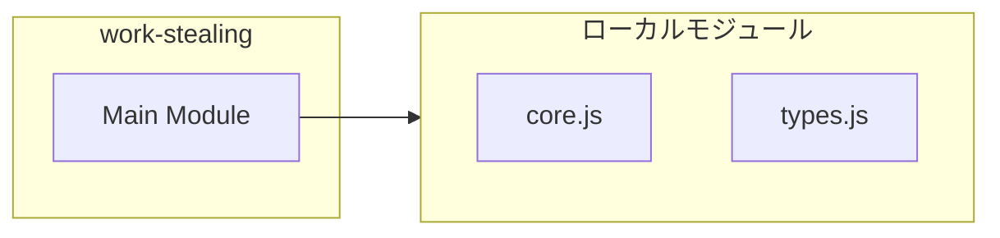
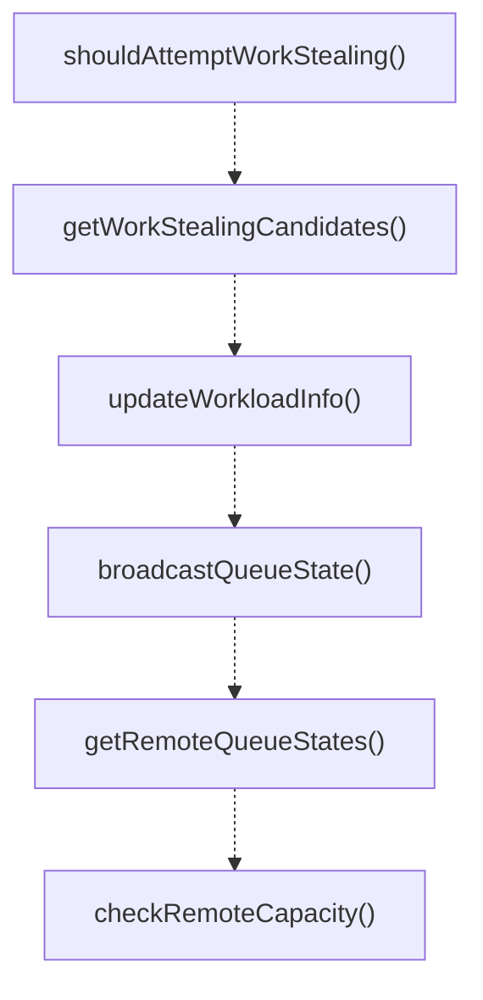
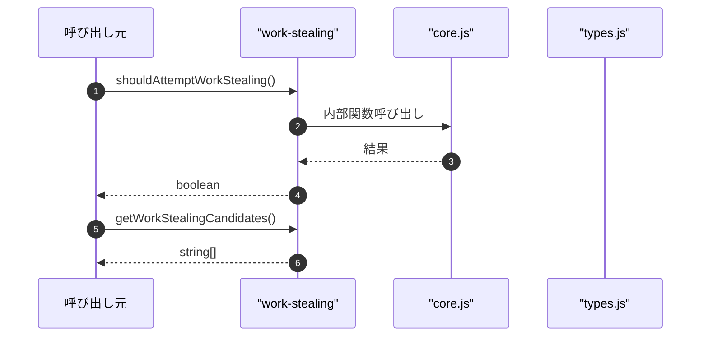

# work-stealing

## 概要

`work-stealing` モジュールのAPIリファレンス。

## インポート

```typescript
import { existsSync, mkdirSync, readdirSync... } from 'node:fs';
import { join } from 'node:path';
import { cleanupDeadInstances, getActiveInstances, updateHeartbeat } from './core.js';
import { BroadcastQueueState, DEFAULT_CONFIG, DistributedLock... } from './types.js';
```

## エクスポート一覧

| 種別 | 名前 | 説明 |
|------|------|------|
| 関数 | `shouldAttemptWorkStealing` | Check if this instance should attempt work stealin |
| 関数 | `getWorkStealingCandidates` | Get candidate instances for work stealing (busiest |
| 関数 | `updateWorkloadInfo` | Update workload info for this instance in heartbea |
| 関数 | `broadcastQueueState` | Broadcast this instance's queue state to other ins |
| 関数 | `getRemoteQueueStates` | Get queue states from all active instances. |
| 関数 | `checkRemoteCapacity` | Check if any remote instance has capacity for more |
| 関数 | `stealWork` | Attempt to steal work from another instance. |
| 関数 | `getWorkStealingSummary` | Get work stealing summary for monitoring. |
| 関数 | `cleanupQueueStates` | Clean up old queue state files. |
| 関数 | `isIdle` | Check if this instance is idle (no pending tasks). |
| 関数 | `findStealCandidate` | Find the best candidate instance to steal work fro |
| 関数 | `safeStealWork` | Safely steal work from another instance using dist |
| 関数 | `getStealingStats` | Get work stealing statistics. |
| 関数 | `resetStealingStats` | Reset stealing statistics (for testing). |
| 関数 | `cleanupExpiredLocks` | Clean up expired locks. |
| 関数 | `enhancedHeartbeat` | Enhanced heartbeat that includes cleanup of locks  |

## 図解

### 依存関係図



### 関数フロー



### シーケンス図



## 関数

### ensureQueueStateDir

```typescript
ensureQueueStateDir(): void
```

Ensure queue state directory exists.

**戻り値**: `void`

### ensureLockDir

```typescript
ensureLockDir(): void
```

Ensure lock directory exists.

**戻り値**: `void`

### tryAcquireLock

```typescript
tryAcquireLock(resource: string, ttlMs: number): DistributedLock | null
```

Try to acquire a distributed lock.

**パラメータ**

| 名前 | 型 | 必須 |
|------|-----|------|
| resource | `string` | はい |
| ttlMs | `number` | はい |

**戻り値**: `DistributedLock | null`

### releaseLock

```typescript
releaseLock(lock: DistributedLock): void
```

Release a distributed lock.

**パラメータ**

| 名前 | 型 | 必須 |
|------|-----|------|
| lock | `DistributedLock` | はい |

**戻り値**: `void`

### shouldAttemptWorkStealing

```typescript
shouldAttemptWorkStealing(): boolean
```

Check if this instance should attempt work stealing.

**戻り値**: `boolean`

### getWorkStealingCandidates

```typescript
getWorkStealingCandidates(topN: number): string[]
```

Get candidate instances for work stealing (busiest instances).

**パラメータ**

| 名前 | 型 | 必須 |
|------|-----|------|
| topN | `number` | はい |

**戻り値**: `string[]`

### updateWorkloadInfo

```typescript
updateWorkloadInfo(pendingTaskCount: number, avgLatencyMs?: number): void
```

Update workload info for this instance in heartbeat.

**パラメータ**

| 名前 | 型 | 必須 |
|------|-----|------|
| pendingTaskCount | `number` | はい |
| avgLatencyMs | `number` | いいえ |

**戻り値**: `void`

### broadcastQueueState

```typescript
broadcastQueueState(options: {
  pendingTaskCount: number;
  activeOrchestrations: number;
  stealableEntries?: StealableQueueEntry[];
  avgLatencyMs?: number;
}): void
```

Broadcast this instance's queue state to other instances.
Other instances can read this to determine if work stealing is possible.

**パラメータ**

| 名前 | 型 | 必須 |
|------|-----|------|
| options | `{
  pendingTaskCount: number;
  activeOrchestrations: number;
  stealableEntries?: StealableQueueEntry[];
  avgLatencyMs?: number;
}` | はい |

**戻り値**: `void`

### getRemoteQueueStates

```typescript
getRemoteQueueStates(): BroadcastQueueState[]
```

Get queue states from all active instances.

**戻り値**: `BroadcastQueueState[]`

### checkRemoteCapacity

```typescript
checkRemoteCapacity(): boolean
```

Check if any remote instance has capacity for more work.
This is useful for determining if we should slow down our own task submission.

**戻り値**: `boolean`

### stealWork

```typescript
stealWork(): StealableQueueEntry | null
```

Attempt to steal work from another instance.
Returns a stealable entry if available.

Note: This is a cooperative mechanism. The stealing instance must have
the actual task data to execute it. This function identifies candidates.

**戻り値**: `StealableQueueEntry | null`

### getWorkStealingSummary

```typescript
getWorkStealingSummary(): {
  remoteInstances: number;
  totalPendingTasks: number;
  stealableTasks: number;
  idleInstances: number;
  busyInstances: number;
}
```

Get work stealing summary for monitoring.

**戻り値**: `{
  remoteInstances: number;
  totalPendingTasks: number;
  stealableTasks: number;
  idleInstances: number;
  busyInstances: number;
}`

### cleanupQueueStates

```typescript
cleanupQueueStates(): void
```

Clean up old queue state files.
Called periodically during heartbeat.

**戻り値**: `void`

### isIdle

```typescript
isIdle(): boolean
```

Check if this instance is idle (no pending tasks).

**戻り値**: `boolean`

### findStealCandidate

```typescript
findStealCandidate(): InstanceInfo | null
```

Find the best candidate instance to steal work from.

**戻り値**: `InstanceInfo | null`

### safeStealWork

```typescript
async safeStealWork(): Promise<StealableQueueEntry | null>
```

Safely steal work from another instance using distributed lock.

**戻り値**: `Promise<StealableQueueEntry | null>`

### getStealingStats

```typescript
getStealingStats(): StealingStats
```

Get work stealing statistics.

**戻り値**: `StealingStats`

### resetStealingStats

```typescript
resetStealingStats(): void
```

Reset stealing statistics (for testing).

**戻り値**: `void`

### cleanupExpiredLocks

```typescript
cleanupExpiredLocks(): void
```

Clean up expired locks.
Called periodically during heartbeat.

**戻り値**: `void`

### enhancedHeartbeat

```typescript
enhancedHeartbeat(): void
```

Enhanced heartbeat that includes cleanup of locks and queue states.

**戻り値**: `void`

---
*自動生成: 2026-02-17T22:24:18.914Z*
