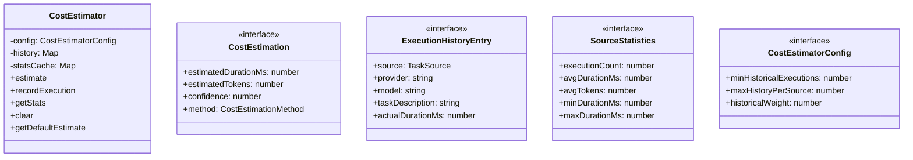
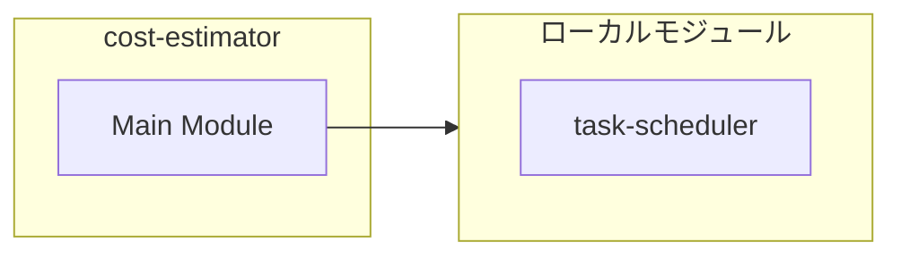
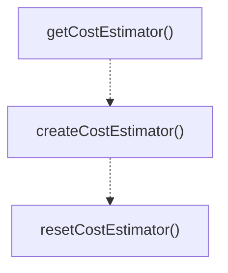

# cost-estimator

## 概要

`cost-estimator` モジュールのAPIリファレンス。

## インポート

```typescript
import { TaskSource } from './task-scheduler';
```

## エクスポート一覧

| 種別 | 名前 | 説明 |
|------|------|------|
| 関数 | `getCostEstimator` | Get the singleton cost estimator instance. |
| 関数 | `createCostEstimator` | Create a new cost estimator with custom config. |
| 関数 | `resetCostEstimator` | Reset the singleton estimator (for testing). |
| クラス | `CostEstimator` | Cost estimator with support for default estimates  |
| インターフェース | `CostEstimation` | Detailed cost estimation result with confidence an |
| インターフェース | `ExecutionHistoryEntry` | Entry recording a completed execution for historic |
| インターフェース | `SourceStatistics` | Statistics for a specific source type. |
| インターフェース | `CostEstimatorConfig` | Configuration for cost estimator. |
| 型 | `CostEstimationMethod` | Estimation method used for cost calculation. |

## 図解

### クラス図



### 依存関係図



### 関数フロー



### シーケンス図


## 関数

### getCostEstimator

```typescript
getCostEstimator(): CostEstimator
```

Get the singleton cost estimator instance.

**戻り値**: `CostEstimator`

### createCostEstimator

```typescript
createCostEstimator(config?: Partial<CostEstimatorConfig>): CostEstimator
```

Create a new cost estimator with custom config.
Useful for testing or isolated usage.

**パラメータ**

| 名前 | 型 | 必須 |
|------|-----|------|
| config | `Partial<CostEstimatorConfig>` | いいえ |

**戻り値**: `CostEstimator`

### resetCostEstimator

```typescript
resetCostEstimator(): void
```

Reset the singleton estimator (for testing).

**戻り値**: `void`

## クラス

### CostEstimator

Cost estimator with support for default estimates and historical learning.
Designed for future extension with ML-based heuristics.

**プロパティ**

| 名前 | 型 | 可視性 |
|------|-----|--------|
| config | `CostEstimatorConfig` | private |
| history | `Map<TaskSource, ExecutionHistoryEntry[]>` | private |
| statsCache | `Map<TaskSource, SourceStatistics>` | private |

**メソッド**

| 名前 | シグネチャ |
|------|------------|
| estimate | `estimate(source, provider, model, taskDescription): CostEstimation` |
| recordExecution | `recordExecution(entry): void` |
| getStats | `getStats(source): SourceStatistics | undefined` |
| clear | `clear(): void` |
| getDefaultEstimate | `getDefaultEstimate(source): { durationMs: number; tokens: number }` |

## インターフェース

### CostEstimation

```typescript
interface CostEstimation {
  estimatedDurationMs: number;
  estimatedTokens: number;
  confidence: number;
  method: CostEstimationMethod;
}
```

Detailed cost estimation result with confidence and method tracking.
Used by CostEstimator for internal tracking and future learning.

### ExecutionHistoryEntry

```typescript
interface ExecutionHistoryEntry {
  source: TaskSource;
  provider: string;
  model: string;
  taskDescription?: string;
  actualDurationMs: number;
  actualTokens: number;
  success: boolean;
  timestamp: number;
}
```

Entry recording a completed execution for historical learning.

### SourceStatistics

```typescript
interface SourceStatistics {
  executionCount: number;
  avgDurationMs: number;
  avgTokens: number;
  minDurationMs: number;
  maxDurationMs: number;
  successRate: number;
  lastUpdated: number;
}
```

Statistics for a specific source type.

### CostEstimatorConfig

```typescript
interface CostEstimatorConfig {
  minHistoricalExecutions: number;
  maxHistoryPerSource: number;
  historicalWeight: number;
}
```

Configuration for cost estimator.

## 型定義

### CostEstimationMethod

```typescript
type CostEstimationMethod = "default" | "historical" | "heuristic"
```

Estimation method used for cost calculation.

---
*自動生成: 2026-02-17T22:16:16.646Z*
