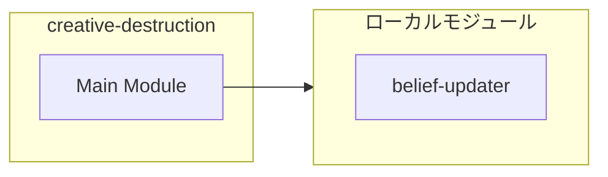
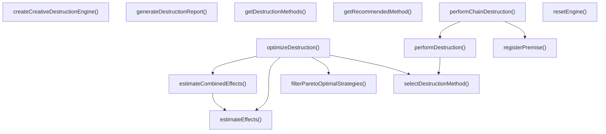
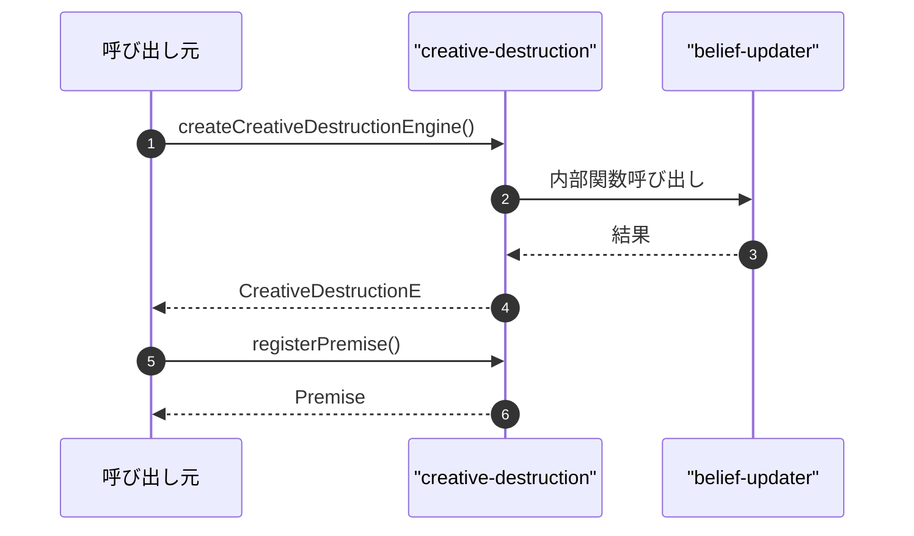

# creative-destruction

## 概要

`creative-destruction` モジュールのAPIリファレンス。

## インポート

```typescript
// from './belief-updater.js': Distribution
// from './belief-updater.js': createPrior, normalizeDistribution
```

## エクスポート一覧

| 種別 | 名前 | 説明 |
|------|------|------|
| 関数 | `createCreativeDestructionEngine` | - |
| 関数 | `registerPremise` | - |
| 関数 | `performDestruction` | - |
| 関数 | `performChainDestruction` | - |
| 関数 | `optimizeDestruction` | - |
| 関数 | `resetEngine` | - |
| 関数 | `generateDestructionReport` | - |
| 関数 | `getDestructionMethods` | - |
| 関数 | `getRecommendedMethod` | - |
| インターフェース | `Premise` | 前提 |
| インターフェース | `DestructionMethod` | 破壊方法 |
| インターフェース | `DestructionResult` | 破壊結果 |
| インターフェース | `ReconstructedView` | 再構築された視点 |
| インターフェース | `DestructionChain` | 破壊チェーン |
| インターフェース | `ParetoOptimalDestruction` | パレート最適破壊 |
| インターフェース | `CreativeDestructionEngine` | 創造的破壊エンジン |
| インターフェース | `CreativeDestructionConfig` | エンジン設定 |
| 型 | `PremiseType` | 前提タイプ |

## 図解

### クラス図

```mermaid
classDiagram
  class Premise {
    <<interface>>
    +id: string
    +content: string
    +type: PremiseType
    +solidity: number
    +dependencies: string
  }
  class DestructionMethod {
    <<interface>>
    +name: string
    +description: string
    +philosophicalBasis: nietzschean_deleu
    +applicableWhen: premise_Premise_b
    +apply: premise_Premise_D
  }
  class DestructionResult {
    <<interface>>
    +originalPremise: Premise
    +method: DestructionMethod
    +remnants: string
    +exposed: string
    +depth: number
  }
  class ReconstructedView {
    <<interface>>
    +description: string
    +basedOn: string
    +instability: number
    +creativityScore: number
    +potentialInsights: string
  }
  class DestructionChain {
    <<interface>>
    +id: string
    +sequence: DestructionResult
    +finalReconstruction: ReconstructedView
    +statistics: totalPremisesDestro
  }
  class ParetoOptimalDestruction {
    <<interface>>
    +targetPremises: Premise
    +methodCombination: Map_string_Destructi
    +expectedEffects: creativityIncrease
    +paretoPosition: x_number_y_number
  }
  class CreativeDestructionEngine {
    <<interface>>
    +premises: Map_string_Premise
    +destructionMethods: DestructionMethod
    +destructionHistory: DestructionChain
    +config: CreativeDestructionC
    +statistics: totalDestructions_n
  }
  class CreativeDestructionConfig {
    <<interface>>
    +maxDestructionDepth: number
    +minReconstructionQuality: number
    +maxSimultaneousDestructions: number
    +destructionIntensity: number
    +autoReconstruction: boolean
  }
```



### 依存関係図



### 関数フロー



### シーケンス図



## 関数

### createCreativeDestructionEngine

```typescript
createCreativeDestructionEngine(config: Partial<CreativeDestructionConfig>): CreativeDestructionEngine
```

**パラメータ**

| 名前 | 型 | 必須 |
|------|-----|------|
| config | `Partial<CreativeDestructionConfig>` | はい |

**戻り値**: `CreativeDestructionEngine`

### registerPremise

```typescript
registerPremise(engine: CreativeDestructionEngine, content: string, type: PremiseType, solidity: number): Premise
```

**パラメータ**

| 名前 | 型 | 必須 |
|------|-----|------|
| engine | `CreativeDestructionEngine` | はい |
| content | `string` | はい |
| type | `PremiseType` | はい |
| solidity | `number` | はい |

**戻り値**: `Premise`

### performDestruction

```typescript
performDestruction(engine: CreativeDestructionEngine, premiseId: string, method?: DestructionMethod): DestructionResult | null
```

**パラメータ**

| 名前 | 型 | 必須 |
|------|-----|------|
| engine | `CreativeDestructionEngine` | はい |
| premiseId | `string` | はい |
| method | `DestructionMethod` | いいえ |

**戻り値**: `DestructionResult | null`

### performChainDestruction

```typescript
performChainDestruction(engine: CreativeDestructionEngine, startingPremiseId: string, depth: number): DestructionChain
```

**パラメータ**

| 名前 | 型 | 必須 |
|------|-----|------|
| engine | `CreativeDestructionEngine` | はい |
| startingPremiseId | `string` | はい |
| depth | `number` | はい |

**戻り値**: `DestructionChain`

### optimizeDestruction

```typescript
optimizeDestruction(engine: CreativeDestructionEngine): ParetoOptimalDestruction[]
```

**パラメータ**

| 名前 | 型 | 必須 |
|------|-----|------|
| engine | `CreativeDestructionEngine` | はい |

**戻り値**: `ParetoOptimalDestruction[]`

### resetEngine

```typescript
resetEngine(engine: CreativeDestructionEngine): CreativeDestructionEngine
```

**パラメータ**

| 名前 | 型 | 必須 |
|------|-----|------|
| engine | `CreativeDestructionEngine` | はい |

**戻り値**: `CreativeDestructionEngine`

### generateDestructionReport

```typescript
generateDestructionReport(engine: CreativeDestructionEngine): string
```

**パラメータ**

| 名前 | 型 | 必須 |
|------|-----|------|
| engine | `CreativeDestructionEngine` | はい |

**戻り値**: `string`

### selectDestructionMethod

```typescript
selectDestructionMethod(premise: Premise, methods: DestructionMethod[]): DestructionMethod | null
```

破壊方法を選択

**パラメータ**

| 名前 | 型 | 必須 |
|------|-----|------|
| premise | `Premise` | はい |
| methods | `DestructionMethod[]` | はい |

**戻り値**: `DestructionMethod | null`

### estimateEffects

```typescript
estimateEffects(premise: Premise, method: DestructionMethod): ParetoOptimalDestruction['expectedEffects']
```

破壊の効果を推定

**パラメータ**

| 名前 | 型 | 必須 |
|------|-----|------|
| premise | `Premise` | はい |
| method | `DestructionMethod` | はい |

**戻り値**: `ParetoOptimalDestruction['expectedEffects']`

### estimateCombinedEffects

```typescript
estimateCombinedEffects(premises: Premise[], methods: Map<string, DestructionMethod>): ParetoOptimalDestruction['expectedEffects']
```

複合破壊の効果を推定

**パラメータ**

| 名前 | 型 | 必須 |
|------|-----|------|
| premises | `Premise[]` | はい |
| methods | `Map<string, DestructionMethod>` | はい |

**戻り値**: `ParetoOptimalDestruction['expectedEffects']`

### filterParetoOptimalStrategies

```typescript
filterParetoOptimalStrategies(strategies: ParetoOptimalDestruction[]): ParetoOptimalDestruction[]
```

パレート最適戦略を抽出

**パラメータ**

| 名前 | 型 | 必須 |
|------|-----|------|
| strategies | `ParetoOptimalDestruction[]` | はい |

**戻り値**: `ParetoOptimalDestruction[]`

### getDestructionMethods

```typescript
getDestructionMethods(): DestructionMethod[]
```

**戻り値**: `DestructionMethod[]`

### getRecommendedMethod

```typescript
getRecommendedMethod(type: PremiseType): DestructionMethod
```

**パラメータ**

| 名前 | 型 | 必須 |
|------|-----|------|
| type | `PremiseType` | はい |

**戻り値**: `DestructionMethod`

## インターフェース

### Premise

```typescript
interface Premise {
  id: string;
  content: string;
  type: PremiseType;
  solidity: number;
  dependencies: string[];
  derivedConclusions: string[];
  confidence: number;
  createdAt: Date;
  updateCount: number;
}
```

前提

### DestructionMethod

```typescript
interface DestructionMethod {
  name: string;
  description: string;
  philosophicalBasis: 'nietzschean' | 'deleuzian' | 'derridean' | 'heideggerian' | 'buddhist';
  applicableWhen: (premise: Premise) => boolean;
  apply: (premise: Premise) => DestructionResult;
  reconstruct: (result: DestructionResult) => ReconstructedView[];
}
```

破壊方法

### DestructionResult

```typescript
interface DestructionResult {
  originalPremise: Premise;
  method: DestructionMethod;
  remnants: string[];
  exposed: string[];
  depth: number;
  completeness: number;
  nextTargets: string[];
  timestamp: Date;
}
```

破壊結果

### ReconstructedView

```typescript
interface ReconstructedView {
  description: string;
  basedOn: string[];
  instability: number;
  creativityScore: number;
  potentialInsights: string[];
}
```

再構築された視点

### DestructionChain

```typescript
interface DestructionChain {
  id: string;
  sequence: DestructionResult[];
  finalReconstruction: ReconstructedView[];
  statistics: {
    totalPremisesDestroyed: number;
    totalViewsReconstructed: number;
    averageDepth: number;
    maxDepth: number;
  };
}
```

破壊チェーン

### ParetoOptimalDestruction

```typescript
interface ParetoOptimalDestruction {
  targetPremises: Premise[];
  methodCombination: Map<string, DestructionMethod>;
  expectedEffects: {
    creativityIncrease: number;
    stabilityDecrease: number;
    insightPotential: number;
    cognitiveLoad: number;
  };
  paretoPosition: { x: number; y: number };
}
```

パレート最適破壊

### CreativeDestructionEngine

```typescript
interface CreativeDestructionEngine {
  premises: Map<string, Premise>;
  destructionMethods: DestructionMethod[];
  destructionHistory: DestructionChain[];
  config: CreativeDestructionConfig;
  statistics: {
    totalDestructions: number;
    successfulReconstructions: number;
    averageCreativityGain: number;
    premisesCurrentlyHeld: number;
  };
}
```

創造的破壊エンジン

### CreativeDestructionConfig

```typescript
interface CreativeDestructionConfig {
  maxDestructionDepth: number;
  minReconstructionQuality: number;
  maxSimultaneousDestructions: number;
  destructionIntensity: number;
  autoReconstruction: boolean;
}
```

エンジン設定

## 型定義

### PremiseType

```typescript
type PremiseType = | 'epistemic'      // 認識論的前提（「我思う、ゆえに我あり」）
  | 'normative'      // 規範的前提（「すべき」「べき」）
  | 'ontological'    // 存在論的前提（「世界は実在する」）
  | 'methodological' // 方法論的前提（「論理は有効である」）
  | 'contextual'     // 文脈的前提（「このタスクでは...」）
  | 'implicit'
```

前提タイプ

---
*自動生成: 2026-02-22T19:27:00.586Z*
