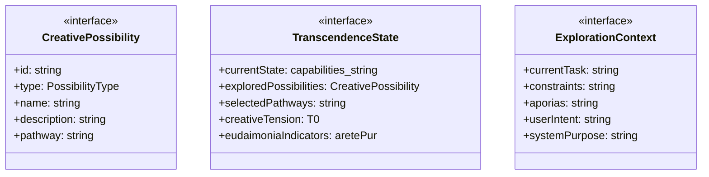
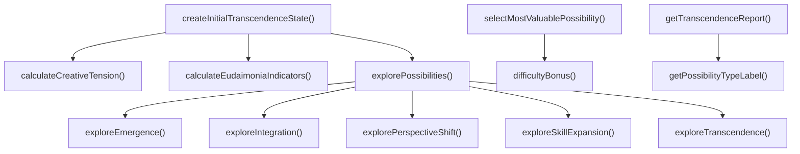

# creative-transcendence

## 概要

`creative-transcendence` モジュールのAPIリファレンス。

## エクスポート一覧

| 種別 | 名前 | 説明 |
|------|------|------|
| 関数 | `explorePossibilities` | 可能性を探索する |
| 関数 | `getTranscendenceReport` | 自己超越レポートを生成 |
| 関数 | `createInitialTranscendenceState` | 初期自己超越状態を作成 |
| 関数 | `selectMostValuablePossibility` | 現在の状態から最も価値のある可能性を選択 |
| インターフェース | `CreativePossibility` | 創造的可能性 |
| インターフェース | `TranscendenceState` | 自己超越の状態 |
| インターフェース | `ExplorationContext` | 可能性探索のコンテキスト |
| 型 | `PossibilityType` | 創造的可能性の種類 |

## 図解

### クラス図



### 関数フロー



## 関数

### explorePossibilities

```typescript
explorePossibilities(context: ExplorationContext): CreativePossibility[]
```

可能性を探索する

**パラメータ**

| 名前 | 型 | 必須 |
|------|-----|------|
| context | `ExplorationContext` | はい |

**戻り値**: `CreativePossibility[]`

### exploreSkillExpansion

```typescript
exploreSkillExpansion(context: ExplorationContext): CreativePossibility[]
```

技能拡張の可能性を探索

**パラメータ**

| 名前 | 型 | 必須 |
|------|-----|------|
| context | `ExplorationContext` | はい |

**戻り値**: `CreativePossibility[]`

### explorePerspectiveShift

```typescript
explorePerspectiveShift(context: ExplorationContext): CreativePossibility[]
```

視点転換の可能性を探索

**パラメータ**

| 名前 | 型 | 必須 |
|------|-----|------|
| context | `ExplorationContext` | はい |

**戻り値**: `CreativePossibility[]`

### exploreIntegration

```typescript
exploreIntegration(context: ExplorationContext): CreativePossibility[]
```

統合の可能性を探索

**パラメータ**

| 名前 | 型 | 必須 |
|------|-----|------|
| context | `ExplorationContext` | はい |

**戻り値**: `CreativePossibility[]`

### exploreEmergence

```typescript
exploreEmergence(context: ExplorationContext): CreativePossibility[]
```

創発の可能性を探索

**パラメータ**

| 名前 | 型 | 必須 |
|------|-----|------|
| context | `ExplorationContext` | はい |

**戻り値**: `CreativePossibility[]`

### exploreTranscendence

```typescript
exploreTranscendence(context: ExplorationContext): CreativePossibility[]
```

超越の可能性を探索

**パラメータ**

| 名前 | 型 | 必須 |
|------|-----|------|
| context | `ExplorationContext` | はい |

**戻り値**: `CreativePossibility[]`

### calculateCreativeTension

```typescript
calculateCreativeTension(currentState: TranscendenceState['currentState'], possibilities: CreativePossibility[]): TranscendenceState['creativeTension']
```

創造的緊張を計算

**パラメータ**

| 名前 | 型 | 必須 |
|------|-----|------|
| currentState | `TranscendenceState['currentState']` | はい |
| possibilities | `CreativePossibility[]` | はい |

**戻り値**: `TranscendenceState['creativeTension']`

### calculateEudaimoniaIndicators

```typescript
calculateEudaimoniaIndicators(possibilities: CreativePossibility[]): TranscendenceState['eudaimoniaIndicators']
```

エウダイモニア指標を計算

**パラメータ**

| 名前 | 型 | 必須 |
|------|-----|------|
| possibilities | `CreativePossibility[]` | はい |

**戻り値**: `TranscendenceState['eudaimoniaIndicators']`

### getTranscendenceReport

```typescript
getTranscendenceReport(state: TranscendenceState): string
```

自己超越レポートを生成

**パラメータ**

| 名前 | 型 | 必須 |
|------|-----|------|
| state | `TranscendenceState` | はい |

**戻り値**: `string`

### getPossibilityTypeLabel

```typescript
getPossibilityTypeLabel(type: PossibilityType): string
```

可能性タイプのラベルを取得

**パラメータ**

| 名前 | 型 | 必須 |
|------|-----|------|
| type | `PossibilityType` | はい |

**戻り値**: `string`

### createInitialTranscendenceState

```typescript
createInitialTranscendenceState(): TranscendenceState
```

初期自己超越状態を作成

**戻り値**: `TranscendenceState`

### selectMostValuablePossibility

```typescript
selectMostValuablePossibility(state: TranscendenceState, preferredType?: PossibilityType): CreativePossibility | null
```

現在の状態から最も価値のある可能性を選択

**パラメータ**

| 名前 | 型 | 必須 |
|------|-----|------|
| state | `TranscendenceState` | はい |
| preferredType | `PossibilityType` | いいえ |

**戻り値**: `CreativePossibility | null`

### difficultyBonus

```typescript
difficultyBonus(p: CreativePossibility): void
```

**パラメータ**

| 名前 | 型 | 必須 |
|------|-----|------|
| p | `CreativePossibility` | はい |

**戻り値**: `void`

## インターフェース

### CreativePossibility

```typescript
interface CreativePossibility {
  id: string;
  type: PossibilityType;
  name: string;
  description: string;
  pathway: string;
  requiredConditions: string[];
  eudaimonicValue: number;
  difficulty: 'accessible' | 'challenging' | 'transcendent';
  risks: string[];
  whyGood: string;
}
```

創造的可能性

### TranscendenceState

```typescript
interface TranscendenceState {
  currentState: {
    capabilities: string[];
    limitations: string[];
    values: string[];
    patterns: string[];
  };
  exploredPossibilities: CreativePossibility[];
  selectedPathways: string[];
  creativeTension: {
    /** 現在と理想のギャップの認識度（0.0-1.0） */
    gapAwareness: number;
    /** 理想への引力（0.0-1.0） */
    idealPull: number;
    /** 現実への接地（0.0-1.0） */
    realityGrounding: number;
  };
  eudaimoniaIndicators: {
    /** 卓越性の追求 */
    aretePursuit: number;
    /** 意味のある関係 */
    meaningfulRelations: number;
    /** 自己実現 */
    selfActualization: number;
    /** 創造的表現 */
    creativeExpression: number;
  };
}
```

自己超越の状態

### ExplorationContext

```typescript
interface ExplorationContext {
  currentTask?: string;
  constraints: string[];
  aporias: string[];
  userIntent?: string;
  systemPurpose: string;
}
```

可能性探索のコンテキスト

## 型定義

### PossibilityType

```typescript
type PossibilityType = | 'skill_expansion'      // 技能の拡張：新しい能力の獲得
  | 'perspective_shift'    // 視点の転換：枠組みの変更
  | 'integration'          // 統合：対立するものの創造的結合
  | 'emergence'            // 創発：予期せぬ新しい性質
  | 'transcendence'
```

創造的可能性の種類

---
*自動生成: 2026-02-22T19:27:00.589Z*
