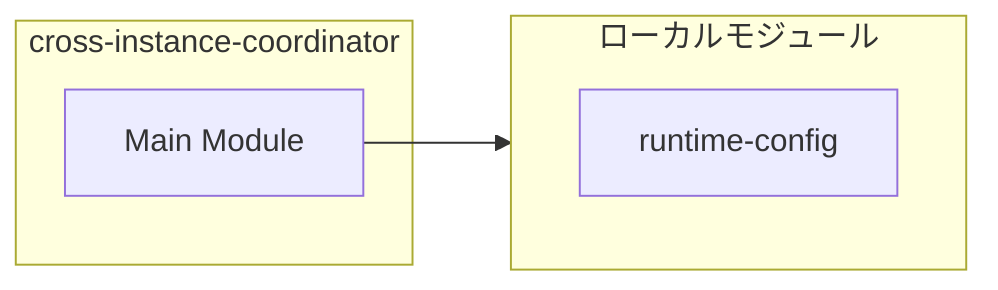
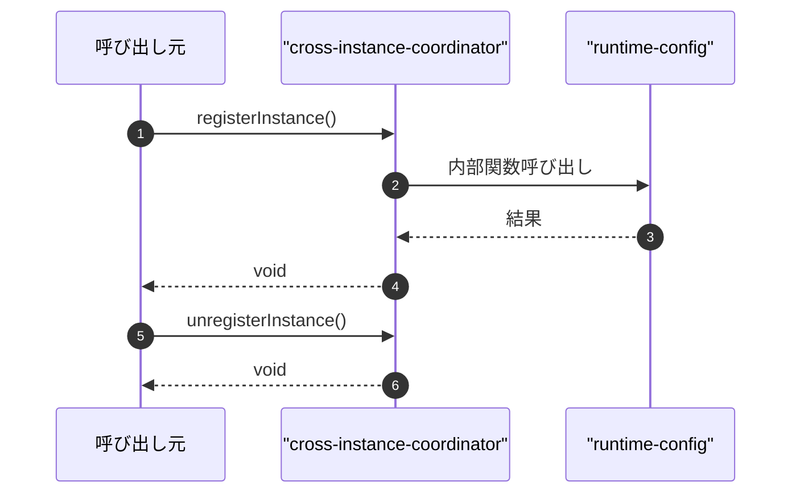

# cross-instance-coordinator

## 概要

`cross-instance-coordinator` モジュールのAPIリファレンス。

## インポート

```typescript
// from 'node:fs': existsSync, mkdirSync, readdirSync, ...
// from 'node:os': homedir
// from 'node:path': join
// from 'node:process': pid
// from './runtime-config.js': getRuntimeConfig, RuntimeConfig
```

## エクスポート一覧

| 種別 | 名前 | 説明 |
|------|------|------|
| 関数 | `registerInstance` | インスタンスを登録してハートビートを開始 |
| 関数 | `unregisterInstance` | このPIインスタンスの登録を解除する |
| 関数 | `updateHeartbeat` | このインスタンスのハートビートを更新する |
| 関数 | `cleanupDeadInstances` | 無効なインスタンスをクリーンアップする |
| 関数 | `getActiveInstanceCount` | アクティブなインスタンス数を取得 |
| 関数 | `getActiveInstances` | アクティブなインスタンス情報を取得する |
| 関数 | `getMyParallelLimit` | このインスタンスの並列処理制限を取得する |
| 関数 | `getDynamicParallelLimit` | 保留タスク数に基づき動的に並列数を制限する。 |
| 関数 | `shouldAttemptWorkStealing` | ワークスチーリングを試みるべきか判定 |
| 関数 | `getWorkStealingCandidates` | ワークスチーリングの候補インスタンスを取得 |
| 関数 | `updateWorkloadInfo` | ワークロード情報を更新する |
| 関数 | `getCoordinatorStatus` | コーディネーターの詳細ステータスを取得する |
| 関数 | `isCoordinatorInitialized` | コーディネータが初期化済みか確認 |
| 関数 | `getTotalMaxLlm` | 合計最大LLM数を取得 |
| 関数 | `getEnvOverrides` | 環境変数による設定上書きを取得 |
| 関数 | `setActiveModel` | アクティブなモデルを更新します |
| 関数 | `clearActiveModel` | このインスタンスのアクティブなモデルを解除する。 |
| 関数 | `clearAllActiveModels` | 全てのアクティブなモデルをクリアする。 |
| 関数 | `getActiveInstancesForModel` | モデルを使用するアクティブなインスタンス数を取得 |
| 関数 | `getModelParallelLimit` | モデルごとの実行並列数の上限を取得 |
| 関数 | `getModelUsageSummary` | モデル使用状況の概要を取得 |
| 関数 | `broadcastQueueState` | キューステータスを他のインスタンスにブロードキャスト |
| 関数 | `getRemoteQueueStates` | 全アクティブインスタンスのキューステートを取得 |
| 関数 | `checkRemoteCapacity` | リモートインスタンスの余裕を確認 |
| 関数 | `stealWork` | 他のインスタンスからタスクを奪う |
| 関数 | `getWorkStealingSummary` | ワークスチーリングの概要を取得 |
| 関数 | `cleanupQueueStates` | 古いキューステートファイルをクリーンアップする。 |
| 関数 | `isIdle` | インスタンスがアイドル状態か確認する |
| 関数 | `findStealCandidate` | 仕事を奪う最適なインスタンスを探す |
| 関数 | `safeStealWork` | 他インスタンスからワークを安全にスチール |
| 関数 | `getStealingStats` | ワークスティーリングの統計情報を取得する。 |
| 関数 | `resetStealingStats` | 盗み統計をリセットする。 |
| 関数 | `cleanupExpiredLocks` | 期限切れのロックを削除する。 |
| 関数 | `enhancedHeartbeat` | 強化されたハートビート処理 |
| インターフェース | `ActiveModelInfo` | アクティブなモデル情報を表すインターフェース |
| インターフェース | `InstanceInfo` | インスタンスの情報を表す |
| インターフェース | `CoordinatorConfig` | クロスインスタンスコーディネーターの設定 |
| インターフェース | `CoordinatorInternalState` | コーディネーターの内部状態 |
| インターフェース | `StealableQueueEntry` | ワークスティーリング用のキューエントリ |
| インターフェース | `BroadcastQueueState` | キュー状態のブロードキャスト形式 |
| インターフェース | `StealingStats` | スチール統計情報（公開インターフェース） |

## 図解

### クラス図


### 依存関係図



### 関数フロー

```mermaid
flowchart TD
  cleanupDeadInstances["cleanupDeadInstances()"]
  clearActiveModel["clearActiveModel()"]
  clearAllActiveModels["clearAllActiveModels()"]
  ensureDirs["ensureDirs()"]
  generateInstanceId["generateInstanceId()"]
  getActiveInstanceCount["getActiveInstanceCount()"]
  getActiveInstances["getActiveInstances()"]
  getActiveInstancesForModel["getActiveInstancesForModel()"]
  getCoordinatorStatus["getCoordinatorStatus()"]
  getDynamicParallelLimit["getDynamicParallelLimit()"]
  getEnvOverrides["getEnvOverrides()"]
  getMyParallelLimit["getMyParallelLimit()"]
  getTotalMaxLlm["getTotalMaxLlm()"]
  getWorkStealingCandidates["getWorkStealingCandidates()"]
  isCoordinatorInitialized["isCoordinatorInitialized()"]
  isInstanceAlive["isInstanceAlive()"]
  loadConfig["loadConfig()"]
  parseLockFile["parseLockFile()"]
  registerInstance["registerInstance()"]
  setActiveModel["setActiveModel()"]
  shouldAttemptWorkStealing["shouldAttemptWorkStealing()"]
  unregisterInstance["unregisterInstance()"]
  updateHeartbeat["updateHeartbeat()"]
  updateWorkloadInfo["updateWorkloadInfo()"]
  cleanupDeadInstances --> ensureDirs
  cleanupDeadInstances --> isInstanceAlive
  cleanupDeadInstances --> parseLockFile
  getActiveInstanceCount --> ensureDirs
  getActiveInstanceCount --> isInstanceAlive
  getActiveInstanceCount --> parseLockFile
  getActiveInstances --> ensureDirs
  getActiveInstances --> isInstanceAlive
  getActiveInstances --> parseLockFile
  getActiveInstancesForModel --> getActiveInstances
  getCoordinatorStatus --> getActiveInstanceCount
  getCoordinatorStatus --> getActiveInstances
  getCoordinatorStatus --> getMyParallelLimit
  getDynamicParallelLimit --> getActiveInstances
  getMyParallelLimit --> getActiveInstanceCount
  getWorkStealingCandidates --> getActiveInstances
  registerInstance --> cleanupDeadInstances
  registerInstance --> ensureDirs
  registerInstance --> generateInstanceId
  registerInstance --> loadConfig
  registerInstance --> updateHeartbeat
  shouldAttemptWorkStealing --> getActiveInstances
  updateHeartbeat --> ensureDirs
```



### シーケンス図



## 関数

### getDefaultConfig

```typescript
getDefaultConfig(): CoordinatorConfig
```

Get default config from centralized RuntimeConfig.
This ensures consistency with other layers.

**戻り値**: `CoordinatorConfig`

### ensureDirs

```typescript
ensureDirs(): void
```

**戻り値**: `void`

### generateInstanceId

```typescript
generateInstanceId(sessionId: string): string
```

**パラメータ**

| 名前 | 型 | 必須 |
|------|-----|------|
| sessionId | `string` | はい |

**戻り値**: `string`

### parseLockFile

```typescript
parseLockFile(filename: string): InstanceInfo | null
```

**パラメータ**

| 名前 | 型 | 必須 |
|------|-----|------|
| filename | `string` | はい |

**戻り値**: `InstanceInfo | null`

### isInstanceAlive

```typescript
isInstanceAlive(info: InstanceInfo, nowMs: number, timeoutMs: number): boolean
```

**パラメータ**

| 名前 | 型 | 必須 |
|------|-----|------|
| info | `InstanceInfo` | はい |
| nowMs | `number` | はい |
| timeoutMs | `number` | はい |

**戻り値**: `boolean`

### loadConfig

```typescript
loadConfig(): CoordinatorConfig
```

**戻り値**: `CoordinatorConfig`

### registerInstance

```typescript
registerInstance(sessionId: string, cwd: string, configOverrides?: Partial<CoordinatorConfig>): void
```

インスタンスを登録してハートビートを開始

**パラメータ**

| 名前 | 型 | 必須 |
|------|-----|------|
| sessionId | `string` | はい |
| cwd | `string` | はい |
| configOverrides | `Partial<CoordinatorConfig>` | いいえ |

**戻り値**: `void`

### unregisterInstance

```typescript
unregisterInstance(): void
```

このPIインスタンスの登録を解除する

**戻り値**: `void`

### updateHeartbeat

```typescript
updateHeartbeat(): void
```

このインスタンスのハートビートを更新する

**戻り値**: `void`

### cleanupDeadInstances

```typescript
cleanupDeadInstances(): void
```

無効なインスタンスをクリーンアップする

**戻り値**: `void`

### getActiveInstanceCount

```typescript
getActiveInstanceCount(): number
```

アクティブなインスタンス数を取得

**戻り値**: `number`

### getActiveInstances

```typescript
getActiveInstances(): InstanceInfo[]
```

アクティブなインスタンス情報を取得する

**戻り値**: `InstanceInfo[]`

### getMyParallelLimit

```typescript
getMyParallelLimit(): number
```

このインスタンスの並列処理制限を取得する

**戻り値**: `number`

### getDynamicParallelLimit

```typescript
getDynamicParallelLimit(myPendingTasks: number): number
```

保留タスク数に基づき動的に並列数を制限する。

**パラメータ**

| 名前 | 型 | 必須 |
|------|-----|------|
| myPendingTasks | `number` | はい |

**戻り値**: `number`

### shouldAttemptWorkStealing

```typescript
shouldAttemptWorkStealing(): boolean
```

ワークスチーリングを試みるべきか判定

**戻り値**: `boolean`

### getWorkStealingCandidates

```typescript
getWorkStealingCandidates(topN: number): string[]
```

ワークスチーリングの候補インスタンスを取得

**パラメータ**

| 名前 | 型 | 必須 |
|------|-----|------|
| topN | `number` | はい |

**戻り値**: `string[]`

### updateWorkloadInfo

```typescript
updateWorkloadInfo(pendingTaskCount: number, avgLatencyMs?: number): void
```

ワークロード情報を更新する

**パラメータ**

| 名前 | 型 | 必須 |
|------|-----|------|
| pendingTaskCount | `number` | はい |
| avgLatencyMs | `number` | いいえ |

**戻り値**: `void`

### getCoordinatorStatus

```typescript
getCoordinatorStatus(): {
  registered: boolean;
  myInstanceId: string | null;
  activeInstanceCount: number;
  myParallelLimit: number;
  config: CoordinatorConfig | null;
  instances: InstanceInfo[];
}
```

コーディネーターの詳細ステータスを取得する

**戻り値**: `{
  registered: boolean;
  myInstanceId: string | null;
  activeInstanceCount: number;
  myParallelLimit: number;
  config: CoordinatorConfig | null;
  instances: InstanceInfo[];
}`

### isCoordinatorInitialized

```typescript
isCoordinatorInitialized(): boolean
```

コーディネータが初期化済みか確認

**戻り値**: `boolean`

### getTotalMaxLlm

```typescript
getTotalMaxLlm(): number
```

合計最大LLM数を取得

**戻り値**: `number`

### getEnvOverrides

```typescript
getEnvOverrides(): Partial<CoordinatorConfig>
```

環境変数による設定上書きを取得

**戻り値**: `Partial<CoordinatorConfig>`

### setActiveModel

```typescript
setActiveModel(provider: string, model: string): void
```

アクティブなモデルを更新します

**パラメータ**

| 名前 | 型 | 必須 |
|------|-----|------|
| provider | `string` | はい |
| model | `string` | はい |

**戻り値**: `void`

### clearActiveModel

```typescript
clearActiveModel(provider: string, model: string): void
```

このインスタンスのアクティブなモデルを解除する。

**パラメータ**

| 名前 | 型 | 必須 |
|------|-----|------|
| provider | `string` | はい |
| model | `string` | はい |

**戻り値**: `void`

### clearAllActiveModels

```typescript
clearAllActiveModels(): void
```

全てのアクティブなモデルをクリアする。

**戻り値**: `void`

### getActiveInstancesForModel

```typescript
getActiveInstancesForModel(provider: string, model: string): number
```

モデルを使用するアクティブなインスタンス数を取得

**パラメータ**

| 名前 | 型 | 必須 |
|------|-----|------|
| provider | `string` | はい |
| model | `string` | はい |

**戻り値**: `number`

### getModelParallelLimit

```typescript
getModelParallelLimit(provider: string, model: string, baseLimit: number): number
```

モデルごとの実行並列数の上限を取得

**パラメータ**

| 名前 | 型 | 必須 |
|------|-----|------|
| provider | `string` | はい |
| model | `string` | はい |
| baseLimit | `number` | はい |

**戻り値**: `number`

### matchesModelPattern

```typescript
matchesModelPattern(pattern: string, model: string): boolean
```

Simple pattern matching for model names.

**パラメータ**

| 名前 | 型 | 必須 |
|------|-----|------|
| pattern | `string` | はい |
| model | `string` | はい |

**戻り値**: `boolean`

### getModelUsageSummary

```typescript
getModelUsageSummary(): {
  models: Array<{
    provider: string;
    model: string;
    instanceCount: number;
  }>;
  instances: InstanceInfo[];
}
```

モデル使用状況の概要を取得

**戻り値**: `{
  models: Array<{
    provider: string;
    model: string;
    instanceCount: number;
  }>;
  instances: InstanceInfo[];
}`

### ensureQueueStateDir

```typescript
ensureQueueStateDir(): void
```

Ensure queue state directory exists.

**戻り値**: `void`

### broadcastQueueState

```typescript
broadcastQueueState(options: {
  pendingTaskCount: number;
  activeOrchestrations: number;
  stealableEntries?: StealableQueueEntry[];
  avgLatencyMs?: number;
}): void
```

キューステータスを他のインスタンスにブロードキャスト

**パラメータ**

| 名前 | 型 | 必須 |
|------|-----|------|
| options | `object` | はい |
| &nbsp;&nbsp;↳ pendingTaskCount | `number` | はい |
| &nbsp;&nbsp;↳ activeOrchestrations | `number` | はい |
| &nbsp;&nbsp;↳ stealableEntries | `StealableQueueEntry[]` | いいえ |
| &nbsp;&nbsp;↳ avgLatencyMs | `number` | いいえ |

**戻り値**: `void`

### getRemoteQueueStates

```typescript
getRemoteQueueStates(): BroadcastQueueState[]
```

全アクティブインスタンスのキューステートを取得

**戻り値**: `BroadcastQueueState[]`

### checkRemoteCapacity

```typescript
checkRemoteCapacity(): boolean
```

リモートインスタンスの余裕を確認

**戻り値**: `boolean`

### stealWork

```typescript
stealWork(): StealableQueueEntry | null
```

他のインスタンスからタスクを奪う

**戻り値**: `StealableQueueEntry | null`

### getWorkStealingSummary

```typescript
getWorkStealingSummary(): {
  remoteInstances: number;
  totalPendingTasks: number;
  stealableTasks: number;
  idleInstances: number;
  busyInstances: number;
}
```

ワークスチーリングの概要を取得

**戻り値**: `{
  remoteInstances: number;
  totalPendingTasks: number;
  stealableTasks: number;
  idleInstances: number;
  busyInstances: number;
}`

### cleanupQueueStates

```typescript
cleanupQueueStates(): void
```

古いキューステートファイルをクリーンアップする。

**戻り値**: `void`

### ensureLockDir

```typescript
ensureLockDir(): void
```

Ensure lock directory exists.

**戻り値**: `void`

### tryAcquireLock

```typescript
tryAcquireLock(resource: string, ttlMs: number): DistributedLock | null
```

Try to acquire a distributed lock.

**パラメータ**

| 名前 | 型 | 必須 |
|------|-----|------|
| resource | `string` | はい |
| ttlMs | `number` | はい |

**戻り値**: `DistributedLock | null`

### releaseLock

```typescript
releaseLock(lock: DistributedLock): void
```

Release a distributed lock.

**パラメータ**

| 名前 | 型 | 必須 |
|------|-----|------|
| lock | `DistributedLock` | はい |

**戻り値**: `void`

### isIdle

```typescript
isIdle(): boolean
```

インスタンスがアイドル状態か確認する

**戻り値**: `boolean`

### findStealCandidate

```typescript
findStealCandidate(): InstanceInfo | null
```

仕事を奪う最適なインスタンスを探す

**戻り値**: `InstanceInfo | null`

### safeStealWork

```typescript
async safeStealWork(): Promise<StealableQueueEntry | null>
```

他インスタンスからワークを安全にスチール

**戻り値**: `Promise<StealableQueueEntry | null>`

### getStealingStats

```typescript
getStealingStats(): StealingStats
```

ワークスティーリングの統計情報を取得する。

**戻り値**: `StealingStats`

### resetStealingStats

```typescript
resetStealingStats(): void
```

盗み統計をリセットする。

**戻り値**: `void`

### cleanupExpiredLocks

```typescript
cleanupExpiredLocks(): void
```

期限切れのロックを削除する。

**戻り値**: `void`

### enhancedHeartbeat

```typescript
enhancedHeartbeat(): void
```

強化されたハートビート処理

**戻り値**: `void`

## インターフェース

### ActiveModelInfo

```typescript
interface ActiveModelInfo {
  provider: string;
  model: string;
  since: string;
}
```

アクティブなモデル情報を表すインターフェース

### InstanceInfo

```typescript
interface InstanceInfo {
  instanceId: string;
  pid: number;
  sessionId: string;
  startedAt: string;
  lastHeartbeat: string;
  cwd: string;
  activeModels: ActiveModelInfo[];
  pendingTaskCount?: number;
  avgLatencyMs?: number;
  lastTaskCompletedAt?: string;
}
```

インスタンスの情報を表す

### CoordinatorConfig

```typescript
interface CoordinatorConfig {
  totalMaxLlm: number;
  heartbeatIntervalMs: number;
  heartbeatTimeoutMs: number;
}
```

クロスインスタンスコーディネーターの設定

### CoordinatorInternalState

```typescript
interface CoordinatorInternalState {
  myInstanceId: string;
  mySessionId: string;
  myStartedAt: string;
  config: CoordinatorConfig;
  heartbeatTimer?: ReturnType<typeof setInterval>;
}
```

コーディネーターの内部状態

### StealableQueueEntry

```typescript
interface StealableQueueEntry {
  id: string;
  toolName: string;
  priority: string;
  instanceId: string;
  enqueuedAt: string;
  estimatedDurationMs?: number;
  estimatedRounds?: number;
}
```

ワークスティーリング用のキューエントリ

### BroadcastQueueState

```typescript
interface BroadcastQueueState {
  instanceId: string;
  timestamp: string;
  pendingTaskCount: number;
  avgLatencyMs?: number;
  activeOrchestrations: number;
  stealableEntries: StealableQueueEntry[];
}
```

キュー状態のブロードキャスト形式

### DistributedLock

```typescript
interface DistributedLock {
  lockId: string;
  acquiredAt: number;
  expiresAt: number;
  resource: string;
}
```

Distributed lock for safe work stealing.

### StealingStats

```typescript
interface StealingStats {
  totalAttempts: number;
  successfulSteals: number;
  failedAttempts: number;
  successRate: number;
  avgLatencyMs: number;
  lastStealAt: number | null;
}
```

スチール統計情報（公開インターフェース）

### StealingStatsInternal

```typescript
interface StealingStatsInternal {
  totalAttempts: number;
  successfulSteals: number;
  failedAttempts: number;
  lastAttemptAt: number | null;
  lastSuccessAt: number | null;
  avgLatencyMs: number;
  latencySamples: number[];
}
```

Stealing statistics tracking (internal).

---
*自動生成: 2026-02-18T14:31:30.972Z*
