# cross-instance-coordinator

## 概要

`cross-instance-coordinator` モジュールのAPIリファレンス。

## インポート

```typescript
import { existsSync, mkdirSync, readdirSync... } from 'node:fs';
import { homedir } from 'node:os';
import { join } from 'node:path';
import { pid } from 'node:process';
```

## エクスポート一覧

| 種別 | 名前 | 説明 |
|------|------|------|
| 関数 | `registerInstance` | Register this pi instance and start heartbeat. |
| 関数 | `unregisterInstance` | Unregister this pi instance. |
| 関数 | `updateHeartbeat` | Update heartbeat for this instance. |
| 関数 | `cleanupDeadInstances` | Remove dead instance lock files. |
| 関数 | `getActiveInstanceCount` | Get count of active pi instances. |
| 関数 | `getActiveInstances` | Get list of active instances. |
| 関数 | `getMyParallelLimit` | Get parallelism limit for this instance. |
| 関数 | `getDynamicParallelLimit` | Get dynamic parallel limit based on workload distr |
| 関数 | `shouldAttemptWorkStealing` | Check if this instance should attempt work stealin |
| 関数 | `getWorkStealingCandidates` | Get candidate instances for work stealing (busiest |
| 関数 | `updateWorkloadInfo` | Update workload info for this instance in heartbea |
| 関数 | `getCoordinatorStatus` | Get detailed status for debugging. |
| 関数 | `isCoordinatorInitialized` | Check if coordinator is initialized. |
| 関数 | `getTotalMaxLlm` | Get total max LLM from config. |
| 関数 | `getEnvOverrides` | Environment variable overrides. |
| 関数 | `setActiveModel` | Update the active model for this instance. |
| 関数 | `clearActiveModel` | Clear an active model for this instance. |
| 関数 | `clearAllActiveModels` | Clear all active models for this instance. |
| 関数 | `getActiveInstancesForModel` | Get count of active instances using a specific mod |
| 関数 | `getModelParallelLimit` | Get the effective parallel limit for a specific mo |
| 関数 | `getModelUsageSummary` | Get a summary of model usage across instances. |
| 関数 | `broadcastQueueState` | Broadcast this instance's queue state to other ins |
| 関数 | `getRemoteQueueStates` | Get queue states from all active instances. |
| 関数 | `checkRemoteCapacity` | Check if any remote instance has capacity for more |
| 関数 | `stealWork` | Attempt to steal work from another instance. |
| 関数 | `getWorkStealingSummary` | Get work stealing summary for monitoring. |
| 関数 | `cleanupQueueStates` | Clean up old queue state files. |
| 関数 | `isIdle` | Check if this instance is idle (no pending tasks). |
| 関数 | `findStealCandidate` | Find the best candidate instance to steal work fro |
| 関数 | `safeStealWork` | Safely steal work from another instance using dist |
| 関数 | `getStealingStats` | Get work stealing statistics. |
| 関数 | `resetStealingStats` | Reset stealing statistics (for testing). |
| 関数 | `cleanupExpiredLocks` | Clean up expired locks. |
| 関数 | `enhancedHeartbeat` | Enhanced heartbeat that includes cleanup of locks  |
| インターフェース | `ActiveModelInfo` | - |
| インターフェース | `InstanceInfo` | - |
| インターフェース | `CoordinatorConfig` | - |
| インターフェース | `CoordinatorState` | - |
| インターフェース | `StealableQueueEntry` | Queue entry for work stealing. |
| インターフェース | `BroadcastQueueState` | Queue state broadcast format. |
| インターフェース | `StealingStats` | Stealing statistics (public interface). |

## 図解

### クラス図

```mermaid
classDiagram
  class ActiveModelInfo {
    <<interface>>
    +provider: string
    +model: string
    +since: string
  }
  class InstanceInfo {
    <<interface>>
    +instanceId: string
    +pid: number
    +sessionId: string
    +startedAt: string
    +lastHeartbeat: string
  }
  class CoordinatorConfig {
    <<interface>>
    +totalMaxLlm: number
    +heartbeatIntervalMs: number
    +heartbeatTimeoutMs: number
  }
  class CoordinatorState {
    <<interface>>
    +myInstanceId: string
    +mySessionId: string
    +myStartedAt: string
    +config: CoordinatorConfig
    +heartbeatTimer: ReturnType_typeofset
  }
  class StealableQueueEntry {
    <<interface>>
    +id: string
    +toolName: string
    +priority: string
    +instanceId: string
    +enqueuedAt: string
  }
  class BroadcastQueueState {
    <<interface>>
    +instanceId: string
    +timestamp: string
    +pendingTaskCount: number
    +avgLatencyMs: number
    +activeOrchestrations: number
  }
  class DistributedLock {
    <<interface>>
    +lockId: string
    +acquiredAt: number
    +expiresAt: number
    +resource: string
  }
  class StealingStats {
    <<interface>>
    +totalAttempts: number
    +successfulSteals: number
    +failedAttempts: number
    +successRate: number
    +avgLatencyMs: number
  }
  class StealingStatsInternal {
    <<interface>>
    +totalAttempts: number
    +successfulSteals: number
    +failedAttempts: number
    +lastAttemptAt: number_null
    +lastSuccessAt: number_null
  }
```



### 関数フロー


### シーケンス図


## 関数

### ensureDirs

```typescript
ensureDirs(): void
```

**戻り値**: `void`

### generateInstanceId

```typescript
generateInstanceId(sessionId: string): string
```

**パラメータ**

| 名前 | 型 | 必須 |
|------|-----|------|
| sessionId | `string` | はい |

**戻り値**: `string`

### parseLockFile

```typescript
parseLockFile(filename: string): InstanceInfo | null
```

**パラメータ**

| 名前 | 型 | 必須 |
|------|-----|------|
| filename | `string` | はい |

**戻り値**: `InstanceInfo | null`

### isInstanceAlive

```typescript
isInstanceAlive(info: InstanceInfo, nowMs: number, timeoutMs: number): boolean
```

**パラメータ**

| 名前 | 型 | 必須 |
|------|-----|------|
| info | `InstanceInfo` | はい |
| nowMs | `number` | はい |
| timeoutMs | `number` | はい |

**戻り値**: `boolean`

### loadConfig

```typescript
loadConfig(): CoordinatorConfig
```

**戻り値**: `CoordinatorConfig`

### registerInstance

```typescript
registerInstance(sessionId: string, cwd: string, configOverrides?: Partial<CoordinatorConfig>): void
```

Register this pi instance and start heartbeat.
Must be called once at startup.

**パラメータ**

| 名前 | 型 | 必須 |
|------|-----|------|
| sessionId | `string` | はい |
| cwd | `string` | はい |
| configOverrides | `Partial<CoordinatorConfig>` | いいえ |

**戻り値**: `void`

### unregisterInstance

```typescript
unregisterInstance(): void
```

Unregister this pi instance.
Should be called on graceful shutdown.

**戻り値**: `void`

### updateHeartbeat

```typescript
updateHeartbeat(): void
```

Update heartbeat for this instance.

**戻り値**: `void`

### cleanupDeadInstances

```typescript
cleanupDeadInstances(): void
```

Remove dead instance lock files.
Called periodically during heartbeat.

**戻り値**: `void`

### getActiveInstanceCount

```typescript
getActiveInstanceCount(): number
```

Get count of active pi instances.

**戻り値**: `number`

### getActiveInstances

```typescript
getActiveInstances(): InstanceInfo[]
```

Get list of active instances.

**戻り値**: `InstanceInfo[]`

### getMyParallelLimit

```typescript
getMyParallelLimit(): number
```

Get parallelism limit for this instance.

Formula: floor(totalMaxLlm / activeInstanceCount)

**戻り値**: `number`

### getDynamicParallelLimit

```typescript
getDynamicParallelLimit(myPendingTasks: number): number
```

Get dynamic parallel limit based on workload distribution.

This implements a simple load-balancing strategy:
- Instances with higher workload get fewer slots
- Instances with lower workload get more slots
- Total slots never exceed totalMaxLlm

**パラメータ**

| 名前 | 型 | 必須 |
|------|-----|------|
| myPendingTasks | `number` | はい |

**戻り値**: `number`

### shouldAttemptWorkStealing

```typescript
shouldAttemptWorkStealing(): boolean
```

Check if this instance should attempt work stealing.

**戻り値**: `boolean`

### getWorkStealingCandidates

```typescript
getWorkStealingCandidates(topN: number): string[]
```

Get candidate instances for work stealing (busiest instances).

**パラメータ**

| 名前 | 型 | 必須 |
|------|-----|------|
| topN | `number` | はい |

**戻り値**: `string[]`

### updateWorkloadInfo

```typescript
updateWorkloadInfo(pendingTaskCount: number, avgLatencyMs?: number): void
```

Update workload info for this instance in heartbeat.

**パラメータ**

| 名前 | 型 | 必須 |
|------|-----|------|
| pendingTaskCount | `number` | はい |
| avgLatencyMs | `number` | いいえ |

**戻り値**: `void`

### getCoordinatorStatus

```typescript
getCoordinatorStatus(): {
  registered: boolean;
  myInstanceId: string | null;
  activeInstanceCount: number;
  myParallelLimit: number;
  config: CoordinatorConfig | null;
  instances: InstanceInfo[];
}
```

Get detailed status for debugging.

**戻り値**: `{
  registered: boolean;
  myInstanceId: string | null;
  activeInstanceCount: number;
  myParallelLimit: number;
  config: CoordinatorConfig | null;
  instances: InstanceInfo[];
}`

### isCoordinatorInitialized

```typescript
isCoordinatorInitialized(): boolean
```

Check if coordinator is initialized.

**戻り値**: `boolean`

### getTotalMaxLlm

```typescript
getTotalMaxLlm(): number
```

Get total max LLM from config.

**戻り値**: `number`

### getEnvOverrides

```typescript
getEnvOverrides(): Partial<CoordinatorConfig>
```

Environment variable overrides.

PI_TOTAL_MAX_LLM: Total max parallel LLM calls across all instances
PI_HEARTBEAT_INTERVAL_MS: Heartbeat interval in milliseconds
PI_HEARTBEAT_TIMEOUT_MS: Time before instance is considered dead

**戻り値**: `Partial<CoordinatorConfig>`

### setActiveModel

```typescript
setActiveModel(provider: string, model: string): void
```

Update the active model for this instance.
Call this when starting to use a specific model.

**パラメータ**

| 名前 | 型 | 必須 |
|------|-----|------|
| provider | `string` | はい |
| model | `string` | はい |

**戻り値**: `void`

### clearActiveModel

```typescript
clearActiveModel(provider: string, model: string): void
```

Clear an active model for this instance.
Call this when done using a specific model.

**パラメータ**

| 名前 | 型 | 必須 |
|------|-----|------|
| provider | `string` | はい |
| model | `string` | はい |

**戻り値**: `void`

### clearAllActiveModels

```typescript
clearAllActiveModels(): void
```

Clear all active models for this instance.

**戻り値**: `void`

### getActiveInstancesForModel

```typescript
getActiveInstancesForModel(provider: string, model: string): number
```

Get count of active instances using a specific model.

**パラメータ**

| 名前 | 型 | 必須 |
|------|-----|------|
| provider | `string` | はい |
| model | `string` | はい |

**戻り値**: `number`

### getModelParallelLimit

```typescript
getModelParallelLimit(provider: string, model: string, baseLimit: number): number
```

Get the effective parallel limit for a specific model.
This accounts for other instances using the same model.

**パラメータ**

| 名前 | 型 | 必須 |
|------|-----|------|
| provider | `string` | はい |
| model | `string` | はい |
| baseLimit | `number` | はい |

**戻り値**: `number`

### matchesModelPattern

```typescript
matchesModelPattern(pattern: string, model: string): boolean
```

Simple pattern matching for model names.

**パラメータ**

| 名前 | 型 | 必須 |
|------|-----|------|
| pattern | `string` | はい |
| model | `string` | はい |

**戻り値**: `boolean`

### getModelUsageSummary

```typescript
getModelUsageSummary(): {
  models: Array<{
    provider: string;
    model: string;
    instanceCount: number;
  }>;
  instances: InstanceInfo[];
}
```

Get a summary of model usage across instances.

**戻り値**: `{
  models: Array<{
    provider: string;
    model: string;
    instanceCount: number;
  }>;
  instances: InstanceInfo[];
}`

### ensureQueueStateDir

```typescript
ensureQueueStateDir(): void
```

Ensure queue state directory exists.

**戻り値**: `void`

### broadcastQueueState

```typescript
broadcastQueueState(options: {
  pendingTaskCount: number;
  activeOrchestrations: number;
  stealableEntries?: StealableQueueEntry[];
  avgLatencyMs?: number;
}): void
```

Broadcast this instance's queue state to other instances.
Other instances can read this to determine if work stealing is possible.

**パラメータ**

| 名前 | 型 | 必須 |
|------|-----|------|
| options | `{
  pendingTaskCount: number;
  activeOrchestrations: number;
  stealableEntries?: StealableQueueEntry[];
  avgLatencyMs?: number;
}` | はい |

**戻り値**: `void`

### getRemoteQueueStates

```typescript
getRemoteQueueStates(): BroadcastQueueState[]
```

Get queue states from all active instances.

**戻り値**: `BroadcastQueueState[]`

### checkRemoteCapacity

```typescript
checkRemoteCapacity(): boolean
```

Check if any remote instance has capacity for more work.
This is useful for determining if we should slow down our own task submission.

**戻り値**: `boolean`

### stealWork

```typescript
stealWork(): StealableQueueEntry | null
```

Attempt to steal work from another instance.
Returns a stealable entry if available.

Note: This is a cooperative mechanism. The stealing instance must have
the actual task data to execute it. This function identifies candidates.

**戻り値**: `StealableQueueEntry | null`

### getWorkStealingSummary

```typescript
getWorkStealingSummary(): {
  remoteInstances: number;
  totalPendingTasks: number;
  stealableTasks: number;
  idleInstances: number;
  busyInstances: number;
}
```

Get work stealing summary for monitoring.

**戻り値**: `{
  remoteInstances: number;
  totalPendingTasks: number;
  stealableTasks: number;
  idleInstances: number;
  busyInstances: number;
}`

### cleanupQueueStates

```typescript
cleanupQueueStates(): void
```

Clean up old queue state files.
Called periodically during heartbeat.

**戻り値**: `void`

### ensureLockDir

```typescript
ensureLockDir(): void
```

Ensure lock directory exists.

**戻り値**: `void`

### tryAcquireLock

```typescript
tryAcquireLock(resource: string, ttlMs: number): DistributedLock | null
```

Try to acquire a distributed lock.

**パラメータ**

| 名前 | 型 | 必須 |
|------|-----|------|
| resource | `string` | はい |
| ttlMs | `number` | はい |

**戻り値**: `DistributedLock | null`

### releaseLock

```typescript
releaseLock(lock: DistributedLock): void
```

Release a distributed lock.

**パラメータ**

| 名前 | 型 | 必須 |
|------|-----|------|
| lock | `DistributedLock` | はい |

**戻り値**: `void`

### isIdle

```typescript
isIdle(): boolean
```

Check if this instance is idle (no pending tasks).

**戻り値**: `boolean`

### findStealCandidate

```typescript
findStealCandidate(): InstanceInfo | null
```

Find the best candidate instance to steal work from.

**戻り値**: `InstanceInfo | null`

### safeStealWork

```typescript
async safeStealWork(): Promise<StealableQueueEntry | null>
```

Safely steal work from another instance using distributed lock.

**戻り値**: `Promise<StealableQueueEntry | null>`

### getStealingStats

```typescript
getStealingStats(): StealingStats
```

Get work stealing statistics.

**戻り値**: `StealingStats`

### resetStealingStats

```typescript
resetStealingStats(): void
```

Reset stealing statistics (for testing).

**戻り値**: `void`

### cleanupExpiredLocks

```typescript
cleanupExpiredLocks(): void
```

Clean up expired locks.
Called periodically during heartbeat.

**戻り値**: `void`

### enhancedHeartbeat

```typescript
enhancedHeartbeat(): void
```

Enhanced heartbeat that includes cleanup of locks and queue states.

**戻り値**: `void`

## インターフェース

### ActiveModelInfo

```typescript
interface ActiveModelInfo {
  provider: string;
  model: string;
  since: string;
}
```

### InstanceInfo

```typescript
interface InstanceInfo {
  instanceId: string;
  pid: number;
  sessionId: string;
  startedAt: string;
  lastHeartbeat: string;
  cwd: string;
  activeModels: ActiveModelInfo[];
  pendingTaskCount?: number;
  avgLatencyMs?: number;
  lastTaskCompletedAt?: string;
}
```

### CoordinatorConfig

```typescript
interface CoordinatorConfig {
  totalMaxLlm: number;
  heartbeatIntervalMs: number;
  heartbeatTimeoutMs: number;
}
```

### CoordinatorState

```typescript
interface CoordinatorState {
  myInstanceId: string;
  mySessionId: string;
  myStartedAt: string;
  config: CoordinatorConfig;
  heartbeatTimer?: ReturnType<typeof setInterval>;
}
```

### StealableQueueEntry

```typescript
interface StealableQueueEntry {
  id: string;
  toolName: string;
  priority: string;
  instanceId: string;
  enqueuedAt: string;
  estimatedDurationMs?: number;
  estimatedRounds?: number;
}
```

Queue entry for work stealing.
Represents a task that can potentially be stolen by another instance.

### BroadcastQueueState

```typescript
interface BroadcastQueueState {
  instanceId: string;
  timestamp: string;
  pendingTaskCount: number;
  avgLatencyMs?: number;
  activeOrchestrations: number;
  stealableEntries: StealableQueueEntry[];
}
```

Queue state broadcast format.

### DistributedLock

```typescript
interface DistributedLock {
  lockId: string;
  acquiredAt: number;
  expiresAt: number;
  resource: string;
}
```

Distributed lock for safe work stealing.

### StealingStats

```typescript
interface StealingStats {
  totalAttempts: number;
  successfulSteals: number;
  failedAttempts: number;
  successRate: number;
  avgLatencyMs: number;
  lastStealAt: number | null;
}
```

Stealing statistics (public interface).

### StealingStatsInternal

```typescript
interface StealingStatsInternal {
  totalAttempts: number;
  successfulSteals: number;
  failedAttempts: number;
  lastAttemptAt: number | null;
  lastSuccessAt: number | null;
  avgLatencyMs: number;
  latencySamples: number[];
}
```

Stealing statistics tracking (internal).

---
*自動生成: 2026-02-18T00:15:35.675Z*
