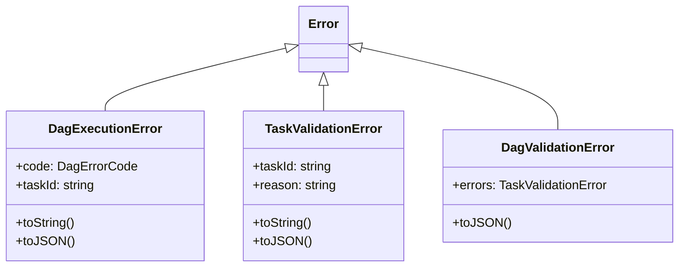

# dag-errors

## 概要

`dag-errors` モジュールのAPIリファレンス。

## エクスポート一覧

| 種別 | 名前 | 説明 |
|------|------|------|
| 関数 | `getDagErrorMessage` | エラーコードから適切なエラーメッセージを生成 |
| 関数 | `isDagError` | エラーがDAG関連エラーかどうかを判定 |
| 関数 | `isValidationError` | エラーが検証エラーかどうかを判定 |
| クラス | `DagExecutionError` | DAG実行エラー |
| クラス | `TaskValidationError` | タスク検証エラー |
| クラス | `DagValidationError` | DAG検証エラー（複数エラー集約用） |
| 型 | `DagErrorCode` | DAG実行エラーコード |

## 図解

### クラス図



## 関数

### getDagErrorMessage

```typescript
getDagErrorMessage(code: DagErrorCode, context?: Record<string, unknown>): string
```

エラーコードから適切なエラーメッセージを生成

**パラメータ**

| 名前 | 型 | 必須 |
|------|-----|------|
| code | `DagErrorCode` | はい |
| context | `Record<string, unknown>` | いいえ |

**戻り値**: `string`

### isDagError

```typescript
isDagError(error: unknown): error is DagExecutionError
```

エラーがDAG関連エラーかどうかを判定

**パラメータ**

| 名前 | 型 | 必須 |
|------|-----|------|
| error | `unknown` | はい |

**戻り値**: `error is DagExecutionError`

### isValidationError

```typescript
isValidationError(error: unknown): error is TaskValidationError
```

エラーが検証エラーかどうかを判定

**パラメータ**

| 名前 | 型 | 必須 |
|------|-----|------|
| error | `unknown` | はい |

**戻り値**: `error is TaskValidationError`

## クラス

### DagExecutionError

DAG実行エラー

**継承**: `Error`

**プロパティ**

| 名前 | 型 | 可視性 |
|------|-----|--------|
| code | `DagErrorCode` | public |
| taskId | `string` | public |

**メソッド**

| 名前 | シグネチャ |
|------|------------|
| toString | `toString(): string` |
| toJSON | `toJSON(): Record<string, unknown>` |

### TaskValidationError

タスク検証エラー

**継承**: `Error`

**プロパティ**

| 名前 | 型 | 可視性 |
|------|-----|--------|
| taskId | `string` | public |
| reason | `string` | public |

**メソッド**

| 名前 | シグネチャ |
|------|------------|
| toString | `toString(): string` |
| toJSON | `toJSON(): Record<string, unknown>` |

### DagValidationError

DAG検証エラー（複数エラー集約用）

**継承**: `Error`

**プロパティ**

| 名前 | 型 | 可視性 |
|------|-----|--------|
| errors | `TaskValidationError[]` | public |

**メソッド**

| 名前 | シグネチャ |
|------|------------|
| toJSON | `toJSON(): Record<string, unknown>` |

## 型定義

### DagErrorCode

```typescript
type DagErrorCode = | "CYCLE_DETECTED"
  | "VALIDATION_FAILED"
  | "TASK_FAILED"
  | "ABORTED"
  | "MISSING_DEPENDENCY"
  | "DUPLICATE_TASK_ID"
```

DAG実行エラーコード

---
*自動生成: 2026-02-24T17:08:02.644Z*
