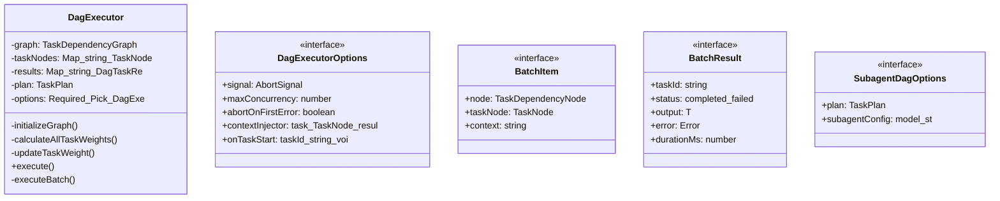
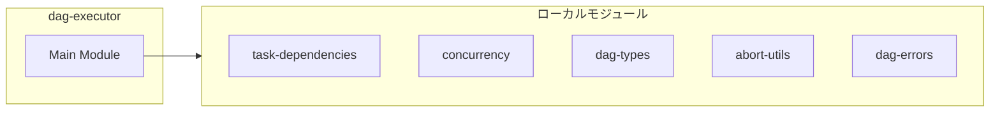
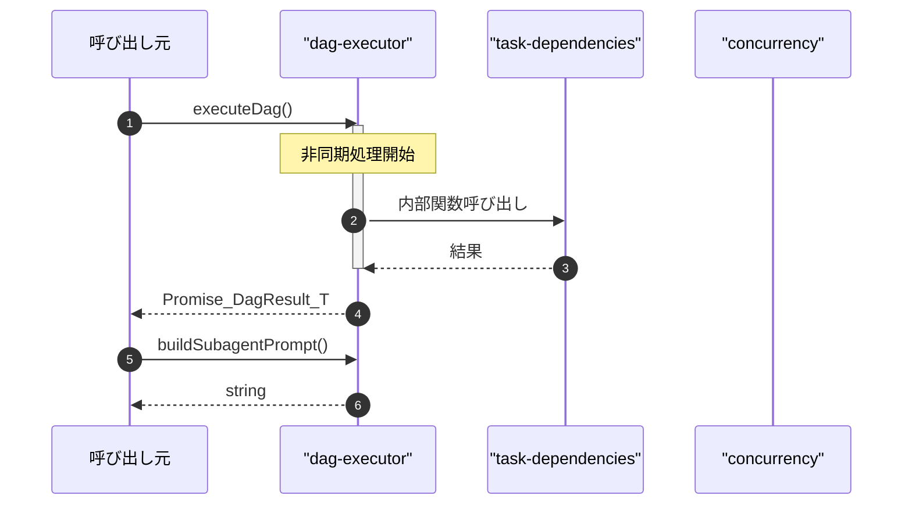

# dag-executor

## 概要

`dag-executor` モジュールのAPIリファレンス。

## インポート

```typescript
// from './task-dependencies.js': TaskDependencyGraph, TaskDependencyNode
// from './concurrency.js': runWithConcurrencyLimit, ConcurrencyRunOptions
// from './dag-types.js': TaskPlan, TaskNode, DagTaskResult, ...
// from './abort-utils.js': createChildAbortController
// from './dag-errors.js': DagExecutionError
// ... and 2 more imports
```

## エクスポート一覧

| 種別 | 名前 | 説明 |
|------|------|------|
| 関数 | `executeDag` | DAG実行の簡易関数 |
| 関数 | `buildSubagentPrompt` | サブエージェント向けの実行プロンプトを構築 |
| クラス | `DagExecutor` | DAG Executor - 依存関係解決付きタスク実行エンジン（DynTaskMAS統合版） |
| インターフェース | `DagExecutorOptions` | DAG実行のオプション |
| インターフェース | `SubagentDagOptions` | サブエージェント用のDAG実行オプション |
| 型 | `TaskExecutor` | タスク実行関数の型 |

## 図解

### クラス図



### 依存関係図



### シーケンス図



## 関数

### executeDag

```typescript
async executeDag(plan: TaskPlan, executor: TaskExecutor<T>, options: DagExecutorOptions): Promise<DagResult<T>>
```

DAG実行の簡易関数

**パラメータ**

| 名前 | 型 | 必須 |
|------|-----|------|
| plan | `TaskPlan` | はい |
| executor | `TaskExecutor<T>` | はい |
| options | `DagExecutorOptions` | はい |

**戻り値**: `Promise<DagResult<T>>`

### buildSubagentPrompt

```typescript
buildSubagentPrompt(task: TaskNode, context: string): string
```

サブエージェント向けの実行プロンプトを構築

**パラメータ**

| 名前 | 型 | 必須 |
|------|-----|------|
| task | `TaskNode` | はい |
| context | `string` | はい |

**戻り値**: `string`

## クラス

### DagExecutor

DAG Executor - 依存関係解決付きタスク実行エンジン（DynTaskMAS統合版）

**プロパティ**

| 名前 | 型 | 可視性 |
|------|-----|--------|
| graph | `TaskDependencyGraph` | private |
| taskNodes | `Map<string, TaskNode>` | private |
| results | `Map<string, DagTaskResult<T>>` | private |
| plan | `TaskPlan` | private |
| options | `Required<
    Pick<DagExecutorOptions, "maxConcurrency" | "abortOnFirstError" | "useWeightBasedScheduling">
  > &
    DagExecutorOptions` | private |
| startTime | `number` | private |
| scheduler | `PriorityScheduler | null` | private |
| taskWeights | `Map<string, number>` | private |

**メソッド**

| 名前 | シグネチャ |
|------|------------|
| initializeGraph | `initializeGraph(): void` |
| calculateAllTaskWeights | `calculateAllTaskWeights(): void` |
| updateTaskWeight | `updateTaskWeight(taskId, status): void` |
| execute | `execute(executor): Promise<DagResult<T>>` |
| executeBatch | `executeBatch(tasks, executor, signal): Promise<void>` |
| executeWithConcurrencyLimit | `executeWithConcurrencyLimit(items, executor, signal): Promise<BatchResult<T>[]>` |
| buildContext | `buildContext(task): string` |
| buildResult | `buildResult(): DagResult<T>` |
| getStats | `getStats(): {
    total: number;
    completed: number;
    failed: number;
    pending: number;
    running: number;
  }` |

## インターフェース

### DagExecutorOptions

```typescript
interface DagExecutorOptions {
  signal?: AbortSignal;
  maxConcurrency?: number;
  abortOnFirstError?: boolean;
  contextInjector?: (task: TaskNode, results: Map<string, DagTaskResult>) => string;
  onTaskStart?: (taskId: string) => void;
  onTaskComplete?: (taskId: string, result: DagTaskResult) => void;
  onTaskError?: (taskId: string, error: Error) => void;
  useWeightBasedScheduling?: boolean;
  weightConfig?: WeightConfig;
  schedulerConfig?: SchedulerConfig;
}
```

DAG実行のオプション

### BatchItem

```typescript
interface BatchItem {
  node: TaskDependencyNode;
  taskNode: TaskNode;
  context: string;
}
```

バッチ実行用の内部アイテム型

### BatchResult

```typescript
interface BatchResult {
  taskId: string;
  status: "completed" | "failed";
  output?: T;
  error?: Error;
  durationMs: number;
}
```

バッチ実行用の内部結果型

### SubagentDagOptions

```typescript
interface SubagentDagOptions {
  plan: TaskPlan;
  subagentConfig?: {
    /** 使用モデル */
    model?: string;
    /** 温度パラメータ */
    temperature?: number;
    /** 最大トークン数 */
    maxTokens?: number;
  };
}
```

サブエージェント用のDAG実行オプション

## 型定義

### TaskExecutor

```typescript
type TaskExecutor = (
  task: TaskNode,
  context: string,
  signal?: AbortSignal,
) => Promise<T>
```

タスク実行関数の型

---
*自動生成: 2026-02-24T17:08:02.645Z*
