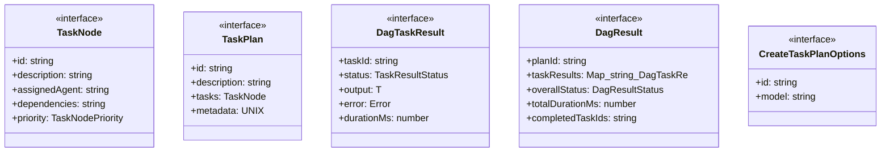

# dag-types

## 概要

`dag-types` モジュールのAPIリファレンス。

## エクスポート一覧

| 種別 | 名前 | 説明 |
|------|------|------|
| インターフェース | `TaskNode` | DAG内の個別タスクノード |
| インターフェース | `TaskPlan` | タスクの実行計画（DAG構造） |
| インターフェース | `DagTaskResult` | 個別タスクの実行結果 |
| インターフェース | `DagResult` | DAG全体の実行結果 |
| インターフェース | `CreateTaskPlanOptions` | タスクプランの作成オプション |
| 型 | `TaskNodePriority` | タスクの優先度 |
| 型 | `TaskResultStatus` | タスク実行結果のステータス |
| 型 | `DagResultStatus` | DAG全体の実行ステータス |
| 型 | `AgentType` | エージェントタイプの定義 |

## 図解

### クラス図



## インターフェース

### TaskNode

```typescript
interface TaskNode {
  id: string;
  description: string;
  assignedAgent?: string;
  dependencies: string[];
  priority?: TaskNodePriority;
  estimatedDurationMs?: number;
  inputContext?: string[];
}
```

DAG内の個別タスクノード

### TaskPlan

```typescript
interface TaskPlan {
  id: string;
  description: string;
  tasks: TaskNode[];
  metadata: {
    /** 作成日時（UNIXタイムスタンプ） */
    createdAt: number;
    /** 使用モデル名 */
    model: string;
    /** 推定総実行時間（ミリ秒） */
    totalEstimatedMs: number;
    /** DAGの最大深さ */
    maxDepth: number;
  };
}
```

タスクの実行計画（DAG構造）

### DagTaskResult

```typescript
interface DagTaskResult {
  taskId: string;
  status: TaskResultStatus;
  output?: T;
  error?: Error;
  durationMs: number;
}
```

個別タスクの実行結果

### DagResult

```typescript
interface DagResult {
  planId: string;
  taskResults: Map<string, DagTaskResult<T>>;
  overallStatus: DagResultStatus;
  totalDurationMs: number;
  completedTaskIds: string[];
  failedTaskIds: string[];
  skippedTaskIds: string[];
}
```

DAG全体の実行結果

### CreateTaskPlanOptions

```typescript
interface CreateTaskPlanOptions {
  id?: string;
  model?: string;
}
```

タスクプランの作成オプション

## 型定義

### TaskNodePriority

```typescript
type TaskNodePriority = "critical" | "high" | "normal" | "low"
```

タスクの優先度

### TaskResultStatus

```typescript
type TaskResultStatus = "completed" | "failed" | "skipped"
```

タスク実行結果のステータス

### DagResultStatus

```typescript
type DagResultStatus = "completed" | "partial" | "failed"
```

DAG全体の実行ステータス

### AgentType

```typescript
type AgentType = "researcher" | "implementer" | "reviewer" | "architect" | "tester"
```

エージェントタイプの定義

---
*自動生成: 2026-02-24T17:08:02.645Z*
