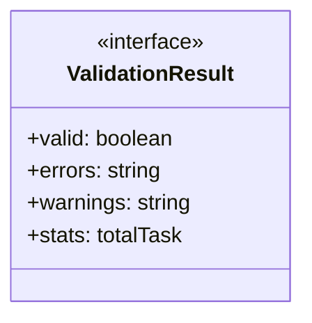
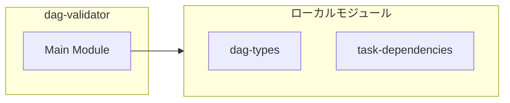
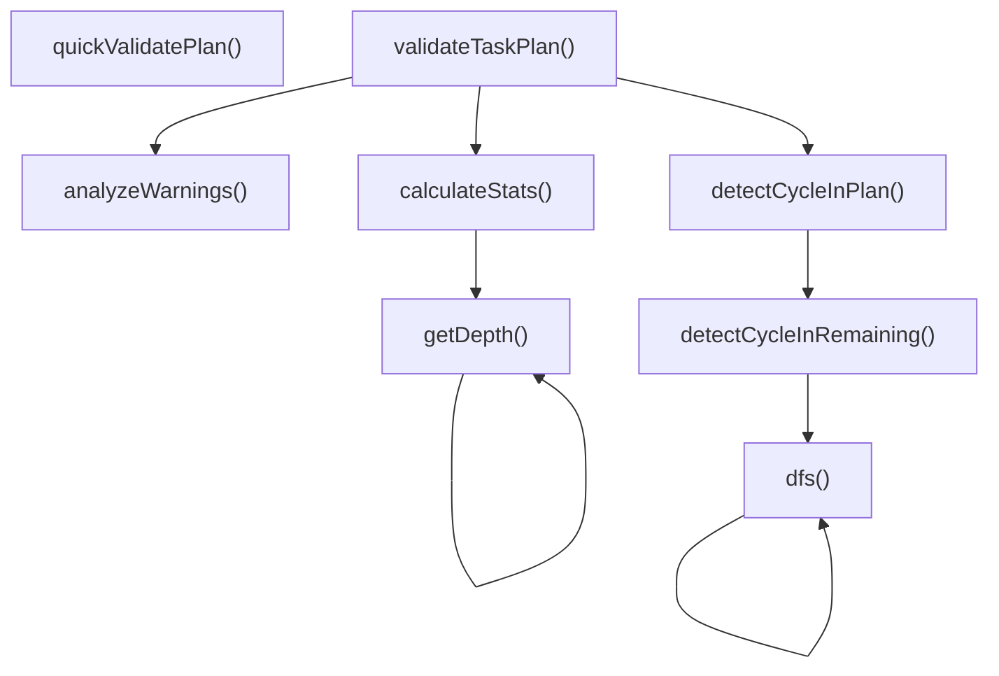
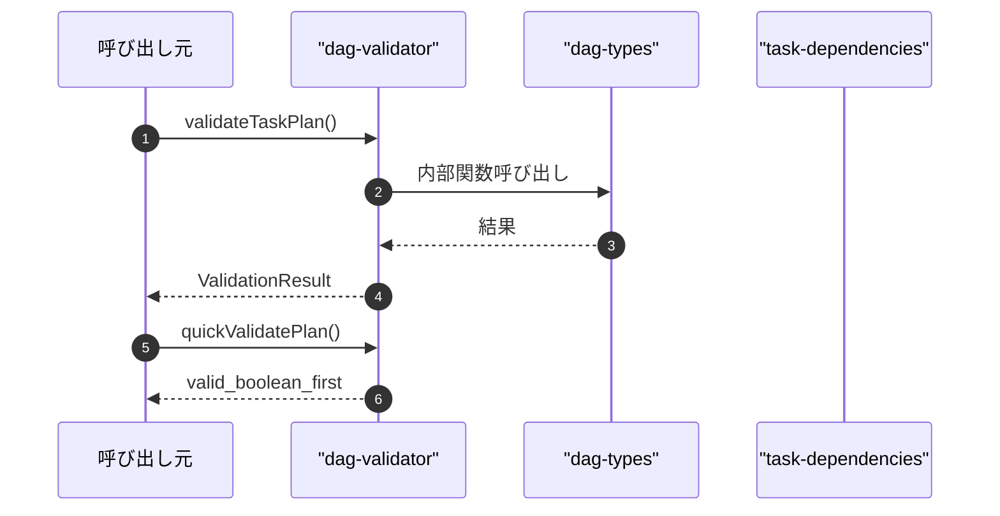

# dag-validator

## 概要

`dag-validator` モジュールのAPIリファレンス。

## インポート

```typescript
// from './dag-types.js': TaskPlan, TaskNode
// from './task-dependencies.js': TaskDependencyGraph
```

## エクスポート一覧

| 種別 | 名前 | 説明 |
|------|------|------|
| 関数 | `validateTaskPlan` | タスクプランを検証する |
| 関数 | `quickValidatePlan` | タスクプランの簡易検証（高速版） |
| インターフェース | `ValidationResult` | 検証結果 |

## 図解

### クラス図



### 依存関係図



### 関数フロー



### シーケンス図



## 関数

### validateTaskPlan

```typescript
validateTaskPlan(plan: TaskPlan): ValidationResult
```

タスクプランを検証する

**パラメータ**

| 名前 | 型 | 必須 |
|------|-----|------|
| plan | `TaskPlan` | はい |

**戻り値**: `ValidationResult`

### detectCycleInPlan

```typescript
detectCycleInPlan(plan: TaskPlan): { hasCycle: boolean; cyclePath: string[] | null }
```

タスクプラン内の循環を検出

**パラメータ**

| 名前 | 型 | 必須 |
|------|-----|------|
| plan | `TaskPlan` | はい |

**戻り値**: `{ hasCycle: boolean; cyclePath: string[] | null }`

### detectCycleInRemaining

```typescript
detectCycleInRemaining(tasks: TaskNode[]): string[] | null
```

残りのタスク内でサイクルを検出

**パラメータ**

| 名前 | 型 | 必須 |
|------|-----|------|
| tasks | `TaskNode[]` | はい |

**戻り値**: `string[] | null`

### dfs

```typescript
dfs(nodeId: string): string[] | null
```

**パラメータ**

| 名前 | 型 | 必須 |
|------|-----|------|
| nodeId | `string` | はい |

**戻り値**: `string[] | null`

### analyzeWarnings

```typescript
analyzeWarnings(plan: TaskPlan, warnings: string[]): void
```

警告を分析

**パラメータ**

| 名前 | 型 | 必須 |
|------|-----|------|
| plan | `TaskPlan` | はい |
| warnings | `string[]` | はい |

**戻り値**: `void`

### calculateStats

```typescript
calculateStats(plan: TaskPlan): ValidationResult["stats"]
```

統計情報を計算

**パラメータ**

| 名前 | 型 | 必須 |
|------|-----|------|
| plan | `TaskPlan` | はい |

**戻り値**: `ValidationResult["stats"]`

### getDepth

```typescript
getDepth(taskId: string, visited: Set<string>): number
```

**パラメータ**

| 名前 | 型 | 必須 |
|------|-----|------|
| taskId | `string` | はい |
| visited | `Set<string>` | はい |

**戻り値**: `number`

### quickValidatePlan

```typescript
quickValidatePlan(plan: TaskPlan): { valid: boolean; firstError?: string }
```

タスクプランの簡易検証（高速版）

**パラメータ**

| 名前 | 型 | 必須 |
|------|-----|------|
| plan | `TaskPlan` | はい |

**戻り値**: `{ valid: boolean; firstError?: string }`

## インターフェース

### ValidationResult

```typescript
interface ValidationResult {
  valid: boolean;
  errors: string[];
  warnings: string[];
  stats?: {
    /** タスク総数 */
    totalTasks: number;
    /** 並列実行可能なタスク数 */
    parallelizableTasks: number;
    /** 最大深さ */
    maxDepth: number;
  };
}
```

検証結果

---
*自動生成: 2026-02-24T17:08:02.647Z*
