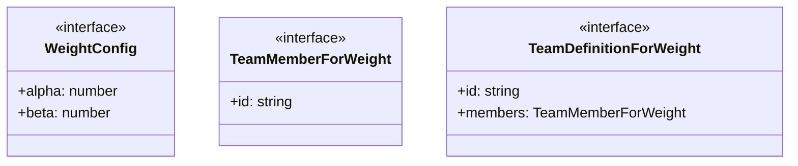
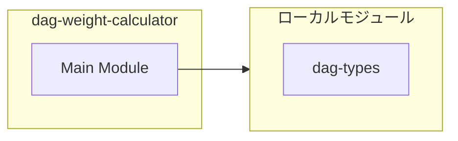
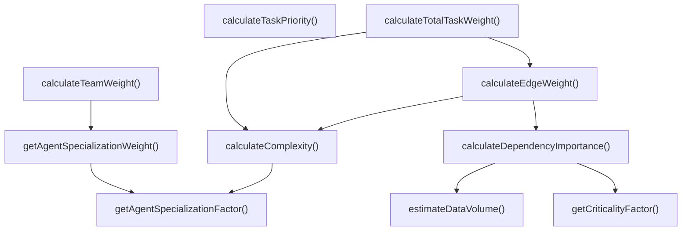
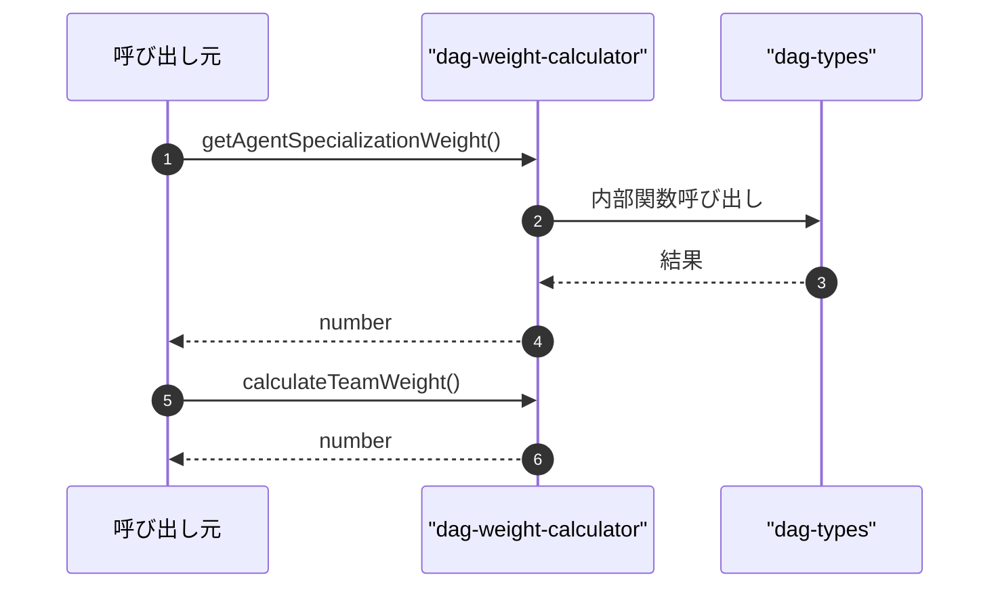

# dag-weight-calculator

## 概要

`dag-weight-calculator` モジュールのAPIリファレンス。

## インポート

```typescript
// from './dag-types.js': TaskNode, TaskNodePriority
```

## エクスポート一覧

| 種別 | 名前 | 説明 |
|------|------|------|
| 関数 | `getAgentSpecializationWeight` | エージェントの専門化重みを取得（公開API） |
| 関数 | `calculateTeamWeight` | チームの重みを計算（メンバー構成ベース） |
| 関数 | `calculateComplexity` | タスクの複雑性スコアを計算 |
| 関数 | `calculateDependencyImportance` | 依存関係の重要度スコアを計算 |
| 関数 | `calculateEdgeWeight` | エッジ重みを計算 |
| 関数 | `calculateTaskPriority` | タスク優先度を計算 |
| 関数 | `calculateTotalTaskWeight` | タスクの総合重みを計算 |
| インターフェース | `WeightConfig` | 重み計算の設定 |
| インターフェース | `TeamMemberForWeight` | チームメンバー定義の最小インターフェース |
| インターフェース | `TeamDefinitionForWeight` | チーム定義の最小インターフェース |

## 図解

### クラス図



### 依存関係図



### 関数フロー



### シーケンス図



## 関数

### getAgentSpecializationFactor

```typescript
getAgentSpecializationFactor(agentId: string | undefined): number
```

エージェントの専門化係数を取得（内部用）

**パラメータ**

| 名前 | 型 | 必須 |
|------|-----|------|
| agentId | `string | undefined` | はい |

**戻り値**: `number`

### getAgentSpecializationWeight

```typescript
getAgentSpecializationWeight(agentId: string): number
```

エージェントの専門化重みを取得（公開API）
DynTaskMAS統合用: subagent_run_parallelとagent_team_run_parallelで使用

**パラメータ**

| 名前 | 型 | 必須 |
|------|-----|------|
| agentId | `string` | はい |

**戻り値**: `number`

### calculateTeamWeight

```typescript
calculateTeamWeight(team: TeamDefinitionForWeight): number
```

チームの重みを計算（メンバー構成ベース）
メンバーの専門性の平均から算出
DynTaskMAS統合用: agent_team_run_parallelで使用

**パラメータ**

| 名前 | 型 | 必須 |
|------|-----|------|
| team | `TeamDefinitionForWeight` | はい |

**戻り値**: `number`

### estimateDataVolume

```typescript
estimateDataVolume(_source: TaskNode, _target: TaskNode): number
```

タスク間の推定データ転送量を計算

**パラメータ**

| 名前 | 型 | 必須 |
|------|-----|------|
| _source | `TaskNode` | はい |
| _target | `TaskNode` | はい |

**戻り値**: `number`

### calculateComplexity

```typescript
calculateComplexity(task: TaskNode): number
```

タスクの複雑性スコアを計算
C(v_j) = log(estimatedDurationMs / 1000) + agentSpecializationFactor

**パラメータ**

| 名前 | 型 | 必須 |
|------|-----|------|
| task | `TaskNode` | はい |

**戻り値**: `number`

### calculateDependencyImportance

```typescript
calculateDependencyImportance(source: TaskNode, target: TaskNode): number
```

依存関係の重要度スコアを計算
I(v_i, v_j) = dataVolumeFactor * criticalityFactor

**パラメータ**

| 名前 | 型 | 必須 |
|------|-----|------|
| source | `TaskNode` | はい |
| target | `TaskNode` | はい |

**戻り値**: `number`

### getCriticalityFactor

```typescript
getCriticalityFactor(priority: TaskNodePriority | undefined): number
```

優先度から重要度係数を取得

**パラメータ**

| 名前 | 型 | 必須 |
|------|-----|------|
| priority | `TaskNodePriority | undefined` | はい |

**戻り値**: `number`

### calculateEdgeWeight

```typescript
calculateEdgeWeight(source: TaskNode, target: TaskNode, config: WeightConfig): number
```

エッジ重みを計算
W(v_i, v_j) = α·C(v_j) + β·I(v_i, v_j)

**パラメータ**

| 名前 | 型 | 必須 |
|------|-----|------|
| source | `TaskNode` | はい |
| target | `TaskNode` | はい |
| config | `WeightConfig` | はい |

**戻り値**: `number`

### calculateTaskPriority

```typescript
calculateTaskPriority(task: TaskNode, criticalPathLength: number): number
```

タスク優先度を計算
P(v_i) = basePriority + criticalPathBonus - dependencyPenalty

**パラメータ**

| 名前 | 型 | 必須 |
|------|-----|------|
| task | `TaskNode` | はい |
| criticalPathLength | `number` | はい |

**戻り値**: `number`

### calculateTotalTaskWeight

```typescript
calculateTotalTaskWeight(task: TaskNode, allTasks: Map<string, TaskNode>, config: WeightConfig): number
```

タスクの総合重みを計算
すべての依存エッジの重みを合計

**パラメータ**

| 名前 | 型 | 必須 |
|------|-----|------|
| task | `TaskNode` | はい |
| allTasks | `Map<string, TaskNode>` | はい |
| config | `WeightConfig` | はい |

**戻り値**: `number`

## インターフェース

### WeightConfig

```typescript
interface WeightConfig {
  alpha: number;
  beta: number;
}
```

重み計算の設定

### TeamMemberForWeight

```typescript
interface TeamMemberForWeight {
  id: string;
}
```

チームメンバー定義の最小インターフェース
チーム重み計算に必要なプロパティのみを定義

### TeamDefinitionForWeight

```typescript
interface TeamDefinitionForWeight {
  id: string;
  members: TeamMemberForWeight[];
}
```

チーム定義の最小インターフェース
チーム重み計算に必要なプロパティのみを定義

---
*自動生成: 2026-02-24T17:08:02.648Z*
