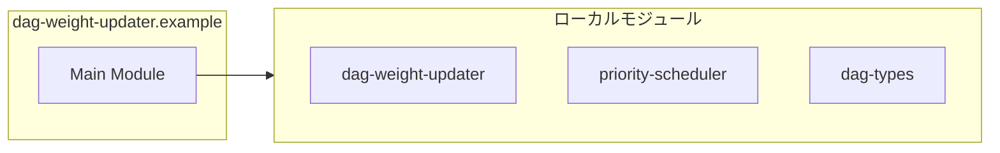

# dag-weight-updater.example

## 概要

`dag-weight-updater.example` モジュールのAPIリファレンス。

## インポート

```typescript
// from './dag-weight-updater.js': TaskGraphUpdater, createDelta
// from './priority-scheduler.js': PriorityScheduler
// from './dag-types.js': TaskNode
```

## エクスポート一覧

| 種別 | 名前 | 説明 |
|------|------|------|

## 図解

### 依存関係図



---
*自動生成: 2026-02-24T17:08:02.648Z*
