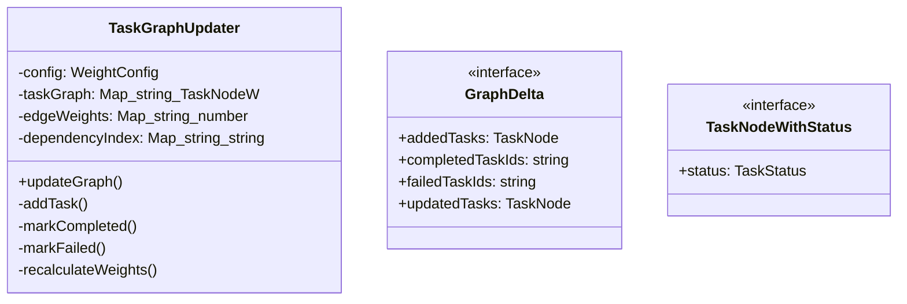
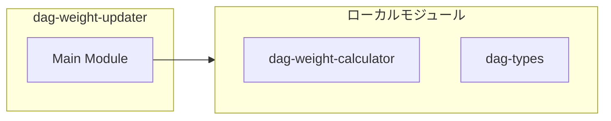

# dag-weight-updater

## 概要

`dag-weight-updater` モジュールのAPIリファレンス。

## インポート

```typescript
// from './dag-weight-calculator.js': calculateEdgeWeight, DEFAULT_WEIGHT_CONFIG, WeightConfig
// from './dag-types.js': TaskNode
```

## エクスポート一覧

| 種別 | 名前 | 説明 |
|------|------|------|
| 関数 | `createDelta` | GraphDeltaを作成するヘルパー関数 |
| クラス | `TaskGraphUpdater` | タスクグラフ更新器 |
| インターフェース | `GraphDelta` | タスクグラフの変更セット |
| 型 | `TaskStatus` | タスクの状態 |

## 図解

### クラス図



### 依存関係図



## 関数

### createDelta

```typescript
createDelta(partial: Partial<GraphDelta>): GraphDelta
```

GraphDeltaを作成するヘルパー関数

**パラメータ**

| 名前 | 型 | 必須 |
|------|-----|------|
| partial | `Partial<GraphDelta>` | はい |

**戻り値**: `GraphDelta`

## クラス

### TaskGraphUpdater

タスクグラフ更新器
DynTaskMAS論文のAlgorithm 1: UpdateTaskGraphを実装
G_{t+1} = U(G_t, Δ_t)

**プロパティ**

| 名前 | 型 | 可視性 |
|------|-----|--------|
| config | `WeightConfig` | private |
| taskGraph | `Map<string, TaskNodeWithStatus>` | private |
| edgeWeights | `Map<string, number>` | private |
| dependencyIndex | `Map<string, string[]>` | private |

**メソッド**

| 名前 | シグネチャ |
|------|------------|
| updateGraph | `updateGraph(delta): void` |
| addTask | `addTask(task): void` |
| markCompleted | `markCompleted(taskId): void` |
| markFailed | `markFailed(taskId): void` |
| recalculateWeights | `recalculateWeights(task): void` |
| getEdgeWeights | `getEdgeWeights(): Map<string, number>` |
| getTaskTotalWeight | `getTaskTotalWeight(taskId): number` |
| getAllTaskWeights | `getAllTaskWeights(): Map<string, number>` |
| getReadyTasks | `getReadyTasks(): TaskNode[]` |
| getTask | `getTask(taskId): TaskNode | undefined` |
| getTaskStatus | `getTaskStatus(taskId): TaskStatus | undefined` |
| getStats | `getStats(): {
    totalTasks: number;
    pendingTasks: number;
    runningTasks: number;
    completedTasks: number;
    failedTasks: number;
    totalEdges: number;
    avgWeight: number;
  }` |
| updateConfig | `updateConfig(config): void` |
| reset | `reset(): void` |

## インターフェース

### GraphDelta

```typescript
interface GraphDelta {
  addedTasks: TaskNode[];
  completedTaskIds: string[];
  failedTaskIds: string[];
  updatedTasks: TaskNode[];
}
```

タスクグラフの変更セット
DynTaskMAS論文のΔ_tに対応

### TaskNodeWithStatus

```typescript
interface TaskNodeWithStatus {
  status: TaskStatus;
}
```

拡張タスクノード（状態付き）

## 型定義

### TaskStatus

```typescript
type TaskStatus = "pending" | "running" | "completed" | "failed"
```

タスクの状態

---
*自動生成: 2026-02-24T17:08:02.649Z*
