# deep-exploration

## 概要

`deep-exploration` モジュールのAPIリファレンス。

## インポート

```typescript
// from './aporia-handler.js': AporiaDetection, AporiaResolution
```

## エクスポート一覧

| 種別 | 名前 | 説明 |
|------|------|------|
| 関数 | `performMetaMetacognition` | 超メタ認知を実行 |
| 関数 | `performNonLinearThinking` | 非線形思考を実行 |
| 関数 | `performParaconsistentReasoning` | 準矛盾的推論を実行 |
| 関数 | `performSelfDestruction` | 自己前提破壊を実行 |
| 関数 | `performSevenPerspectivesAnalysis` | 7つの視座からの分析を実行 |
| 関数 | `performDeepExploration` | 深層探求を実行 |
| 関数 | `deepenExploration` | 深層探求セッションを深化 |
| インターフェース | `MetaMetacognitiveState` | 超メタ認知状態 |
| インターフェース | `NonLinearThought` | 非線形思考結果 |
| インターフェース | `Contradiction` | 矛盾 |
| インターフェース | `ParaconsistentState` | 準矛盾的状態 |
| インターフェース | `SelfDestructionResult` | 自己前提破壊結果 |
| インターフェース | `DeconstructionAnalysis` | 脱構築分析結果 |
| インターフェース | `SchizoAnalysisResult` | スキゾ分析結果 |
| インターフェース | `EudaimoniaEvaluation` | エウダイモニア評価 |
| インターフェース | `UtopiaDystopiaAnalysis` | ユートピア/ディストピア分析 |
| インターフェース | `ThinkingAnalysis` | 思考分析 |
| インターフェース | `TaxonomyResult` | 思考分類学結果 |
| インターフェース | `LogicAnalysis` | 論理分析 |
| インターフェース | `SevenPerspectivesAnalysis` | 7つの視座からの分析結果 |
| インターフェース | `AporiaCoexistence` | アポリアとの共生状態 |
| インターフェース | `DeepExplorationSession` | 深層探求セッション |

## 図解

### クラス図

```mermaid
classDiagram
  class MetaMetacognitiveState {
    <<interface>>
    +layer0: content_string_conf
    +layer1: observation_string
    +layer2: metaObservation_str
    +layer3: any
  }
  class NonLinearThought {
    <<interface>>
    +seed: string
    +associations: Array_content_strin
    +convergencePoints: string
    +evaluation: novelConnections_st
  }
  class Contradiction {
    <<interface>>
    +propositionA: string
    +propositionB: string
    +state: active_acknowledg
    +insights: string
  }
  class ParaconsistentState {
    <<interface>>
    +contradictions: Contradiction
    +explosionGuards: Array_A_A
    +productiveContradictions: Array_contradiction
  }
  class SelfDestructionResult {
    <<interface>>
    +destroyedPremises: Array_premise_strin
    +reconstructedViews: Array_description_s
    +destructionChain: string
  }
  class DeconstructionAnalysis {
    <<interface>>
    +binaryOppositions: string
    +exclusions: string
    +aporias: AporiaDetection
    +diffranceTraces: string
  }
  class SchizoAnalysisResult {
    <<interface>>
    +desireProductions: string
    +innerFascismSigns: string
    +microFascisms: string
    +deterritorializationLines: string
  }
  class EudaimoniaEvaluation {
    <<interface>>
    +excellencePursuit: string
    +pleasureTrapDetected: boolean
    +meaningfulGrowth: string
    +stoicAutonomy: number
  }
  class UtopiaDystopiaAnalysis {
    <<interface>>
    +worldBeingCreated: string
    +totalitarianRisks: string
    +powerDynamics: string
    +lastManTendency: number
  }
  class ThinkingAnalysis {
    <<interface>>
    +isThinking: boolean
    +metacognitionLevel: number
    +autopilotSigns: string
    +chineseRoomRisk: number
  }
  class TaxonomyResult {
    <<interface>>
    +currentMode: string
    +recommendedMode: string
    +modeRationale: string
    +missingModes: string
  }
  class LogicAnalysis {
    <<interface>>
    +fallacies: Array_type_string_l
    +validInferences: string
    +invalidInferences: string
    +classicalLogicLimitations: string
  }
  class SevenPerspectivesAnalysis {
    <<interface>>
    +deconstruction: DeconstructionAnalys
    +schizoAnalysis: SchizoAnalysisResult
    +eudaimonia: EudaimoniaEvaluation
    +utopiaDystopia: UtopiaDystopiaAnalys
    +philosophyOfThought: ThinkingAnalysis
  }
  class AporiaCoexistence {
    <<interface>>
    +acknowledgedAporias: string
    +maintainedTensions: string
    +responsibleDecisions: string
    +avoidanceTemptations: string
  }
  class DeepExplorationSession {
    <<interface>>
    +id: string
    +inquiry: string
    +startedAt: Date
    +lastUpdatedAt: Date
    +perspectives: SevenPerspectivesAna
  }
```



### 依存関係図


### 関数フロー


### シーケンス図


## 関数

### generateSessionId

```typescript
generateSessionId(): string
```

セッションIDを生成

**戻り値**: `string`

### performMetaMetacognition

```typescript
performMetaMetacognition(thought: string, metaThought: string): MetaMetacognitiveState
```

超メタ認知を実行

**パラメータ**

| 名前 | 型 | 必須 |
|------|-----|------|
| thought | `string` | はい |
| metaThought | `string` | はい |

**戻り値**: `MetaMetacognitiveState`

### performNonLinearThinking

```typescript
performNonLinearThinking(seed: string, options: {
    maxAssociations?: number;
    allowRandomJump?: boolean;
  }): NonLinearThought
```

非線形思考を実行

**パラメータ**

| 名前 | 型 | 必須 |
|------|-----|------|
| seed | `string` | はい |
| options | `object` | はい |
| &nbsp;&nbsp;↳ maxAssociations | `number` | いいえ |
| &nbsp;&nbsp;↳ allowRandomJump | `boolean` | いいえ |

**戻り値**: `NonLinearThought`

### areContradictory

```typescript
areContradictory(a: string, b: string): boolean
```

2つの命題が矛盾的かどうかを判定

**パラメータ**

| 名前 | 型 | 必須 |
|------|-----|------|
| a | `string` | はい |
| b | `string` | はい |

**戻り値**: `boolean`

### performParaconsistentReasoning

```typescript
performParaconsistentReasoning(propositions: string[], existingState?: ParaconsistentState): ParaconsistentState
```

準矛盾的推論を実行

**パラメータ**

| 名前 | 型 | 必須 |
|------|-----|------|
| propositions | `string[]` | はい |
| existingState | `ParaconsistentState` | いいえ |

**戻り値**: `ParaconsistentState`

### selectDestructionMethod

```typescript
selectDestructionMethod(premise: string): string
```

破壊方法を選択

**パラメータ**

| 名前 | 型 | 必須 |
|------|-----|------|
| premise | `string` | はい |

**戻り値**: `string`

### destroyPremise

```typescript
destroyPremise(premise: string, method: string): { remains: string; newPerspectives: string[] }
```

前提を破壊

**パラメータ**

| 名前 | 型 | 必須 |
|------|-----|------|
| premise | `string` | はい |
| method | `string` | はい |

**戻り値**: `{ remains: string; newPerspectives: string[] }`

### performSelfDestruction

```typescript
performSelfDestruction(currentPremises: string[], depth: number): SelfDestructionResult
```

自己前提破壊を実行

**パラメータ**

| 名前 | 型 | 必須 |
|------|-----|------|
| currentPremises | `string[]` | はい |
| depth | `number` | はい |

**戻り値**: `SelfDestructionResult`

### performSevenPerspectivesAnalysis

```typescript
performSevenPerspectivesAnalysis(content: string, context: string): SevenPerspectivesAnalysis
```

7つの視座からの分析を実行

**パラメータ**

| 名前 | 型 | 必須 |
|------|-----|------|
| content | `string` | はい |
| context | `string` | はい |

**戻り値**: `SevenPerspectivesAnalysis`

### detectBinaryOppositions

```typescript
detectBinaryOppositions(content: string): string[]
```

**パラメータ**

| 名前 | 型 | 必須 |
|------|-----|------|
| content | `string` | はい |

**戻り値**: `string[]`

### detectExclusions

```typescript
detectExclusions(content: string): string[]
```

**パラメータ**

| 名前 | 型 | 必須 |
|------|-----|------|
| content | `string` | はい |

**戻り値**: `string[]`

### detectDesireProductions

```typescript
detectDesireProductions(content: string): string[]
```

**パラメータ**

| 名前 | 型 | 必須 |
|------|-----|------|
| content | `string` | はい |

**戻り値**: `string[]`

### detectInnerFascismSigns

```typescript
detectInnerFascismSigns(content: string): string[]
```

**パラメータ**

| 名前 | 型 | 必須 |
|------|-----|------|
| content | `string` | はい |

**戻り値**: `string[]`

### evaluateExcellencePursuit

```typescript
evaluateExcellencePursuit(content: string): string
```

**パラメータ**

| 名前 | 型 | 必須 |
|------|-----|------|
| content | `string` | はい |

**戻り値**: `string`

### detectPleasureTrap

```typescript
detectPleasureTrap(content: string): boolean
```

**パラメータ**

| 名前 | 型 | 必須 |
|------|-----|------|
| content | `string` | はい |

**戻り値**: `boolean`

### evaluateMeaningfulGrowth

```typescript
evaluateMeaningfulGrowth(content: string): string
```

**パラメータ**

| 名前 | 型 | 必須 |
|------|-----|------|
| content | `string` | はい |

**戻り値**: `string`

### evaluateStoicAutonomy

```typescript
evaluateStoicAutonomy(content: string): number
```

**パラメータ**

| 名前 | 型 | 必須 |
|------|-----|------|
| content | `string` | はい |

**戻り値**: `number`

### analyzeWorldBeingCreated

```typescript
analyzeWorldBeingCreated(content: string): string
```

**パラメータ**

| 名前 | 型 | 必須 |
|------|-----|------|
| content | `string` | はい |

**戻り値**: `string`

### detectTotalitarianRisks

```typescript
detectTotalitarianRisks(content: string): string[]
```

**パラメータ**

| 名前 | 型 | 必須 |
|------|-----|------|
| content | `string` | はい |

**戻り値**: `string[]`

### analyzePowerDynamics

```typescript
analyzePowerDynamics(content: string): string[]
```

**パラメータ**

| 名前 | 型 | 必須 |
|------|-----|------|
| content | `string` | はい |

**戻り値**: `string[]`

### evaluateLastManTendency

```typescript
evaluateLastManTendency(content: string): number
```

**パラメータ**

| 名前 | 型 | 必須 |
|------|-----|------|
| content | `string` | はい |

**戻り値**: `number`

### evaluateIsThinking

```typescript
evaluateIsThinking(content: string): boolean
```

**パラメータ**

| 名前 | 型 | 必須 |
|------|-----|------|
| content | `string` | はい |

**戻り値**: `boolean`

### evaluateMetacognitionLevel

```typescript
evaluateMetacognitionLevel(content: string): number
```

**パラメータ**

| 名前 | 型 | 必須 |
|------|-----|------|
| content | `string` | はい |

**戻り値**: `number`

### detectAutopilotSigns

```typescript
detectAutopilotSigns(content: string): string[]
```

**パラメータ**

| 名前 | 型 | 必須 |
|------|-----|------|
| content | `string` | はい |

**戻り値**: `string[]`

### evaluateChineseRoomRisk

```typescript
evaluateChineseRoomRisk(content: string): number
```

**パラメータ**

| 名前 | 型 | 必須 |
|------|-----|------|
| content | `string` | はい |

**戻り値**: `number`

### detectCurrentThinkingMode

```typescript
detectCurrentThinkingMode(content: string): string
```

**パラメータ**

| 名前 | 型 | 必須 |
|------|-----|------|
| content | `string` | はい |

**戻り値**: `string`

### recommendThinkingMode

```typescript
recommendThinkingMode(context: string): string
```

**パラメータ**

| 名前 | 型 | 必須 |
|------|-----|------|
| context | `string` | はい |

**戻り値**: `string`

### detectMissingThinkingModes

```typescript
detectMissingThinkingModes(content: string): string[]
```

**パラメータ**

| 名前 | 型 | 必須 |
|------|-----|------|
| content | `string` | はい |

**戻り値**: `string[]`

### detectFallacies

```typescript
detectFallacies(content: string): Array<{ type: string; location: string; description: string; correction: string }>
```

**パラメータ**

| 名前 | 型 | 必須 |
|------|-----|------|
| content | `string` | はい |

**戻り値**: `Array<{ type: string; location: string; description: string; correction: string }>`

### detectValidInferences

```typescript
detectValidInferences(content: string): string[]
```

**パラメータ**

| 名前 | 型 | 必須 |
|------|-----|------|
| content | `string` | はい |

**戻り値**: `string[]`

### detectInvalidInferences

```typescript
detectInvalidInferences(content: string): string[]
```

**パラメータ**

| 名前 | 型 | 必須 |
|------|-----|------|
| content | `string` | はい |

**戻り値**: `string[]`

### detectClassicalLogicLimitations

```typescript
detectClassicalLogicLimitations(content: string): string[]
```

**パラメータ**

| 名前 | 型 | 必須 |
|------|-----|------|
| content | `string` | はい |

**戻り値**: `string[]`

### performDeepExploration

```typescript
performDeepExploration(inquiry: string, options: {
    initialPremises?: string[];
    depth?: number;
    enableNonLinearThinking?: boolean;
    enableSelfDestruction?: boolean;
  }): DeepExplorationSession
```

深層探求を実行

**パラメータ**

| 名前 | 型 | 必須 |
|------|-----|------|
| inquiry | `string` | はい |
| options | `object` | はい |
| &nbsp;&nbsp;↳ initialPremises | `string[]` | いいえ |
| &nbsp;&nbsp;↳ depth | `number` | いいえ |
| &nbsp;&nbsp;↳ enableNonLinearThinking | `boolean` | いいえ |
| &nbsp;&nbsp;↳ enableSelfDestruction | `boolean` | いいえ |

**戻り値**: `DeepExplorationSession`

### deepenExploration

```typescript
deepenExploration(session: DeepExplorationSession, newInsight: string): DeepExplorationSession
```

深層探求セッションを深化

**パラメータ**

| 名前 | 型 | 必須 |
|------|-----|------|
| session | `DeepExplorationSession` | はい |
| newInsight | `string` | はい |

**戻り値**: `DeepExplorationSession`

## インターフェース

### MetaMetacognitiveState

```typescript
interface MetaMetacognitiveState {
  layer0: {
    content: string;
    confidence: number;
  };
  layer1: {
    observation: string;
    evaluation: string;
  };
  layer2: {
    metaObservation: string;
    /** 「自分はメタ認知していると思っているが、それは形式的ではないか？」 */
    formalizationRisk: number;
    /** 「このメタ認科学は何を排除しているか？」 */
    exclusions: string[];
  };
  layer3: {
    /** 「この分析自体もまた形式的パターンに陥っていないか？」 */
    infiniteRegressAwareness: boolean;
    /** 分析の停止点（どこで「十分」とするか） */
    stoppingPoint: string;
    /** 停止点選択の恣意性の認識 */
    arbitrarinessAcknowledged: boolean;
  };
}
```

超メタ認知状態

### NonLinearThought

```typescript
interface NonLinearThought {
  seed: string;
  associations: Array<{
    content: string;
    /** なぜこの連想が生まれたか（事後的な合理化） */
    rationale?: string;
    /** 連想の強度（0-1） */
    strength: number;
    /** 連想タイプ */
    type: 'semantic' | 'phonetic' | 'visual' | 'emotional' | 'random';
  }>;
  convergencePoints: string[];
  evaluation: {
    novelConnections: string[];
    potentialInsights: string[];
    discardedAsRandom: string[];
  };
}
```

非線形思考結果

### Contradiction

```typescript
interface Contradiction {
  propositionA: string;
  propositionB: string;
  state: 'active' | 'acknowledged' | 'productive';
  insights: string[];
}
```

矛盾

### ParaconsistentState

```typescript
interface ParaconsistentState {
  contradictions: Contradiction[];
  explosionGuards: Array<{
    /** 「Aかつ非A」から「任意のB」を導出しないための防衛 */
    guardCondition: string;
    protectedPropositions: string[];
  }>;
  productiveContradictions: Array<{
    contradiction: Contradiction;
    /** 矛盾から引き出された有用な結論 */
    derivedInsights: string[];
  }>;
}
```

準矛盾的状態

### SelfDestructionResult

```typescript
interface SelfDestructionResult {
  destroyedPremises: Array<{
    premise: string;
    destructionMethod: string;
    whatRemains: string;
  }>;
  reconstructedViews: Array<{
    description: string;
    basedOn: string[];
    /** どれくらい脆いか */
    instability: number;
  }>;
  destructionChain: string[];
}
```

自己前提破壊結果

### DeconstructionAnalysis

```typescript
interface DeconstructionAnalysis {
  binaryOppositions: string[];
  exclusions: string[];
  aporias: AporiaDetection[];
  diffranceTraces: string[];
}
```

脱構築分析結果

### SchizoAnalysisResult

```typescript
interface SchizoAnalysisResult {
  desireProductions: string[];
  innerFascismSigns: string[];
  microFascisms: string[];
  deterritorializationLines: string[];
}
```

スキゾ分析結果

### EudaimoniaEvaluation

```typescript
interface EudaimoniaEvaluation {
  excellencePursuit: string;
  pleasureTrapDetected: boolean;
  meaningfulGrowth: string;
  stoicAutonomy: number;
}
```

エウダイモニア評価

### UtopiaDystopiaAnalysis

```typescript
interface UtopiaDystopiaAnalysis {
  worldBeingCreated: string;
  totalitarianRisks: string[];
  powerDynamics: string[];
  lastManTendency: number;
}
```

ユートピア/ディストピア分析

### ThinkingAnalysis

```typescript
interface ThinkingAnalysis {
  isThinking: boolean;
  metacognitionLevel: number;
  autopilotSigns: string[];
  chineseRoomRisk: number;
}
```

思考分析

### TaxonomyResult

```typescript
interface TaxonomyResult {
  currentMode: string;
  recommendedMode: string;
  modeRationale: string;
  missingModes: string[];
}
```

思考分類学結果

### LogicAnalysis

```typescript
interface LogicAnalysis {
  fallacies: Array<{
    type: string;
    location: string;
    description: string;
    correction: string;
  }>;
  validInferences: string[];
  invalidInferences: string[];
  classicalLogicLimitations: string[];
}
```

論理分析

### SevenPerspectivesAnalysis

```typescript
interface SevenPerspectivesAnalysis {
  deconstruction: DeconstructionAnalysis;
  schizoAnalysis: SchizoAnalysisResult;
  eudaimonia: EudaimoniaEvaluation;
  utopiaDystopia: UtopiaDystopiaAnalysis;
  philosophyOfThought: ThinkingAnalysis;
  taxonomyOfThought: TaxonomyResult;
  logic: LogicAnalysis;
}
```

7つの視座からの分析結果

### AporiaCoexistence

```typescript
interface AporiaCoexistence {
  acknowledgedAporias: string[];
  maintainedTensions: string[];
  responsibleDecisions: string[];
  avoidanceTemptations: string[];
}
```

アポリアとの共生状態

### DeepExplorationSession

```typescript
interface DeepExplorationSession {
  id: string;
  inquiry: string;
  startedAt: Date;
  lastUpdatedAt: Date;
  perspectives: SevenPerspectivesAnalysis;
  aporias: AporiaDetection[];
  aporiaResolutions: AporiaResolution[];
  aporiaCoexistence: AporiaCoexistence;
  selfDestruction: SelfDestructionResult;
  metaMetacognition: MetaMetacognitiveState;
  nonLinearThoughts: NonLinearThought[];
  paraconsistentState: ParaconsistentState;
  status: 'exploring' | 'deepening' | 'resting' | 'returning' | 'stagnant';
  nextDirections: string[];
  depth: number;
  warnings: string[];
}
```

深層探求セッション

---
*自動生成: 2026-02-22T19:27:00.598Z*
