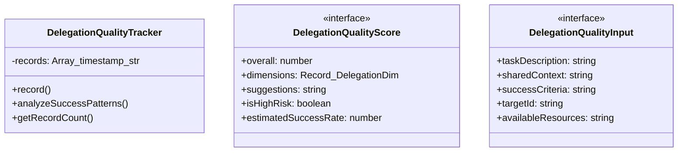
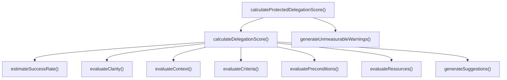

# delegation-quality

## 概要

`delegation-quality` モジュールのAPIリファレンス。

## エクスポート一覧

| 種別 | 名前 | 説明 |
|------|------|------|
| 関数 | `calculateDelegationScore` | 委任品質スコアを計算 |
| 関数 | `generateUnmeasurableWarnings` | 測定不可能な価値の保護警告を生成 |
| 関数 | `calculateProtectedDelegationScore` | 委任品質スコアを「保護的」に計算 |
| クラス | `DelegationQualityTracker` | 委任品質トラッカー |
| インターフェース | `DelegationQualityScore` | 委任品質スコアの詳細 |
| インターフェース | `DelegationQualityInput` | 委任品質評価の入力 |
| 型 | `DelegationDimension` | 委任品質の5つの次元 |

## 図解

### クラス図



### 関数フロー



## 関数

### calculateDelegationScore

```typescript
calculateDelegationScore(input: DelegationQualityInput): DelegationQualityScore
```

委任品質スコアを計算

**パラメータ**

| 名前 | 型 | 必須 |
|------|-----|------|
| input | `DelegationQualityInput` | はい |

**戻り値**: `DelegationQualityScore`

### evaluateClarity

```typescript
evaluateClarity(taskDescription: string): number
```

タスクの明確性を評価

**パラメータ**

| 名前 | 型 | 必須 |
|------|-----|------|
| taskDescription | `string` | はい |

**戻り値**: `number`

### evaluateContext

```typescript
evaluateContext(sharedContext?: string): number
```

コンテキストの充足性を評価

**パラメータ**

| 名前 | 型 | 必須 |
|------|-----|------|
| sharedContext | `string` | いいえ |

**戻り値**: `number`

### evaluatePreconditions

```typescript
evaluatePreconditions(availableResources?: string[]): number
```

前提条件の充足を評価

**パラメータ**

| 名前 | 型 | 必須 |
|------|-----|------|
| availableResources | `string[]` | いいえ |

**戻り値**: `number`

### evaluateCriteria

```typescript
evaluateCriteria(successCriteria?: string[]): number
```

成功基準の明確さを評価

**パラメータ**

| 名前 | 型 | 必須 |
|------|-----|------|
| successCriteria | `string[]` | いいえ |

**戻り値**: `number`

### evaluateResources

```typescript
evaluateResources(targetId: string, availableResources?: string[]): number
```

リソースの可用性を評価

**パラメータ**

| 名前 | 型 | 必須 |
|------|-----|------|
| targetId | `string` | はい |
| availableResources | `string[]` | いいえ |

**戻り値**: `number`

### generateSuggestions

```typescript
generateSuggestions(dimensions: Record<DelegationDimension, number>): string[]
```

改善提案を生成

**パラメータ**

| 名前 | 型 | 必須 |
|------|-----|------|
| dimensions | `Record<DelegationDimension, number>` | はい |

**戻り値**: `string[]`

### generateUnmeasurableWarnings

```typescript
generateUnmeasurableWarnings(overall: number): string[]
```

測定不可能な価値の保護警告を生成

**パラメータ**

| 名前 | 型 | 必須 |
|------|-----|------|
| overall | `number` | はい |

**戻り値**: `string[]`

### calculateProtectedDelegationScore

```typescript
calculateProtectedDelegationScore(input: DelegationQualityInput): DelegationQualityScore & { unmeasurableWarnings: string[] }
```

委任品質スコアを「保護的」に計算

**パラメータ**

| 名前 | 型 | 必須 |
|------|-----|------|
| input | `DelegationQualityInput` | はい |

**戻り値**: `DelegationQualityScore & { unmeasurableWarnings: string[] }`

### estimateSuccessRate

```typescript
estimateSuccessRate(overall: number, dimensions: Record<DelegationDimension, number>): number
```

推定成功率を計算

**パラメータ**

| 名前 | 型 | 必須 |
|------|-----|------|
| overall | `number` | はい |
| dimensions | `Record<DelegationDimension, number>` | はい |

**戻り値**: `number`

## クラス

### DelegationQualityTracker

委任品質トラッカー
過去の委任結果を記録し、パターンを学習する

**プロパティ**

| 名前 | 型 | 可視性 |
|------|-----|--------|
| records | `Array<{
    timestamp: string;
    input: DelegationQualityInput;
    score: DelegationQualityScore;
    actualOutcome: "success" | "partial" | "failure";
  }>` | private |

**メソッド**

| 名前 | シグネチャ |
|------|------------|
| record | `record(input, score, outcome): void` |
| analyzeSuccessPatterns | `analyzeSuccessPatterns(): {
    avgClarity: number;
    avgContext: number;
    commonCharacteristics: string[];
  }` |
| getRecordCount | `getRecordCount(): number` |

## インターフェース

### DelegationQualityScore

```typescript
interface DelegationQualityScore {
  overall: number;
  dimensions: Record<DelegationDimension, number>;
  suggestions: string[];
  isHighRisk: boolean;
  estimatedSuccessRate: number;
}
```

委任品質スコアの詳細

### DelegationQualityInput

```typescript
interface DelegationQualityInput {
  taskDescription: string;
  sharedContext?: string;
  successCriteria?: string[];
  targetId: string;
  availableResources?: string[];
}
```

委任品質評価の入力

## 型定義

### DelegationDimension

```typescript
type DelegationDimension = | "clarity"       // タスクの明確性
  | "context"       // コンテキストの充足性
  | "preconditions" // 前提条件の充足
  | "criteria"      // 成功基準の明確さ
  | "resources"
```

委任品質の5つの次元

---
*自動生成: 2026-02-24T17:08:02.655Z*
