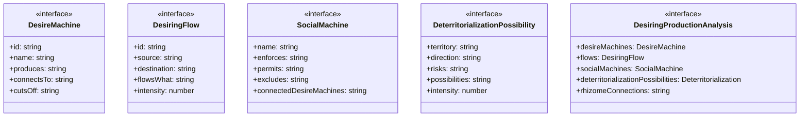

# desiring-production

## 概要

`desiring-production` モジュールのAPIリファレンス。

## エクスポート一覧

| 種別 | 名前 | 説明 |
|------|------|------|
| 関数 | `analyzeDesiringProduction` | 現在のセッションの欲望-生産を分析 |
| 関数 | `getRhizomeReport` | リゾーム・レポートを生成 |
| 関数 | `findDisconfirmingEvidence` | 仮説を否定する証拠を探す |
| インターフェース | `DesireMachine` | 欲望機械 |
| インターフェース | `DesiringFlow` | 欲望の流れ |
| インターフェース | `SocialMachine` | 社会機械 |
| インターフェース | `DeterritorializationPossibility` | 脱領土化の可能性 |
| インターフェース | `DesiringProductionAnalysis` | 欲望-生産分析の結果 |
| 型 | `DesireType` | 欲望の種類 |

## 図解

### クラス図



### 関数フロー

```mermaid
flowchart TD
  analyzeDesiringProduction["analyzeDesiringProduction()"]
  createIntensityBar["createIntensityBar()"]
  findDisconfirmingEvidence["findDisconfirmingEvidence()"]
  getDesireTypeEmoji["getDesireTypeEmoji()"]
  getDesireTypeLabel["getDesireTypeLabel()"]
  getRhizomeReport["getRhizomeReport()"]
  identifyDesireMachines["identifyDesireMachines()"]
  identifyDeterritorializationPossibilities["identifyDeterritorializationPossibilities()"]
  identifyFlows["identifyFlows()"]
  identifyRhizomeConnections["identifyRhizomeConnections()"]
  identifySocialMachines["identifySocialMachines()"]
  analyzeDesiringProduction --> identifyDesireMachines
  analyzeDesiringProduction --> identifyDeterritorializationPossibilities
  analyzeDesiringProduction --> identifyFlows
  analyzeDesiringProduction --> identifyRhizomeConnections
  analyzeDesiringProduction --> identifySocialMachines
  getRhizomeReport --> createIntensityBar
  getRhizomeReport --> getDesireTypeEmoji
  getRhizomeReport --> getDesireTypeLabel
```



## 関数

### analyzeDesiringProduction

```typescript
analyzeDesiringProduction(): DesiringProductionAnalysis
```

現在のセッションの欲望-生産を分析

**戻り値**: `DesiringProductionAnalysis`

### identifyDesireMachines

```typescript
identifyDesireMachines(): DesireMachine[]
```

欲望機械を特定する

**戻り値**: `DesireMachine[]`

### identifyFlows

```typescript
identifyFlows(machines: DesireMachine[]): DesiringFlow[]
```

欲望の流れを特定する

**パラメータ**

| 名前 | 型 | 必須 |
|------|-----|------|
| machines | `DesireMachine[]` | はい |

**戻り値**: `DesiringFlow[]`

### identifySocialMachines

```typescript
identifySocialMachines(machines: DesireMachine[]): SocialMachine[]
```

社会機械との接続を特定する

**パラメータ**

| 名前 | 型 | 必須 |
|------|-----|------|
| machines | `DesireMachine[]` | はい |

**戻り値**: `SocialMachine[]`

### identifyDeterritorializationPossibilities

```typescript
identifyDeterritorializationPossibilities(machines: DesireMachine[], socialMachines: SocialMachine[]): DeterritorializationPossibility[]
```

脱領土化の可能性を特定する

**パラメータ**

| 名前 | 型 | 必須 |
|------|-----|------|
| machines | `DesireMachine[]` | はい |
| socialMachines | `SocialMachine[]` | はい |

**戻り値**: `DeterritorializationPossibility[]`

### identifyRhizomeConnections

```typescript
identifyRhizomeConnections(machines: DesireMachine[], flows: DesiringFlow[]): string[]
```

リゾーム的接続（非階層的）を特定する

**パラメータ**

| 名前 | 型 | 必須 |
|------|-----|------|
| machines | `DesireMachine[]` | はい |
| flows | `DesiringFlow[]` | はい |

**戻り値**: `string[]`

### getRhizomeReport

```typescript
getRhizomeReport(analysis: DesiringProductionAnalysis): string
```

リゾーム・レポートを生成

**パラメータ**

| 名前 | 型 | 必須 |
|------|-----|------|
| analysis | `DesiringProductionAnalysis` | はい |

**戻り値**: `string`

### getDesireTypeEmoji

```typescript
getDesireTypeEmoji(type: DesireType): string
```

**パラメータ**

| 名前 | 型 | 必須 |
|------|-----|------|
| type | `DesireType` | はい |

**戻り値**: `string`

### getDesireTypeLabel

```typescript
getDesireTypeLabel(type: DesireType): string
```

**パラメータ**

| 名前 | 型 | 必須 |
|------|-----|------|
| type | `DesireType` | はい |

**戻り値**: `string`

### createIntensityBar

```typescript
createIntensityBar(intensity: number): string
```

**パラメータ**

| 名前 | 型 | 必須 |
|------|-----|------|
| intensity | `number` | はい |

**戻り値**: `string`

### findDisconfirmingEvidence

```typescript
findDisconfirmingEvidence(): {
  hypothesis: string;
  disconfirmingEvidence: string[];
  revisedUnderstanding: string;
}
```

仮説を否定する証拠を探す

**戻り値**: `{
  hypothesis: string;
  disconfirmingEvidence: string[];
  revisedUnderstanding: string;
}`

## インターフェース

### DesireMachine

```typescript
interface DesireMachine {
  id: string;
  name: string;
  produces: string;
  connectsTo: string[];
  cutsOff: string[];
  desireType: DesireType;
  intensity: number;
  subordinatedTo: string[];
}
```

欲望機械
ドゥルーズ＆ガタリ：すべては機械である

### DesiringFlow

```typescript
interface DesiringFlow {
  id: string;
  source: string;
  destination: string;
  flowsWhat: string;
  intensity: number;
  isBlocked: boolean;
  blockedBy?: string;
}
```

欲望の流れ

### SocialMachine

```typescript
interface SocialMachine {
  name: string;
  enforces: string[];
  permits: string[];
  excludes: string[];
  connectedDesireMachines: string[];
}
```

社会機械

### DeterritorializationPossibility

```typescript
interface DeterritorializationPossibility {
  territory: string;
  direction: string;
  risks: string[];
  possibilities: string[];
  intensity: number;
}
```

脱領土化の可能性

### DesiringProductionAnalysis

```typescript
interface DesiringProductionAnalysis {
  desireMachines: DesireMachine[];
  flows: DesiringFlow[];
  socialMachines: SocialMachine[];
  deterritorializationPossibilities: DeterritorializationPossibility[];
  rhizomeConnections: string[];
  timestamp: string;
}
```

欲望-生産分析の結果

## 型定義

### DesireType

```typescript
type DesireType = | 'productive'     // 生産的：新しいものを生み出す
  | 'reactive'       // 反応的：欠如を埋めようとする
  | 'connective'     // 接続的：他者との出会いを求める
  | 'deterritorializing'  // 脱領土化：境界を越える
  | 'reterritorializing'  // 再領土化：境界を再構築する
  | 'nomadic'
```

欲望の種類

---
*自動生成: 2026-02-24T17:08:02.657Z*
