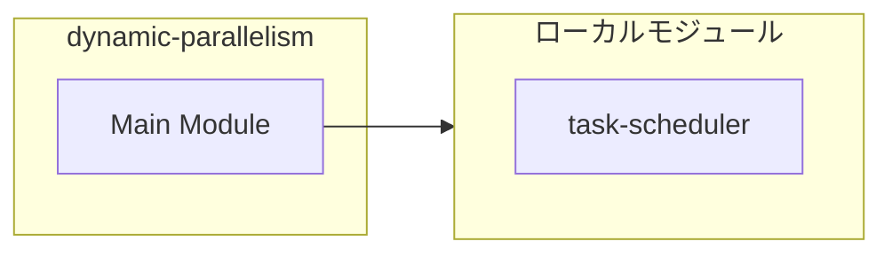
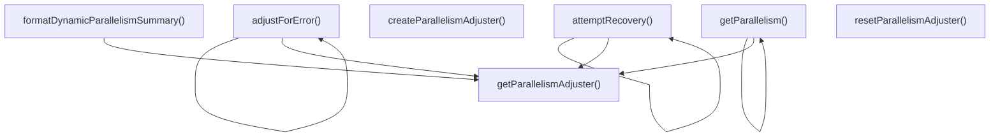
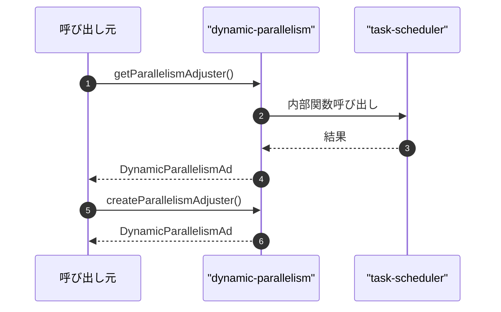

# dynamic-parallelism

## 概要

`dynamic-parallelism` モジュールのAPIリファレンス。

## インポート

```typescript
// from './task-scheduler': QueueStats
```

## エクスポート一覧

| 種別 | 名前 | 説明 |
|------|------|------|
| 関数 | `getParallelismAdjuster` | 並列度調整器を取得 |
| 関数 | `createParallelismAdjuster` | 並列度調整器を生成 |
| 関数 | `resetParallelismAdjuster` | 並列度調整器リセット |
| 関数 | `getParallelism` | 現在の並列度取得 |
| 関数 | `adjustForError` | エラー時並列度調整 |
| 関数 | `attemptRecovery` | 復旧を試行する |
| 関数 | `formatDynamicParallelismSummary` | 並列度概要を整形 |
| クラス | `DynamicParallelismAdjuster` | 動的並列度調整器 |
| インターフェース | `ParallelismConfig` | 動的並列度設定 |
| インターフェース | `ProviderHealth` | プロバイダー健全性 |
| インターフェース | `DynamicAdjusterConfig` | 動的調整設定 |
| インターフェース | `ErrorEvent` | エラーイベント |

## 図解

### クラス図


### 依存関係図



### 関数フロー



### シーケンス図



## 関数

### handler

```typescript
handler(e: Event): void
```

**パラメータ**

| 名前 | 型 | 必須 |
|------|-----|------|
| e | `Event` | はい |

**戻り値**: `void`

### getParallelismAdjuster

```typescript
getParallelismAdjuster(): DynamicParallelismAdjuster
```

並列度調整器を取得

**戻り値**: `DynamicParallelismAdjuster`

### createParallelismAdjuster

```typescript
createParallelismAdjuster(config: Partial<DynamicAdjusterConfig>): DynamicParallelismAdjuster
```

並列度調整器を生成

**パラメータ**

| 名前 | 型 | 必須 |
|------|-----|------|
| config | `Partial<DynamicAdjusterConfig>` | はい |

**戻り値**: `DynamicParallelismAdjuster`

### resetParallelismAdjuster

```typescript
resetParallelismAdjuster(): void
```

並列度調整器リセット

**戻り値**: `void`

### getParallelism

```typescript
getParallelism(provider: string, model: string): number
```

現在の並列度取得

**パラメータ**

| 名前 | 型 | 必須 |
|------|-----|------|
| provider | `string` | はい |
| model | `string` | はい |

**戻り値**: `number`

### adjustForError

```typescript
adjustForError(provider: string, model: string, errorType: "429" | "timeout" | "error"): void
```

エラー時並列度調整

**パラメータ**

| 名前 | 型 | 必須 |
|------|-----|------|
| provider | `string` | はい |
| model | `string` | はい |
| errorType | `"429" | "timeout" | "error"` | はい |

**戻り値**: `void`

### attemptRecovery

```typescript
attemptRecovery(provider: string, model: string): void
```

復旧を試行する

**パラメータ**

| 名前 | 型 | 必須 |
|------|-----|------|
| provider | `string` | はい |
| model | `string` | はい |

**戻り値**: `void`

### formatDynamicParallelismSummary

```typescript
formatDynamicParallelismSummary(): string
```

並列度概要を整形

**戻り値**: `string`

## クラス

### DynamicParallelismAdjuster

動的並列度調整器

**プロパティ**

| 名前 | 型 | 可視性 |
|------|-----|--------|
| states | `Map<string, ProviderModelState>` | private |
| config | `DynamicAdjusterConfig` | private |
| recoveryTimer | `ReturnType<typeof setInterval> | null` | private |
| eventTarget | `EventTarget` | private |

**メソッド**

| 名前 | シグネチャ |
|------|------------|
| getParallelism | `getParallelism(provider, model): number` |
| getConfig | `getConfig(provider, model): ParallelismConfig` |
| adjustForError | `adjustForError(provider, model, errorType): void` |
| attemptRecovery | `attemptRecovery(provider, model): void` |
| applyCrossInstanceLimits | `applyCrossInstanceLimits(provider, model, instanceCount): void` |
| getHealth | `getHealth(provider, model): ProviderHealth` |
| recordSuccess | `recordSuccess(provider, model, responseMs): void` |
| requestStarted | `requestStarted(provider, model): void` |
| requestCompleted | `requestCompleted(provider, model): void` |
| getAllStates | `getAllStates(): Map<string, { config: ParallelismConfig; health: ProviderHealth }>` |
| reset | `reset(provider, model): void` |
| resetAll | `resetAll(): void` |
| onParallelismChange | `onParallelismChange(callback): () => void` |
| shutdown | `shutdown(): void` |
| buildKey | `buildKey(provider, model): string` |
| getOrCreateState | `getOrCreateState(key): ProviderModelState` |
| pruneErrors | `pruneErrors(state): void` |
| updateHealth | `updateHealth(state): void` |
| startRecoveryTimer | `startRecoveryTimer(): void` |
| processAutomaticRecovery | `processAutomaticRecovery(): void` |
| dispatchEvent | `dispatchEvent(type, detail): void` |
| log | `log(level, message): void` |

## インターフェース

### ParallelismConfig

```typescript
interface ParallelismConfig {
  baseParallelism: number;
  currentParallelism: number;
  minParallelism: number;
  maxParallelism: number;
  adjustmentReason: string;
  lastAdjustedAt: number;
}
```

動的並列度設定

### ProviderHealth

```typescript
interface ProviderHealth {
  healthy: boolean;
  activeRequests: number;
  recent429Count: number;
  avgResponseMs: number;
  recommendedBackoffMs: number;
}
```

プロバイダー健全性

### ProviderModelState

```typescript
interface ProviderModelState {
  config: ParallelismConfig;
  health: ProviderHealth;
  activeRequests: number;
  recentErrors: Array<{ type: "429" | "timeout" | "error"; timestamp: number }>;
  responseTimes: number[];
  crossInstanceMultiplier: number;
}
```

Internal state for a provider/model combination.

### DynamicAdjusterConfig

```typescript
interface DynamicAdjusterConfig {
  minParallelism: number;
  baseParallelism: number;
  maxParallelism: number;
  reductionOn429: number;
  reductionOnTimeout: number;
  increaseOnRecovery: number;
  recoveryIntervalMs: number;
  errorWindowMs: number;
  maxErrorHistory: number;
  maxResponseSamples: number;
}
```

動的調整設定

### ErrorEvent

```typescript
interface ErrorEvent {
  provider: string;
  model: string;
  type: "429" | "timeout" | "error";
  timestamp: number;
  details?: string;
}
```

エラーイベント

---
*自動生成: 2026-02-24T17:08:02.659Z*
