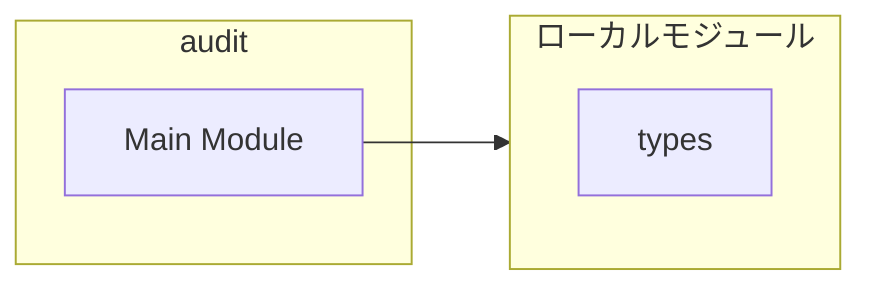
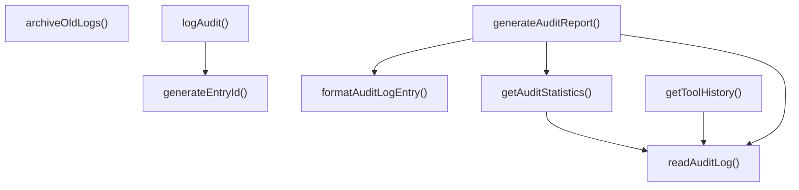
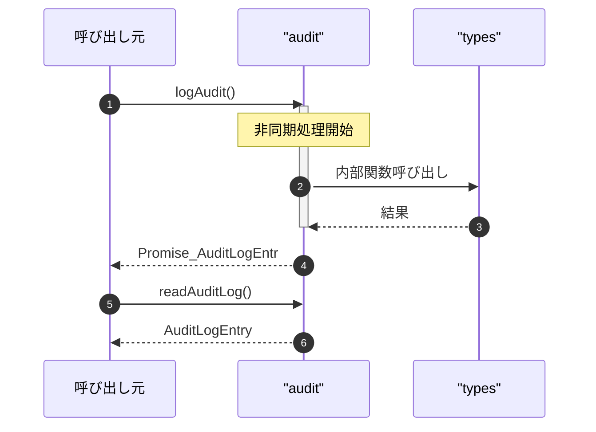

# audit

## 概要

`audit` モジュールのAPIリファレンス。

## インポート

```typescript
// from 'node:fs': appendFileSync, existsSync, mkdirSync, ...
// from 'node:path': join, dirname
// from 'node:crypto': createHash
// from './types.js': AuditLogEntry, AuditAction, DynamicToolsPaths, ...
```

## エクスポート一覧

| 種別 | 名前 | 説明 |
|------|------|------|
| 関数 | `logAudit` | 監査ログを非同期で記録する |
| 関数 | `readAuditLog` | ログ読込 |
| 関数 | `getToolHistory` | 履歴取得 |
| 関数 | `getAuditStatistics` | 監査統計を取得 |
| 関数 | `formatAuditLogEntry` | 監査ログをフォーマット |
| 関数 | `generateAuditReport` | 監査ログレポートを生成 |
| 関数 | `archiveOldLogs` | 古いログをアーカイブ |

## 図解

### 依存関係図



### 関数フロー



### シーケンス図



## 関数

### generateEntryId

```typescript
generateEntryId(): string
```

エントリIDを生成

**戻り値**: `string`

### logAudit

```typescript
async logAudit(entry: {
    action: AuditAction;
    toolId?: string;
    toolName?: string;
    actor: string;
    details: Record<string, unknown>;
    success: boolean;
    errorMessage?: string;
  }, paths?: DynamicToolsPaths): Promise<AuditLogEntry>
```

監査ログを非同期で記録する

**パラメータ**

| 名前 | 型 | 必須 |
|------|-----|------|
| entry | `object` | はい |
| &nbsp;&nbsp;↳ action | `AuditAction` | はい |
| &nbsp;&nbsp;↳ toolId | `string` | いいえ |
| &nbsp;&nbsp;↳ toolName | `string` | いいえ |
| &nbsp;&nbsp;↳ actor | `string` | はい |
| &nbsp;&nbsp;↳ details | `Record<string, unknown>` | はい |
| &nbsp;&nbsp;↳ success | `boolean` | はい |
| &nbsp;&nbsp;↳ errorMessage | `string` | いいえ |
| paths | `DynamicToolsPaths` | いいえ |

**戻り値**: `Promise<AuditLogEntry>`

### readAuditLog

```typescript
readAuditLog(options?: {
    limit?: number;
    toolId?: string;
    action?: AuditAction;
    since?: Date;
  }, paths?: DynamicToolsPaths): AuditLogEntry[]
```

ログ読込

**パラメータ**

| 名前 | 型 | 必須 |
|------|-----|------|
| options | `object` | いいえ |
| &nbsp;&nbsp;↳ limit | `number` | いいえ |
| &nbsp;&nbsp;↳ toolId | `string` | いいえ |
| &nbsp;&nbsp;↳ action | `AuditAction` | いいえ |
| &nbsp;&nbsp;↳ since | `Date` | いいえ |
| paths | `DynamicToolsPaths` | いいえ |

**戻り値**: `AuditLogEntry[]`

### getToolHistory

```typescript
getToolHistory(toolId: string, paths?: DynamicToolsPaths): AuditLogEntry[]
```

履歴取得

**パラメータ**

| 名前 | 型 | 必須 |
|------|-----|------|
| toolId | `string` | はい |
| paths | `DynamicToolsPaths` | いいえ |

**戻り値**: `AuditLogEntry[]`

### getAuditStatistics

```typescript
getAuditStatistics(since: Date, paths?: DynamicToolsPaths): {
  totalActions: number;
  successfulActions: number;
  failedActions: number;
  actionsByType: Record<AuditAction, number>;
  topTools: Array<{ toolId: string; toolName: string; count: number }>;
}
```

監査統計を取得

**パラメータ**

| 名前 | 型 | 必須 |
|------|-----|------|
| since | `Date` | はい |
| paths | `DynamicToolsPaths` | いいえ |

**戻り値**: `{
  totalActions: number;
  successfulActions: number;
  failedActions: number;
  actionsByType: Record<AuditAction, number>;
  topTools: Array<{ toolId: string; toolName: string; count: number }>;
}`

### formatAuditLogEntry

```typescript
formatAuditLogEntry(entry: AuditLogEntry): string
```

監査ログをフォーマット

**パラメータ**

| 名前 | 型 | 必須 |
|------|-----|------|
| entry | `AuditLogEntry` | はい |

**戻り値**: `string`

### generateAuditReport

```typescript
generateAuditReport(since: Date, paths?: DynamicToolsPaths): string
```

監査ログレポートを生成

**パラメータ**

| 名前 | 型 | 必須 |
|------|-----|------|
| since | `Date` | はい |
| paths | `DynamicToolsPaths` | いいえ |

**戻り値**: `string`

### archiveOldLogs

```typescript
archiveOldLogs(daysToKeep: number, paths?: DynamicToolsPaths): { archived: number; error?: string }
```

古いログをアーカイブ

**パラメータ**

| 名前 | 型 | 必須 |
|------|-----|------|
| daysToKeep | `number` | はい |
| paths | `DynamicToolsPaths` | いいえ |

**戻り値**: `{ archived: number; error?: string }`

---
*自動生成: 2026-02-18T18:06:17.513Z*
