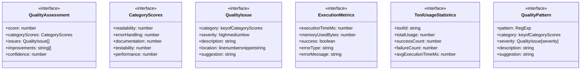

# quality

## 概要

`quality` モジュールのAPIリファレンス。

## エクスポート一覧

| 種別 | 名前 | 説明 |
|------|------|------|
| 関数 | `assessCodeQuality` | コードの品質を評価 |
| 関数 | `recordExecutionMetrics` | 実行メトリクスを記録 |
| 関数 | `getUsageStatistics` | 使用統計を取得 |
| 関数 | `getAllUsageStatistics` | 全ツールの使用統計を取得 |
| 関数 | `resetUsageStatistics` | 使用統計をリセット（テスト用） |
| 関数 | `recordQualityScore` | 品質スコアをトレンドに追加 |
| 関数 | `analyzeQualityTrend` | 品質トレンドの傾向を分析 |
| インターフェース | `QualityAssessment` | 品質評価結果 |
| インターフェース | `CategoryScores` | カテゴリ別スコア |
| インターフェース | `QualityIssue` | 品質問題 |
| インターフェース | `ExecutionMetrics` | 実行メトリクス |
| インターフェース | `ToolUsageStatistics` | ツール使用統計 |

## 図解

### クラス図



### 関数フロー


## 関数

### assessCodeQuality

```typescript
assessCodeQuality(code: string): QualityAssessment
```

コードの品質を評価

**パラメータ**

| 名前 | 型 | 必須 |
|------|-----|------|
| code | `string` | はい |

**戻り値**: `QualityAssessment`

### findLineNumber

```typescript
findLineNumber(lines: string[], index: number): number
```

行番号を検索

**パラメータ**

| 名前 | 型 | 必須 |
|------|-----|------|
| lines | `string[]` | はい |
| index | `number` | はい |

**戻り値**: `number`

### extractFunctionLengths

```typescript
extractFunctionLengths(code: string): Array<{ name: string; length: number; startLine: number }>
```

関数の長さを抽出

**パラメータ**

| 名前 | 型 | 必須 |
|------|-----|------|
| code | `string` | はい |

**戻り値**: `Array<{ name: string; length: number; startLine: number }>`

### generateImprovements

```typescript
generateImprovements(scores: CategoryScores, issues: QualityIssue[]): string[]
```

改善提案を生成

**パラメータ**

| 名前 | 型 | 必須 |
|------|-----|------|
| scores | `CategoryScores` | はい |
| issues | `QualityIssue[]` | はい |

**戻り値**: `string[]`

### calculateConfidence

```typescript
calculateConfidence(code: string, issueCount: number): number
```

信頼度を計算

**パラメータ**

| 名前 | 型 | 必須 |
|------|-----|------|
| code | `string` | はい |
| issueCount | `number` | はい |

**戻り値**: `number`

### recordExecutionMetrics

```typescript
recordExecutionMetrics(toolId: string, metrics: ExecutionMetrics): void
```

実行メトリクスを記録

**パラメータ**

| 名前 | 型 | 必須 |
|------|-----|------|
| toolId | `string` | はい |
| metrics | `ExecutionMetrics` | はい |

**戻り値**: `void`

### getUsageStatistics

```typescript
getUsageStatistics(toolId: string): ToolUsageStatistics | undefined
```

使用統計を取得

**パラメータ**

| 名前 | 型 | 必須 |
|------|-----|------|
| toolId | `string` | はい |

**戻り値**: `ToolUsageStatistics | undefined`

### getAllUsageStatistics

```typescript
getAllUsageStatistics(): ToolUsageStatistics[]
```

全ツールの使用統計を取得

**戻り値**: `ToolUsageStatistics[]`

### resetUsageStatistics

```typescript
resetUsageStatistics(): void
```

使用統計をリセット（テスト用）

**戻り値**: `void`

### recordQualityScore

```typescript
recordQualityScore(toolId: string, score: number): void
```

品質スコアをトレンドに追加

**パラメータ**

| 名前 | 型 | 必須 |
|------|-----|------|
| toolId | `string` | はい |
| score | `number` | はい |

**戻り値**: `void`

### analyzeQualityTrend

```typescript
analyzeQualityTrend(toolId: string): {
  trend: "improving" | "declining" | "stable";
  avgRecentScore: number;
  changeRate: number;
}
```

品質トレンドの傾向を分析

**パラメータ**

| 名前 | 型 | 必須 |
|------|-----|------|
| toolId | `string` | はい |

**戻り値**: `{
  trend: "improving" | "declining" | "stable";
  avgRecentScore: number;
  changeRate: number;
}`

## インターフェース

### QualityAssessment

```typescript
interface QualityAssessment {
  score: number;
  categoryScores: CategoryScores;
  issues: QualityIssue[];
  improvements: string[];
  confidence: number;
}
```

品質評価結果

### CategoryScores

```typescript
interface CategoryScores {
  readability: number;
  errorHandling: number;
  documentation: number;
  testability: number;
  performance: number;
  securityAwareness: number;
}
```

カテゴリ別スコア

### QualityIssue

```typescript
interface QualityIssue {
  category: keyof CategoryScores;
  severity: "high" | "medium" | "low";
  description: string;
  location?: {
    line?: number;
    snippet?: string;
  };
  suggestion: string;
}
```

品質問題

### ExecutionMetrics

```typescript
interface ExecutionMetrics {
  executionTimeMs: number;
  memoryUsedBytes?: number;
  success: boolean;
  errorType?: string;
  errorMessage?: string;
  inputParameters?: Record<string, unknown>;
  outputSizeBytes?: number;
}
```

実行メトリクス

### ToolUsageStatistics

```typescript
interface ToolUsageStatistics {
  toolId: string;
  totalUsage: number;
  successCount: number;
  failureCount: number;
  avgExecutionTimeMs: number;
  maxExecutionTimeMs: number;
  minExecutionTimeMs: number;
  avgMemoryBytes?: number;
  successRate: number;
  errorBreakdown: Record<string, number>;
  recentExecutions: ExecutionMetrics[];
  qualityTrend: number[];
}
```

ツール使用統計

### QualityPattern

```typescript
interface QualityPattern {
  pattern: RegExp;
  category: keyof CategoryScores;
  severity: QualityIssue["severity"];
  description: string;
  suggestion: string;
  isPositive: boolean;
}
```

品質パターンの定義

---
*自動生成: 2026-02-17T21:48:27.693Z*
