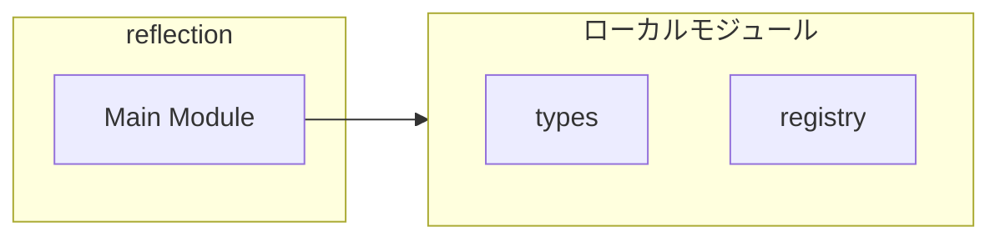
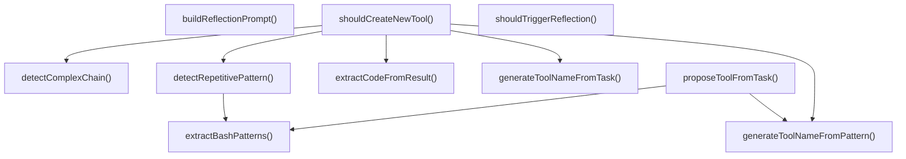
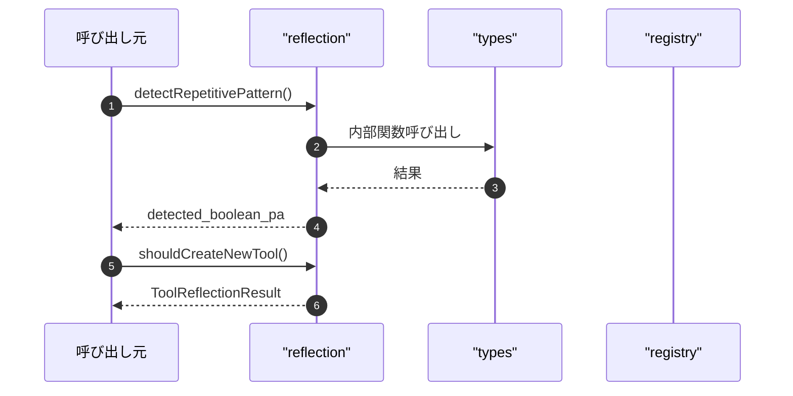

# reflection

## 概要

`reflection` モジュールのAPIリファレンス。

## インポート

```typescript
// from './types.js': ToolReflectionResult, ToolReflectionContext, DynamicToolMode, ...
// from './registry.js': loadAllToolDefinitions, recommendToolsForTask
```

## エクスポート一覧

| 種別 | 名前 | 説明 |
|------|------|------|
| 関数 | `detectRepetitivePattern` | - |
| 関数 | `shouldCreateNewTool` | - |
| 関数 | `buildReflectionPrompt` | - |
| 関数 | `proposeToolFromTask` | - |
| 関数 | `shouldTriggerReflection` | - |

## 図解

### 依存関係図



### 関数フロー



### シーケンス図



## 関数

### detectRepetitivePattern

```typescript
detectRepetitivePattern(context: ToolReflectionContext): { detected: boolean; pattern: string; occurrences: number } | null
```

**パラメータ**

| 名前 | 型 | 必須 |
|------|-----|------|
| context | `ToolReflectionContext` | はい |

**戻り値**: `{ detected: boolean; pattern: string; occurrences: number } | null`

### extractBashPatterns

```typescript
extractBashPatterns(output: string): string[]
```

Bashコマンドパターンを抽出

**パラメータ**

| 名前 | 型 | 必須 |
|------|-----|------|
| output | `string` | はい |

**戻り値**: `string[]`

### shouldCreateNewTool

```typescript
shouldCreateNewTool(context: ToolReflectionContext): ToolReflectionResult
```

**パラメータ**

| 名前 | 型 | 必須 |
|------|-----|------|
| context | `ToolReflectionContext` | はい |

**戻り値**: `ToolReflectionResult`

### generateToolNameFromPattern

```typescript
generateToolNameFromPattern(pattern: string): string
```

パターンからツール名を生成

**パラメータ**

| 名前 | 型 | 必須 |
|------|-----|------|
| pattern | `string` | はい |

**戻り値**: `string`

### generateToolNameFromTask

```typescript
generateToolNameFromTask(task: string): string
```

タスクからツール名を生成

**パラメータ**

| 名前 | 型 | 必須 |
|------|-----|------|
| task | `string` | はい |

**戻り値**: `string`

### extractCodeFromResult

```typescript
extractCodeFromResult(result: string): string
```

実行結果からコードを抽出

**パラメータ**

| 名前 | 型 | 必須 |
|------|-----|------|
| result | `string` | はい |

**戻り値**: `string`

### detectComplexChain

```typescript
detectComplexChain(result: string): boolean
```

複雑な操作チェーンを検出

**パラメータ**

| 名前 | 型 | 必須 |
|------|-----|------|
| result | `string` | はい |

**戻り値**: `boolean`

### buildReflectionPrompt

```typescript
buildReflectionPrompt(context: ToolReflectionContext, reflectionResult: ToolReflectionResult): string
```

**パラメータ**

| 名前 | 型 | 必須 |
|------|-----|------|
| context | `ToolReflectionContext` | はい |
| reflectionResult | `ToolReflectionResult` | はい |

**戻り値**: `string`

### proposeToolFromTask

```typescript
proposeToolFromTask(task: string, lastToolResult?: string): ToolReflectionResult["proposedTool"] | null
```

**パラメータ**

| 名前 | 型 | 必須 |
|------|-----|------|
| task | `string` | はい |
| lastToolResult | `string` | いいえ |

**戻り値**: `ToolReflectionResult["proposedTool"] | null`

### shouldTriggerReflection

```typescript
shouldTriggerReflection(context: Partial<ToolReflectionContext>): boolean
```

**パラメータ**

| 名前 | 型 | 必須 |
|------|-----|------|
| context | `Partial<ToolReflectionContext>` | はい |

**戻り値**: `boolean`

---
*自動生成: 2026-02-18T18:06:17.517Z*
