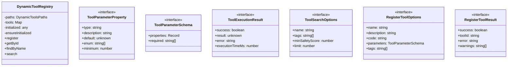

# registry

## 概要

`registry` モジュールのAPIリファレンス。

## インポート

```typescript
import { existsSync, mkdirSync, readFileSync... } from 'node:fs';
import { join, basename } from 'node:path';
import { createHash } from 'node:crypto';
import { DynamicToolDefinition, DynamicToolRegistrationRequest, DynamicToolRegistrationResult... } from './types.js';
import { quickSafetyCheck, analyzeCodeSafety } from './safety.js';
// ... and 2 more imports
```

## エクスポート一覧

| 種別 | 名前 | 説明 |
|------|------|------|
| 関数 | `ensureDynamicToolsPaths` | ディレクトリを確保 |
| 関数 | `generateToolId` | ツールIDを生成 |
| 関数 | `generateRunId` | 実行IDを生成 |
| 関数 | `saveToolDefinition` | ツール定義をファイルに保存 |
| 関数 | `loadToolDefinition` | ツール定義をファイルから読み込み |
| 関数 | `loadToolDefinitionByName` | 名前でツール定義を検索 |
| 関数 | `resolveToolDefinition` | IDまたは名前でツール定義を取得 |
| 関数 | `loadAllToolDefinitions` | すべてのツール定義をロード |
| 関数 | `deleteToolDefinition` | ツール定義を削除 |
| 関数 | `registerDynamicTool` | ツールを登録 |
| 関数 | `listDynamicTools` | ツール一覧を取得 |
| 関数 | `deleteDynamicTool` | ツールを削除 |
| 関数 | `updateToolUsage` | ツールの使用統計を更新 |
| 関数 | `searchDynamicTools` | キーワードでツールを検索 |
| 関数 | `recommendToolsForTask` | タスクに適したツールを推奨 |
| 関数 | `getRegistry` | レジストリのシングルトンインスタンスを取得 |
| 関数 | `resetRegistry` | レジストリをリセット（テスト用） |
| クラス | `DynamicToolRegistry` | 動的ツールレジストリクラス |
| インターフェース | `ToolParameterProperty` | ツールパラメータのプロパティ定義（拡張機能互換） |
| インターフェース | `ToolParameterSchema` | ツールパラメータスキーマ（拡張機能互換） |
| インターフェース | `ToolExecutionResult` | ツール実行結果（拡張機能互換） |
| インターフェース | `ToolSearchOptions` | ツール検索オプション（拡張機能互換） |
| インターフェース | `RegisterToolOptions` | ツール登録オプション（拡張機能互換） |
| インターフェース | `RegisterToolResult` | ツール登録結果（拡張機能互換） |

## 図解

### クラス図



### 依存関係図


### 関数フロー


### シーケンス図


## 関数

### ensureDynamicToolsPaths

```typescript
ensureDynamicToolsPaths(paths: DynamicToolsPaths): void
```

ディレクトリを確保

**パラメータ**

| 名前 | 型 | 必須 |
|------|-----|------|
| paths | `DynamicToolsPaths` | はい |

**戻り値**: `void`

### generateToolId

```typescript
generateToolId(name: string, code: string): string
```

ツールIDを生成
名前とコードのハッシュベース

**パラメータ**

| 名前 | 型 | 必須 |
|------|-----|------|
| name | `string` | はい |
| code | `string` | はい |

**戻り値**: `string`

### generateRunId

```typescript
generateRunId(): string
```

実行IDを生成

**戻り値**: `string`

### saveToolDefinition

```typescript
saveToolDefinition(tool: DynamicToolDefinition, paths: DynamicToolsPaths): void
```

ツール定義をファイルに保存

**パラメータ**

| 名前 | 型 | 必須 |
|------|-----|------|
| tool | `DynamicToolDefinition` | はい |
| paths | `DynamicToolsPaths` | はい |

**戻り値**: `void`

### loadToolDefinition

```typescript
loadToolDefinition(toolId: string, paths: DynamicToolsPaths): DynamicToolDefinition | null
```

ツール定義をファイルから読み込み

**パラメータ**

| 名前 | 型 | 必須 |
|------|-----|------|
| toolId | `string` | はい |
| paths | `DynamicToolsPaths` | はい |

**戻り値**: `DynamicToolDefinition | null`

### loadToolDefinitionByName

```typescript
loadToolDefinitionByName(name: string, paths: DynamicToolsPaths): DynamicToolDefinition | null
```

名前でツール定義を検索

**パラメータ**

| 名前 | 型 | 必須 |
|------|-----|------|
| name | `string` | はい |
| paths | `DynamicToolsPaths` | はい |

**戻り値**: `DynamicToolDefinition | null`

### resolveToolDefinition

```typescript
resolveToolDefinition(toolIdOrName: string, paths: DynamicToolsPaths): DynamicToolDefinition | null
```

IDまたは名前でツール定義を取得

**パラメータ**

| 名前 | 型 | 必須 |
|------|-----|------|
| toolIdOrName | `string` | はい |
| paths | `DynamicToolsPaths` | はい |

**戻り値**: `DynamicToolDefinition | null`

### loadAllToolDefinitions

```typescript
loadAllToolDefinitions(paths: DynamicToolsPaths): DynamicToolDefinition[]
```

すべてのツール定義をロード

**パラメータ**

| 名前 | 型 | 必須 |
|------|-----|------|
| paths | `DynamicToolsPaths` | はい |

**戻り値**: `DynamicToolDefinition[]`

### deleteToolDefinition

```typescript
deleteToolDefinition(toolId: string, paths: DynamicToolsPaths): boolean
```

ツール定義を削除

**パラメータ**

| 名前 | 型 | 必須 |
|------|-----|------|
| toolId | `string` | はい |
| paths | `DynamicToolsPaths` | はい |

**戻り値**: `boolean`

### registerDynamicTool

```typescript
async registerDynamicTool(request: DynamicToolRegistrationRequest, options?: {
    actor?: string;
    skipVerification?: boolean;
    paths?: DynamicToolsPaths;
  }): Promise<DynamicToolRegistrationResult>
```

ツールを登録

**パラメータ**

| 名前 | 型 | 必須 |
|------|-----|------|
| request | `DynamicToolRegistrationRequest` | はい |
| options | `{
    actor?: string;
    skipVerification?: boolean;
    paths?: DynamicToolsPaths;
  }` | いいえ |

**戻り値**: `Promise<DynamicToolRegistrationResult>`

### validateToolName

```typescript
validateToolName(name: string): { valid: boolean; error?: string }
```

ツール名の検証

**パラメータ**

| 名前 | 型 | 必須 |
|------|-----|------|
| name | `string` | はい |

**戻り値**: `{ valid: boolean; error?: string }`

### listDynamicTools

```typescript
listDynamicTools(options?: DynamicToolListOptions, paths?: DynamicToolsPaths): DynamicToolDefinition[]
```

ツール一覧を取得

**パラメータ**

| 名前 | 型 | 必須 |
|------|-----|------|
| options | `DynamicToolListOptions` | いいえ |
| paths | `DynamicToolsPaths` | いいえ |

**戻り値**: `DynamicToolDefinition[]`

### deleteDynamicTool

```typescript
async deleteDynamicTool(toolIdOrName: string, options?: {
    actor?: string;
    paths?: DynamicToolsPaths;
  }): Promise<{ success: boolean; error?: string }>
```

ツールを削除

**パラメータ**

| 名前 | 型 | 必須 |
|------|-----|------|
| toolIdOrName | `string` | はい |
| options | `{
    actor?: string;
    paths?: DynamicToolsPaths;
  }` | いいえ |

**戻り値**: `Promise<{ success: boolean; error?: string }>`

### updateToolUsage

```typescript
updateToolUsage(toolId: string, success: boolean, executionTimeMs: number, paths?: DynamicToolsPaths): void
```

ツールの使用統計を更新

**パラメータ**

| 名前 | 型 | 必須 |
|------|-----|------|
| toolId | `string` | はい |
| success | `boolean` | はい |
| executionTimeMs | `number` | はい |
| paths | `DynamicToolsPaths` | いいえ |

**戻り値**: `void`

### searchDynamicTools

```typescript
searchDynamicTools(keyword: string, paths?: DynamicToolsPaths): DynamicToolDefinition[]
```

キーワードでツールを検索

**パラメータ**

| 名前 | 型 | 必須 |
|------|-----|------|
| keyword | `string` | はい |
| paths | `DynamicToolsPaths` | いいえ |

**戻り値**: `DynamicToolDefinition[]`

### recommendToolsForTask

```typescript
recommendToolsForTask(task: string, paths?: DynamicToolsPaths): DynamicToolDefinition[]
```

タスクに適したツールを推奨

**パラメータ**

| 名前 | 型 | 必須 |
|------|-----|------|
| task | `string` | はい |
| paths | `DynamicToolsPaths` | いいえ |

**戻り値**: `DynamicToolDefinition[]`

### getRegistry

```typescript
getRegistry(): DynamicToolRegistry
```

レジストリのシングルトンインスタンスを取得

**戻り値**: `DynamicToolRegistry`

### resetRegistry

```typescript
resetRegistry(): void
```

レジストリをリセット（テスト用）

**戻り値**: `void`

## クラス

### DynamicToolRegistry

動的ツールレジストリクラス
関数ベースのAPIをラップしてオブジェクト指向APIを提供

使用例:
```typescript
const registry = getRegistry();
const result = registry.register({
  name: "my_tool",
  description: "ツールの説明",
  code: "console.log('hello');",
});
```

**プロパティ**

| 名前 | 型 | 可視性 |
|------|-----|--------|
| paths | `DynamicToolsPaths` | private |
| tools | `Map<string, DynamicToolDefinition>` | private |
| initialized | `any` | private |

**メソッド**

| 名前 | シグネチャ |
|------|------------|
| ensureInitialized | `ensureInitialized(): void` |
| register | `register(options): RegisterToolResult` |
| getById | `getById(toolId): DynamicToolDefinition | undefined` |
| findByName | `findByName(name): DynamicToolDefinition | undefined` |
| search | `search(options): DynamicToolDefinition[]` |
| delete | `delete(toolId): { success: boolean; error?: string }` |
| recordUsage | `recordUsage(toolId): void` |
| getAll | `getAll(): DynamicToolDefinition[]` |
| count | `count(): number` |
| calculateSafetyScore | `calculateSafetyScore(code): number` |
| calculateQualityScore | `calculateQualityScore(code): number` |
| convertParameters | `convertParameters(params): import("./types.js").ToolParameterDefinition[]` |
| convertType | `convertType(type): "string" | "number" | "boolean" | "object" | "array"` |

## インターフェース

### ToolParameterProperty

```typescript
interface ToolParameterProperty {
  type: string;
  description: string;
  default?: unknown;
  enum?: string[];
  minimum?: number;
  maximum?: number;
}
```

ツールパラメータのプロパティ定義（拡張機能互換）

### ToolParameterSchema

```typescript
interface ToolParameterSchema {
  properties: Record<string, ToolParameterProperty>;
  required: string[];
}
```

ツールパラメータスキーマ（拡張機能互換）

### ToolExecutionResult

```typescript
interface ToolExecutionResult {
  success: boolean;
  result?: unknown;
  error?: string;
  executionTimeMs: number;
}
```

ツール実行結果（拡張機能互換）

### ToolSearchOptions

```typescript
interface ToolSearchOptions {
  name?: string;
  tags?: string[];
  minSafetyScore?: number;
  limit?: number;
}
```

ツール検索オプション（拡張機能互換）

### RegisterToolOptions

```typescript
interface RegisterToolOptions {
  name: string;
  description: string;
  code: string;
  parameters?: ToolParameterSchema;
  tags?: string[];
  generatedFrom?: string;
}
```

ツール登録オプション（拡張機能互換）

### RegisterToolResult

```typescript
interface RegisterToolResult {
  success: boolean;
  toolId?: string;
  error?: string;
  warnings?: string[];
}
```

ツール登録結果（拡張機能互換）

---
*自動生成: 2026-02-17T21:54:59.782Z*
