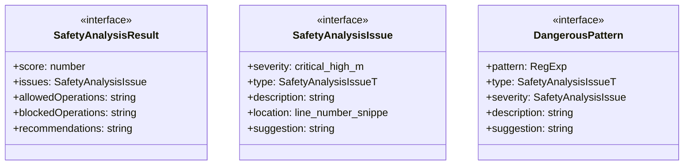
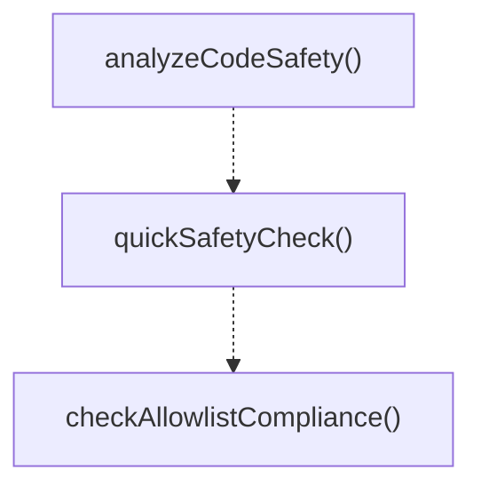

# safety

## 概要

`safety` モジュールのAPIリファレンス。

## エクスポート一覧

| 種別 | 名前 | 説明 |
|------|------|------|
| 関数 | `analyzeCodeSafety` | コードの安全性を解析 |
| 関数 | `quickSafetyCheck` | 高速な安全性チェック（詳細解析なし） |
| 関数 | `checkAllowlistCompliance` | 許可リストへの準拠をチェック |
| インターフェース | `SafetyAnalysisResult` | 安全性解析結果 |
| インターフェース | `SafetyAnalysisIssue` | 安全性解析で検出された問題の詳細 |
| 型 | `SafetyAnalysisIssueType` | 安全性問題の種類（解析用） |

## 図解

### クラス図



### 関数フロー



## 関数

### analyzeCodeSafety

```typescript
analyzeCodeSafety(code: string, options: {
    /** 許可された操作のリスト */
    allowlist?: string[];
    /** 厳格モード（より低いスコア） */
    strict?: boolean;
  }): SafetyAnalysisResult
```

コードの安全性を解析

**パラメータ**

| 名前 | 型 | 必須 |
|------|-----|------|
| code | `string` | はい |
| options | `object` | はい |
| &nbsp;&nbsp;↳ allowlist | `string[]` | いいえ |
| &nbsp;&nbsp;↳ strict | `boolean` | いいえ |

**戻り値**: `SafetyAnalysisResult`

### findLineNumber

```typescript
findLineNumber(lines: string[], index: number): number
```

行番号を検索

**パラメータ**

| 名前 | 型 | 必須 |
|------|-----|------|
| lines | `string[]` | はい |
| index | `number` | はい |

**戻り値**: `number`

### getSeverityPenalty

```typescript
getSeverityPenalty(severity: SafetyAnalysisIssue["severity"], strict: boolean): number
```

重大度に応じたペナルティを取得

**パラメータ**

| 名前 | 型 | 必須 |
|------|-----|------|
| severity | `SafetyAnalysisIssue["severity"]` | はい |
| strict | `boolean` | はい |

**戻り値**: `number`

### quickSafetyCheck

```typescript
quickSafetyCheck(code: string): {
  isSafe: boolean;
  reason?: string;
}
```

高速な安全性チェック（詳細解析なし）

**パラメータ**

| 名前 | 型 | 必須 |
|------|-----|------|
| code | `string` | はい |

**戻り値**: `{
  isSafe: boolean;
  reason?: string;
}`

### checkAllowlistCompliance

```typescript
checkAllowlistCompliance(code: string, allowlist: string[]): {
  compliant: boolean;
  violations: string[];
}
```

許可リストへの準拠をチェック

**パラメータ**

| 名前 | 型 | 必須 |
|------|-----|------|
| code | `string` | はい |
| allowlist | `string[]` | はい |

**戻り値**: `{
  compliant: boolean;
  violations: string[];
}`

## インターフェース

### SafetyAnalysisResult

```typescript
interface SafetyAnalysisResult {
  score: number;
  issues: SafetyAnalysisIssue[];
  allowedOperations: string[];
  blockedOperations: string[];
  recommendations: string[];
  isSafe: boolean;
  confidence: number;
}
```

安全性解析結果

### SafetyAnalysisIssue

```typescript
interface SafetyAnalysisIssue {
  severity: "critical" | "high" | "medium" | "low";
  type: SafetyAnalysisIssueType;
  description: string;
  location?: {
    line?: number;
    snippet?: string;
  };
  suggestion?: string;
}
```

安全性解析で検出された問題の詳細

### DangerousPattern

```typescript
interface DangerousPattern {
  pattern: RegExp;
  type: SafetyAnalysisIssueType;
  severity: SafetyAnalysisIssue["severity"];
  description: string;
  suggestion: string;
}
```

禁止パターンの定義

## 型定義

### SafetyAnalysisIssueType

```typescript
type SafetyAnalysisIssueType = | "file-system-write"
  | "file-system-delete"
  | "network-access"
  | "command-injection"
  | "eval-usage"
  | "process-spawn"
  | "environment-access"
  | "sensitive-data"
  | "resource-exhaustion"
  | "unbounded-operation"
  | "prototype-pollution"
  | "unsafe-regex"
```

安全性問題の種類（解析用）

---
*自動生成: 2026-02-18T07:17:30.432Z*
