# types

## 概要

`types` モジュールのAPIリファレンス。

## インポート

```typescript
// from 'node:path': join
```

## エクスポート一覧

| 種別 | 名前 | 説明 |
|------|------|------|
| 関数 | `getDynamicToolsPaths` | デフォルトパスを取得 |
| インターフェース | `DynamicToolsPaths` | - |
| インターフェース | `ToolParameterDefinition` | ツールパラメータ定義 |
| インターフェース | `DynamicToolDefinition` | 動的ツールの定義 |
| インターフェース | `DynamicToolResult` | ツール実行結果 |
| インターフェース | `DynamicToolRunOptions` | - |
| インターフェース | `DynamicToolRegistrationRequest` | - |
| インターフェース | `DynamicToolRegistrationResult` | - |
| インターフェース | `DynamicToolListOptions` | - |
| インターフェース | `SafetyVerificationResult` | - |
| インターフェース | `SafetyIssue` | 検出されたセキュリティ問題の詳細を表します。 |
| インターフェース | `AllowedOperations` | 許可された操作範囲を定義します。 |
| インターフェース | `DynamicToolQualityMetrics` | 動的ツールごとの品質メトリクス詳細を表します。 |
| インターフェース | `QualityMetricsReport` | 品質メトリクスレポートを表します。 |
| インターフェース | `AuditLogEntry` | システム監査ログのエントリを表します。 |
| インターフェース | `ConvertToSkillOptions` | スキル変換時のオプションを指定します。 |
| インターフェース | `ConvertToSkillResult` | スキル変換の実行結果を表します。 |
| インターフェース | `ToolReflectionResult` | ツールのリフレクション結果を表します。 |
| インターフェース | `ToolReflectionContext` | ツールのリフレクションコンテキスト |
| インターフェース | `DynamicToolsConfig` | 動的ツールの設定 |
| 型 | `DynamicToolMode` | ツール実行モード |
| 型 | `VerificationStatus` | 検証ステータス |
| 型 | `SafetyIssueType` | セキュリティ問題の種別を定義します。 |
| 型 | `AuditAction` | 監査ログに記録されるアクションの種別を定義します。 |

## 図解

### クラス図

```mermaid
classDiagram
  class DynamicToolsPaths {
    <<interface>>
    +toolsDir: string
    +skillsDir: string
    +auditLogFile: string
    +metricsFile: string
  }
  class ToolParameterDefinition {
    <<interface>>
    +name: string
    +type: string_number_b
    +required: boolean
    +description: string
    +default: unknown
  }
  class DynamicToolDefinition {
    <<interface>>
    +id: string
    +name: string
    +description: string
    +mode: DynamicToolMode
    +parameters: ToolParameterDefinit
  }
  class DynamicToolResult {
    <<interface>>
    +success: boolean
    +output: string
    +error: string
    +executionTimeMs: number
    +toolId: string
  }
  class DynamicToolRunOptions {
    <<interface>>
    +toolIdOrName: string
    +parameters: Record_string_unknow
    +timeoutMs: number
    +signal: AbortSignal
    +debug: boolean
  }
  class DynamicToolRegistrationRequest {
    <<interface>>
    +name: string
    +description: string
    +mode: DynamicToolMode
    +parameters: ToolParameterDefinit
    +code: string
  }
  class DynamicToolRegistrationResult {
    <<interface>>
    +success: boolean
    +tool: DynamicToolDefinitio
    +error: string
    +verificationResult: SafetyVerificationRe
  }
  class DynamicToolListOptions {
    <<interface>>
    +tags: string
    +verificationStatus: VerificationStatus
    +mode: DynamicToolMode
    +sortBy: name_createdAt
    +sortOrder: asc_desc
  }
  class SafetyVerificationResult {
    <<interface>>
    +safe: boolean
    +riskLevel: low_medium_high
    +issues: SafetyIssue
    +recommendations: string
    +verifiedAt: string
  }
  class SafetyIssue {
    <<interface>>
    +type: SafetyIssueType
    +severity: low_medium_high
    +description: string
    +location: line_number_column
    +suggestion: string
  }
  class AllowedOperations {
    <<interface>>
    +allowedModules: string
    +allowedCommands: string
    +allowedFilePaths: string
    +allowedDomains: string
    +maxExecutionTimeMs: number
  }
  class DynamicToolQualityMetrics {
    <<interface>>
    +toolId: string
    +successRate: number
    +averageExecutionTimeMs: number
    +totalUsageCount: number
    +errorCount: number
  }
  class QualityMetricsReport {
    <<interface>>
    +totalTools: number
    +activeTools: number
    +averageSuccessRate: number
    +averageQualityScore: number
    +topTools: Array_toolId_string
  }
  class AuditLogEntry {
    <<interface>>
    +id: string
    +timestamp: string
    +action: AuditAction
    +toolId: string
    +toolName: string
  }
  class ConvertToSkillOptions {
    <<interface>>
    +toolId: string
    +skillName: string
    +skillDescription: string
    +overwrite: boolean
  }
  class ConvertToSkillResult {
    <<interface>>
    +success: boolean
    +skillPath: string
    +error: string
  }
  class ToolReflectionResult {
    <<interface>>
    +needsReflection: boolean
    +shouldCreateTool: boolean
    +proposedTool: name_string_descrip
    +improvementSuggestions: string
    +reflectionReason: string
  }
  class ToolReflectionContext {
    <<interface>>
    +lastToolName: string
    +lastToolResult: string
    +currentTask: string
    +failureCount: number
    +patternMatch: detected_boolean_pa
  }
  class DynamicToolsConfig {
    <<interface>>
    +enabled: boolean
    +autoCreateEnabled: boolean
    +autoVerificationEnabled: boolean
    +maxTools: number
    +defaultTimeoutMs: number
  }
```



## 関数

### getDynamicToolsPaths

```typescript
getDynamicToolsPaths(): DynamicToolsPaths
```

デフォルトパスを取得

**戻り値**: `DynamicToolsPaths`

## インターフェース

### DynamicToolsPaths

```typescript
interface DynamicToolsPaths {
  toolsDir: string;
  skillsDir: string;
  auditLogFile: string;
  metricsFile: string;
}
```

### ToolParameterDefinition

```typescript
interface ToolParameterDefinition {
  name: string;
  type: "string" | "number" | "boolean" | "object" | "array";
  required: boolean;
  description: string;
  default?: unknown;
  allowedValues?: unknown[];
}
```

ツールパラメータ定義

### DynamicToolDefinition

```typescript
interface DynamicToolDefinition {
  id: string;
  name: string;
  description: string;
  mode: DynamicToolMode;
  parameters: ToolParameterDefinition[];
  code: string;
  createdAt: string;
  updatedAt: string;
  createdFromTask?: string;
  usageCount: number;
  lastUsedAt?: string;
  confidenceScore: number;
  verificationStatus: VerificationStatus;
  tags: string[];
  createdBy: string;
}
```

動的ツールの定義

### DynamicToolResult

```typescript
interface DynamicToolResult {
  success: boolean;
  output: string;
  error?: string;
  executionTimeMs: number;
  toolId: string;
  runId: string;
  timestamp: string;
}
```

ツール実行結果

### DynamicToolRunOptions

```typescript
interface DynamicToolRunOptions {
  toolIdOrName: string;
  parameters: Record<string, unknown>;
  timeoutMs?: number;
  signal?: AbortSignal;
  debug?: boolean;
}
```

### DynamicToolRegistrationRequest

```typescript
interface DynamicToolRegistrationRequest {
  name: string;
  description: string;
  mode: DynamicToolMode;
  parameters?: ToolParameterDefinition[];
  code: string;
  createdFromTask?: string;
  tags?: string[];
  createdBy?: string;
}
```

### DynamicToolRegistrationResult

```typescript
interface DynamicToolRegistrationResult {
  success: boolean;
  tool?: DynamicToolDefinition;
  error?: string;
  verificationResult?: SafetyVerificationResult;
}
```

### DynamicToolListOptions

```typescript
interface DynamicToolListOptions {
  tags?: string[];
  verificationStatus?: VerificationStatus[];
  mode?: DynamicToolMode[];
  sortBy?: "name" | "createdAt" | "updatedAt" | "usageCount" | "confidenceScore";
  sortOrder?: "asc" | "desc";
  limit?: number;
}
```

### SafetyVerificationResult

```typescript
interface SafetyVerificationResult {
  safe: boolean;
  riskLevel: "low" | "medium" | "high" | "critical";
  issues: SafetyIssue[];
  recommendations: string[];
  verifiedAt: string;
}
```

### SafetyIssue

```typescript
interface SafetyIssue {
  type: SafetyIssueType;
  severity: "low" | "medium" | "high" | "critical";
  description: string;
  location?: {
    line?: number;
    column?: number;
  };
  suggestion?: string;
}
```

検出されたセキュリティ問題の詳細を表します。

### AllowedOperations

```typescript
interface AllowedOperations {
  allowedModules: string[];
  allowedCommands: string[];
  allowedFilePaths: string[];
  allowedDomains: string[];
  maxExecutionTimeMs: number;
  maxOutputSizeBytes: number;
}
```

許可された操作範囲を定義します。

### DynamicToolQualityMetrics

```typescript
interface DynamicToolQualityMetrics {
  toolId: string;
  successRate: number;
  averageExecutionTimeMs: number;
  totalUsageCount: number;
  errorCount: number;
  lastError?: string;
  lastErrorAt?: string;
  userRating?: number;
  qualityScore: number;
  calculatedAt: string;
}
```

動的ツールごとの品質メトリクス詳細を表します。

### QualityMetricsReport

```typescript
interface QualityMetricsReport {
  totalTools: number;
  activeTools: number;
  averageSuccessRate: number;
  averageQualityScore: number;
  topTools: Array<{
    toolId: string;
    name: string;
    usageCount: number;
    successRate: number;
  }>;
  problematicTools: Array<{
    toolId: string;
    name: string;
    issue: string;
  }>;
  generatedAt: string;
}
```

品質メトリクスレポートを表します。

### AuditLogEntry

```typescript
interface AuditLogEntry {
  id: string;
  timestamp: string;
  action: AuditAction;
  toolId?: string;
  toolName?: string;
  actor: string;
  details: Record<string, unknown>;
  success: boolean;
  errorMessage?: string;
}
```

システム監査ログのエントリを表します。

### ConvertToSkillOptions

```typescript
interface ConvertToSkillOptions {
  toolId: string;
  skillName?: string;
  skillDescription?: string;
  overwrite?: boolean;
}
```

スキル変換時のオプションを指定します。

### ConvertToSkillResult

```typescript
interface ConvertToSkillResult {
  success: boolean;
  skillPath?: string;
  error?: string;
}
```

スキル変換の実行結果を表します。

### ToolReflectionResult

```typescript
interface ToolReflectionResult {
  needsReflection: boolean;
  shouldCreateTool: boolean;
  proposedTool?: {
    name: string;
    description: string;
    mode: DynamicToolMode;
    code: string;
    reason: string;
  };
  improvementSuggestions: string[];
  reflectionReason: string;
}
```

ツールのリフレクション結果を表します。

### ToolReflectionContext

```typescript
interface ToolReflectionContext {
  lastToolName: string;
  lastToolResult: string;
  currentTask: string;
  failureCount: number;
  patternMatch?: {
    detected: boolean;
    pattern: string;
    occurrences: number;
  };
}
```

ツールのリフレクションコンテキスト

### DynamicToolsConfig

```typescript
interface DynamicToolsConfig {
  enabled: boolean;
  autoCreateEnabled: boolean;
  autoVerificationEnabled: boolean;
  maxTools: number;
  defaultTimeoutMs: number;
  auditLogEnabled: boolean;
  autoConvertToSkill: boolean;
  allowedOperations: AllowedOperations;
}
```

動的ツールの設定

## 型定義

### DynamicToolMode

```typescript
type DynamicToolMode = | "bash"          // Bash コマンド実行
  | "function"      // TypeScript関数実行
  | "template"      // テンプレートベース
  | "skill"
```

ツール実行モード

### VerificationStatus

```typescript
type VerificationStatus = | "unverified"     // 未検証
  | "pending"        // 検証中
  | "passed"         // 検証通過
  | "failed"         // 検証失敗
  | "deprecated"
```

検証ステータス

### SafetyIssueType

```typescript
type SafetyIssueType = | "forbidden-function"      // 禁止関数の使用
  | "network-access"          // ネットワークアクセス
  | "file-system-modification" // ファイルシステム変更
  | "code-injection"          // コードインジェクション
  | "eval-usage"              // eval/Function使用
  | "unsafe-regex"            // 危険な正規表現
  | "command-injection"       // コマンドインジェクション
  | "missing-validation"      // 入力検証不足
  | "hardcoded-secret"        // ハードコードされた秘密情報
  | "excessive-permissions"
```

セキュリティ問題の種別を定義します。

### AuditAction

```typescript
type AuditAction = | "tool.create"       // ツール作成
  | "tool.run"          // ツール実行
  | "tool.delete"       // ツール削除
  | "tool.update"       // ツール更新
  | "tool.export"       // ツールエクスポート
  | "tool.import"       // ツールインポート
  | "verification.run"  // 検証実行
  | "verification.pass" // 検証通過
  | "verification.fail"
```

監査ログに記録されるアクションの種別を定義します。

---
*自動生成: 2026-02-18T18:06:17.521Z*
