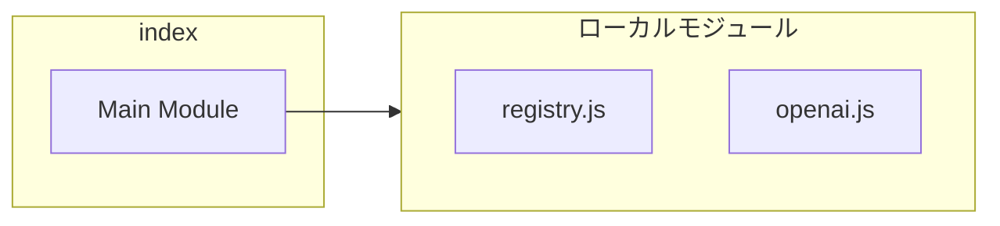
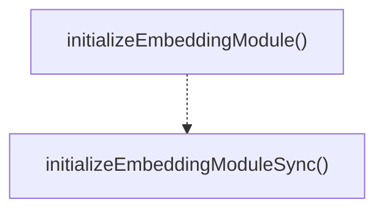

# index

## 概要

`index` モジュールのAPIリファレンス。

## インポート

```typescript
import { embeddingRegistry } from './registry.js';
import { openAIEmbeddingProvider } from './providers/openai.js';
```

## エクスポート一覧

| 種別 | 名前 | 説明 |
|------|------|------|
| 関数 | `initializeEmbeddingModule` | Initialize the embedding module with default provi |
| 関数 | `initializeEmbeddingModuleSync` | Synchronous initialization for non-async contexts. |

## 図解

### 依存関係図



### 関数フロー



### シーケンス図


## 関数

### initializeEmbeddingModule

```typescript
async initializeEmbeddingModule(): Promise<void>
```

Initialize the embedding module with default providers.
Registers OpenAI provider.

**戻り値**: `Promise<void>`

### initializeEmbeddingModuleSync

```typescript
initializeEmbeddingModuleSync(): void
```

Synchronous initialization for non-async contexts.

**戻り値**: `void`

---
*自動生成: 2026-02-17T22:24:18.931Z*
