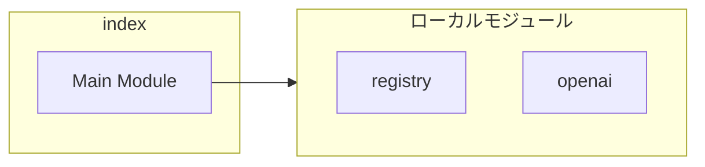
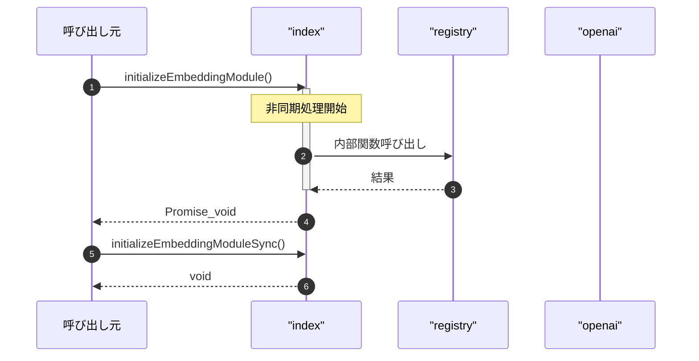

# index

## 概要

`index` モジュールのAPIリファレンス。

## インポート

```typescript
// from './registry.js': embeddingRegistry
// from './providers/openai.js': openAIEmbeddingProvider
```

## エクスポート一覧

| 種別 | 名前 | 説明 |
|------|------|------|
| 関数 | `initializeEmbeddingModule` | - |
| 関数 | `initializeEmbeddingModuleSync` | - |

## 図解

### 依存関係図



### シーケンス図



## 関数

### initializeEmbeddingModule

```typescript
async initializeEmbeddingModule(): Promise<void>
```

**戻り値**: `Promise<void>`

### initializeEmbeddingModuleSync

```typescript
initializeEmbeddingModuleSync(): void
```

**戻り値**: `void`

---
*自動生成: 2026-02-18T18:06:17.522Z*
