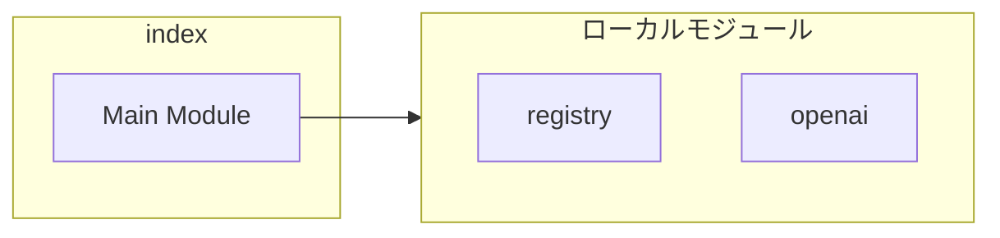
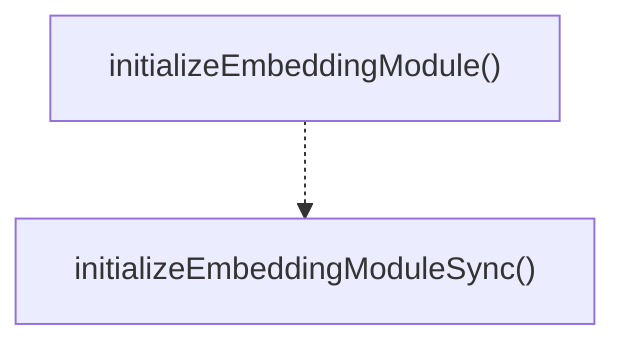
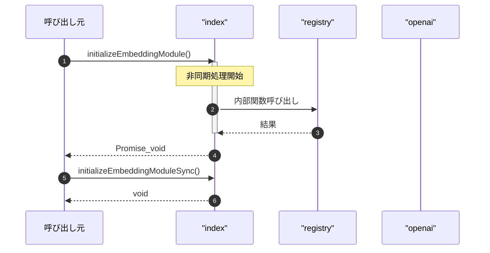

# index

## 概要

`index` モジュールのAPIリファレンス。

## インポート

```typescript
import { embeddingRegistry } from './registry.js';
import { openAIEmbeddingProvider } from './providers/openai.js';
```

## エクスポート一覧

| 種別 | 名前 | 説明 |
|------|------|------|
| 関数 | `initializeEmbeddingModule` | デフォルトプロバイダで埋め込みモジュールを初期化 |
| 関数 | `initializeEmbeddingModuleSync` | 非同期コンテキスト用の同期初期化 |

## 図解

### 依存関係図



### 関数フロー



### シーケンス図



## 関数

### initializeEmbeddingModule

```typescript
async initializeEmbeddingModule(): Promise<void>
```

デフォルトプロバイダで埋め込みモジュールを初期化

**戻り値**: `Promise<void>`

### initializeEmbeddingModuleSync

```typescript
initializeEmbeddingModuleSync(): void
```

非同期コンテキスト用の同期初期化

**戻り値**: `void`

---
*自動生成: 2026-02-18T07:48:44.952Z*
