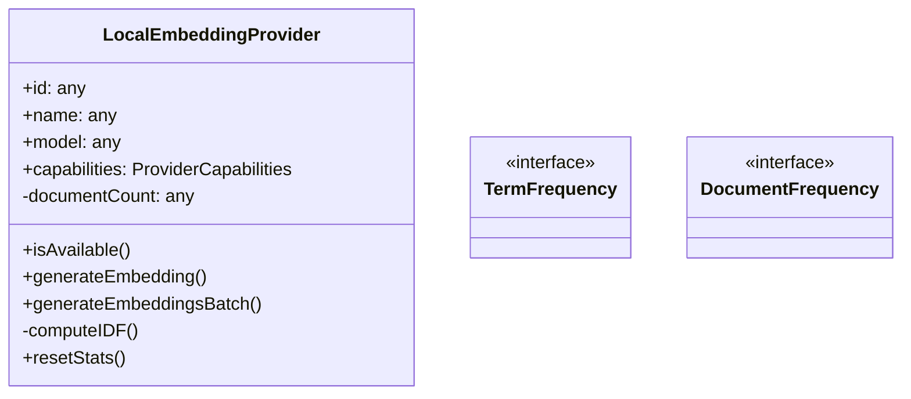
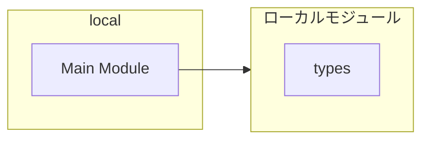

# local

## 概要

`local` モジュールのAPIリファレンス。

## インポート

```typescript
// from '../types.js': EmbeddingProvider, ProviderCapabilities
```

## エクスポート一覧

| 種別 | 名前 | 説明 |
|------|------|------|
| 関数 | `createLocalEmbeddingProvider` | ローカル埋め込みプロバイダーを作成 |
| クラス | `LocalEmbeddingProvider` | ローカル埋め込みプロバイダー |

## 図解

### クラス図



### 依存関係図



## 関数

### tokenize

```typescript
tokenize(text: string): string[]
```

テキストをトークン化

**パラメータ**

| 名前 | 型 | 必須 |
|------|-----|------|
| text | `string` | はい |

**戻り値**: `string[]`

### computeTermFrequency

```typescript
computeTermFrequency(tokens: string[]): TermFrequency
```

用語頻度を計算

**パラメータ**

| 名前 | 型 | 必須 |
|------|-----|------|
| tokens | `string[]` | はい |

**戻り値**: `TermFrequency`

### hashString

```typescript
hashString(str: string): number
```

文字列をハッシュ化してインデックスを生成

**パラメータ**

| 名前 | 型 | 必須 |
|------|-----|------|
| str | `string` | はい |

**戻り値**: `number`

### createLocalEmbeddingProvider

```typescript
createLocalEmbeddingProvider(): EmbeddingProvider
```

ローカル埋め込みプロバイダーを作成

**戻り値**: `EmbeddingProvider`

## クラス

### LocalEmbeddingProvider

ローカル埋め込みプロバイダー

**プロパティ**

| 名前 | 型 | 可視性 |
|------|-----|--------|
| id | `any` | public |
| name | `any` | public |
| model | `any` | public |
| capabilities | `ProviderCapabilities` | public |
| documentCount | `any` | private |
| documentFrequency | `DocumentFrequency` | private |

**メソッド**

| 名前 | シグネチャ |
|------|------------|
| isAvailable | `isAvailable(): Promise<boolean>` |
| generateEmbedding | `generateEmbedding(text): Promise<number[]>` |
| generateEmbeddingsBatch | `generateEmbeddingsBatch(texts): Promise<number[][]>` |
| computeIDF | `computeIDF(term): number` |
| resetStats | `resetStats(): void` |

## インターフェース

### TermFrequency

```typescript
interface TermFrequency {
}
```

文書の用語頻度情報

### DocumentFrequency

```typescript
interface DocumentFrequency {
}
```

逆文書頻度キャッシュ

---
*自動生成: 2026-02-24T17:08:02.671Z*
