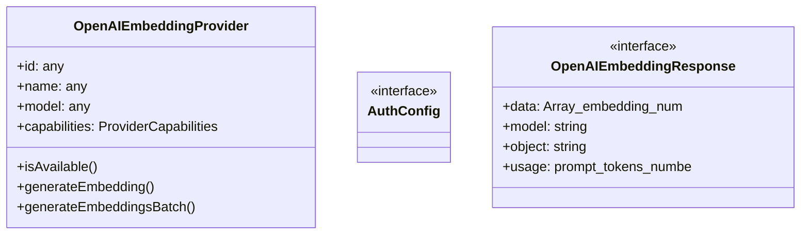
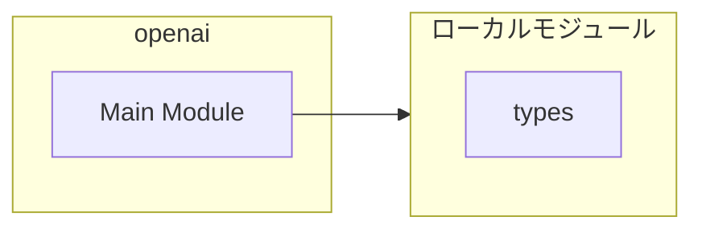

# openai

## 概要

`openai` モジュールのAPIリファレンス。

## インポート

```typescript
import { existsSync, readFileSync } from 'node:fs';
import { join } from 'node:path';
import { homedir } from 'node:os';
import { execSync } from 'node:child_process';
import { EmbeddingProvider, ProviderCapabilities } from '../types.js';
```

## エクスポート一覧

| 種別 | 名前 | 説明 |
|------|------|------|
| 関数 | `getOpenAIKey` | OpenAI APIキーを取得する |
| クラス | `OpenAIEmbeddingProvider` | OpenAI埋め込みプロバイダー |

## 図解

### クラス図



### 依存関係図



## 関数

### resolveKeyValue

```typescript
resolveKeyValue(key: string): string | null
```

Resolve a key value that may be a literal, env var reference, or shell command.
This follows pi's official key resolution method.

**パラメータ**

| 名前 | 型 | 必須 |
|------|-----|------|
| key | `string` | はい |

**戻り値**: `string | null`

### loadAuthConfig

```typescript
loadAuthConfig(): AuthConfig
```

Load auth configuration from auth.json.

**戻り値**: `AuthConfig`

### getOpenAIKey

```typescript
getOpenAIKey(): string | null
```

OpenAI APIキーを取得する

**戻り値**: `string | null`

## クラス

### OpenAIEmbeddingProvider

OpenAI埋め込みプロバイダー

**プロパティ**

| 名前 | 型 | 可視性 |
|------|-----|--------|
| id | `any` | public |
| name | `any` | public |
| model | `any` | public |
| capabilities | `ProviderCapabilities` | public |

**メソッド**

| 名前 | シグネチャ |
|------|------------|
| isAvailable | `isAvailable(): Promise<boolean>` |
| generateEmbedding | `generateEmbedding(text): Promise<number[] | null>` |
| generateEmbeddingsBatch | `generateEmbeddingsBatch(texts): Promise<(number[] | null)[]>` |

## インターフェース

### AuthConfig

```typescript
interface AuthConfig {
}
```

### OpenAIEmbeddingResponse

```typescript
interface OpenAIEmbeddingResponse {
  data: Array<{
    embedding: number[];
    index: number;
    object: string;
  }>;
  model: string;
  object: string;
  usage: {
    prompt_tokens: number;
    total_tokens: number;
  };
}
```

---
*自動生成: 2026-02-18T06:37:19.872Z*
