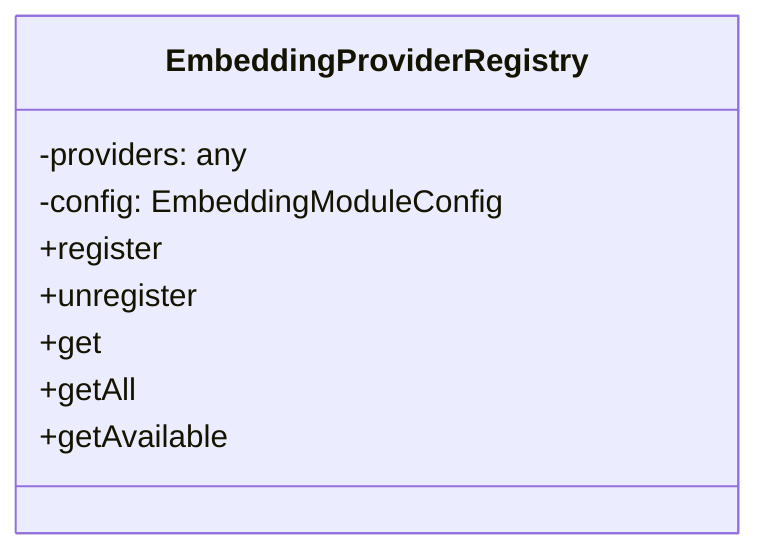
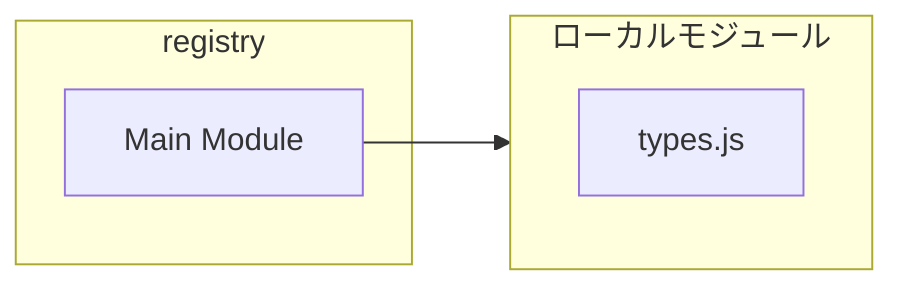
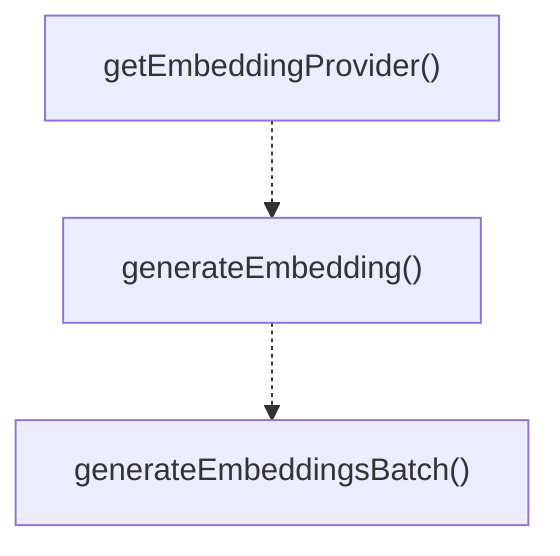
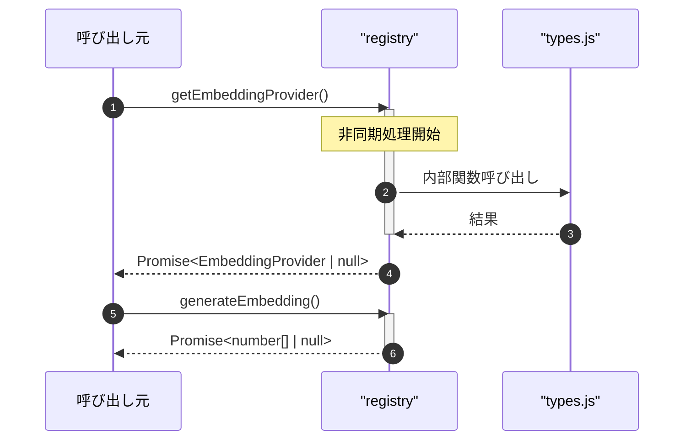

# registry

## 概要

`registry` モジュールのAPIリファレンス。

## インポート

```typescript
import { existsSync, readFileSync, writeFileSync... } from 'node:fs';
import { join } from 'node:path';
import { homedir } from 'node:os';
import { EmbeddingProvider, ProviderConfig, EmbeddingModuleConfig... } from './types.js';
```

## エクスポート一覧

| 種別 | 名前 | 説明 |
|------|------|------|
| 関数 | `getEmbeddingProvider` | デフォルトプロバイダーを取得 |
| 関数 | `generateEmbedding` | エンベディングを生成（デフォルトプロバイダー使用） |
| 関数 | `generateEmbeddingsBatch` | バッチエンベディングを生成（デフォルトプロバイダー使用） |
| クラス | `EmbeddingProviderRegistry` | プロバイダーレジストリ |

## 図解

### クラス図



### 依存関係図



### 関数フロー



### シーケンス図



## 関数

### getEmbeddingProvider

```typescript
async getEmbeddingProvider(config?: ProviderConfig): Promise<EmbeddingProvider | null>
```

デフォルトプロバイダーを取得

**パラメータ**

| 名前 | 型 | 必須 |
|------|-----|------|
| config | `ProviderConfig` | いいえ |

**戻り値**: `Promise<EmbeddingProvider | null>`

### generateEmbedding

```typescript
async generateEmbedding(text: string, config?: ProviderConfig): Promise<number[] | null>
```

エンベディングを生成（デフォルトプロバイダー使用）

**パラメータ**

| 名前 | 型 | 必須 |
|------|-----|------|
| text | `string` | はい |
| config | `ProviderConfig` | いいえ |

**戻り値**: `Promise<number[] | null>`

### generateEmbeddingsBatch

```typescript
async generateEmbeddingsBatch(texts: string[], config?: ProviderConfig): Promise<(number[] | null)[]>
```

バッチエンベディングを生成（デフォルトプロバイダー使用）

**パラメータ**

| 名前 | 型 | 必須 |
|------|-----|------|
| texts | `string[]` | はい |
| config | `ProviderConfig` | いいえ |

**戻り値**: `Promise<(number[] | null)[]>`

## クラス

### EmbeddingProviderRegistry

プロバイダーレジストリ

責務:
- プロバイダーの登録・検索
- 設定に基づくプロバイダー選択
- デフォルトプロバイダー管理

**プロパティ**

| 名前 | 型 | 可視性 |
|------|-----|--------|
| providers | `any` | private |
| config | `EmbeddingModuleConfig` | private |

**メソッド**

| 名前 | シグネチャ |
|------|------------|
| register | `register(provider): void` |
| unregister | `unregister(providerId): void` |
| get | `get(providerId): EmbeddingProvider | undefined` |
| getAll | `getAll(): EmbeddingProvider[]` |
| getAvailable | `getAvailable(): Promise<EmbeddingProvider[]>` |
| getAllStatus | `getAllStatus(): Promise<ProviderStatus[]>` |
| setDefault | `setDefault(providerId): void` |
| getDefaultProviderId | `getDefaultProviderId(): string | null` |
| getDefault | `getDefault(): Promise<EmbeddingProvider | null>` |
| resolve | `resolve(config): Promise<EmbeddingProvider | null>` |
| getConfigPath | `getConfigPath(): string` |
| getConfig | `getConfig(): EmbeddingModuleConfig` |
| updateConfig | `updateConfig(updates): void` |
| loadConfig | `loadConfig(): EmbeddingModuleConfig` |
| saveConfig | `saveConfig(): void` |

---
*自動生成: 2026-02-17T22:24:18.934Z*
