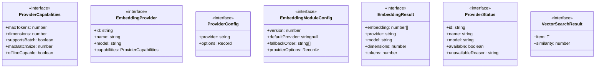

# types

## 概要

`types` モジュールのAPIリファレンス。

## エクスポート一覧

| 種別 | 名前 | 説明 |
|------|------|------|
| インターフェース | `ProviderCapabilities` | エンベディングプロバイダーの能力 |
| インターフェース | `EmbeddingProvider` | エンベディングプロバイダーインターフェース |
| インターフェース | `ProviderConfig` | プロバイダー設定 |
| インターフェース | `EmbeddingModuleConfig` | エンベディングモジュール設定 |
| インターフェース | `EmbeddingResult` | エンベディング生成結果 |
| インターフェース | `ProviderStatus` | プロバイダー状態 |
| インターフェース | `VectorSearchResult` | ベクトル検索結果 |

## 図解

### クラス図



## インターフェース

### ProviderCapabilities

```typescript
interface ProviderCapabilities {
  maxTokens: number;
  dimensions: number;
  supportsBatch: boolean;
  maxBatchSize: number;
  offlineCapable: boolean;
}
```

エンベディングプロバイダーの能力

### EmbeddingProvider

```typescript
interface EmbeddingProvider {
  id: string;
  name: string;
  model: string;
  capabilities: ProviderCapabilities;
  isAvailable();
  generateEmbedding(text);
  generateEmbeddingsBatch(texts);
  initialize();
  dispose();
}
```

エンベディングプロバイダーインターフェース

### ProviderConfig

```typescript
interface ProviderConfig {
  provider?: string;
  options?: Record<string, unknown>;
}
```

プロバイダー設定

### EmbeddingModuleConfig

```typescript
interface EmbeddingModuleConfig {
  version: number;
  defaultProvider: string | null;
  fallbackOrder: string[];
  providerOptions?: Record<string, Record<string, unknown>>;
}
```

エンベディングモジュール設定

### EmbeddingResult

```typescript
interface EmbeddingResult {
  embedding: number[];
  provider: string;
  model: string;
  dimensions: number;
  tokens?: number;
}
```

エンベディング生成結果

### ProviderStatus

```typescript
interface ProviderStatus {
  id: string;
  name: string;
  model: string;
  available: boolean;
  unavailableReason?: string;
  capabilities: ProviderCapabilities;
}
```

プロバイダー状態

### VectorSearchResult

```typescript
interface VectorSearchResult {
  item: T;
  similarity: number;
}
```

ベクトル検索結果

---
*自動生成: 2026-02-17T21:54:59.789Z*
