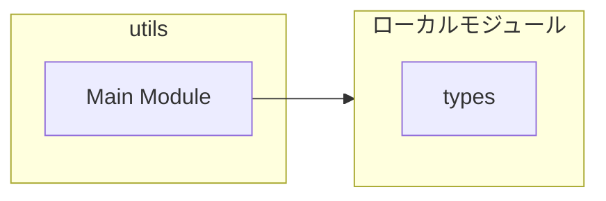
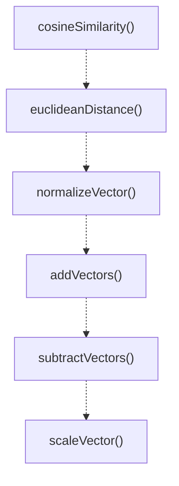
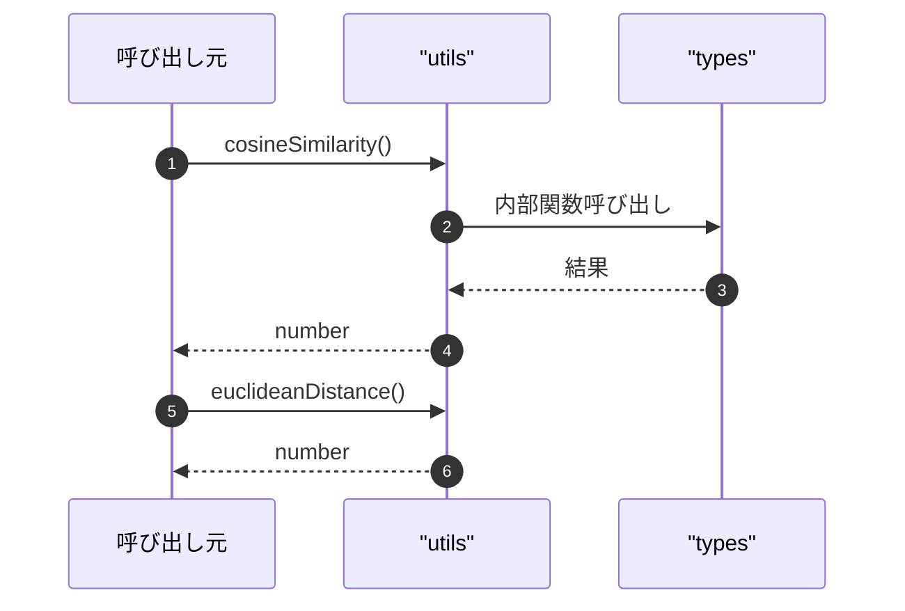

# utils

## 概要

`utils` モジュールのAPIリファレンス。

## インポート

```typescript
import { VectorSearchResult } from './types.js';
```

## エクスポート一覧

| 種別 | 名前 | 説明 |
|------|------|------|
| 関数 | `cosineSimilarity` | Calculate cosine similarity between two vectors. |
| 関数 | `euclideanDistance` | Calculate Euclidean distance between two vectors. |
| 関数 | `normalizeVector` | Normalize a vector to unit length. |
| 関数 | `addVectors` | Add two vectors element-wise. |
| 関数 | `subtractVectors` | Subtract two vectors element-wise. |
| 関数 | `scaleVector` | Scale a vector by a scalar. |
| 関数 | `meanVector` | Calculate the mean of multiple vectors. |
| 関数 | `findNearestNeighbors` | Find the k nearest neighbors to a query vector. |
| 関数 | `findBySimilarityThreshold` | Find items above a similarity threshold. |
| 関数 | `isValidEmbedding` | Check if a value is a valid embedding vector. |
| 関数 | `zeroVector` | Create a zero vector of specified dimensions. |
| 関数 | `vectorNorm` | Calculate the norm (magnitude) of a vector. |
| 関数 | `dotProduct` | Calculate dot product of two vectors. |

## 図解

### 依存関係図



### 関数フロー



### シーケンス図



## 関数

### cosineSimilarity

```typescript
cosineSimilarity(a: number[], b: number[]): number
```

Calculate cosine similarity between two vectors.

**パラメータ**

| 名前 | 型 | 必須 |
|------|-----|------|
| a | `number[]` | はい |
| b | `number[]` | はい |

**戻り値**: `number`

### euclideanDistance

```typescript
euclideanDistance(a: number[], b: number[]): number
```

Calculate Euclidean distance between two vectors.

**パラメータ**

| 名前 | 型 | 必須 |
|------|-----|------|
| a | `number[]` | はい |
| b | `number[]` | はい |

**戻り値**: `number`

### normalizeVector

```typescript
normalizeVector(vector: number[]): number[]
```

Normalize a vector to unit length.

**パラメータ**

| 名前 | 型 | 必須 |
|------|-----|------|
| vector | `number[]` | はい |

**戻り値**: `number[]`

### addVectors

```typescript
addVectors(a: number[], b: number[]): number[]
```

Add two vectors element-wise.

**パラメータ**

| 名前 | 型 | 必須 |
|------|-----|------|
| a | `number[]` | はい |
| b | `number[]` | はい |

**戻り値**: `number[]`

### subtractVectors

```typescript
subtractVectors(a: number[], b: number[]): number[]
```

Subtract two vectors element-wise.

**パラメータ**

| 名前 | 型 | 必須 |
|------|-----|------|
| a | `number[]` | はい |
| b | `number[]` | はい |

**戻り値**: `number[]`

### scaleVector

```typescript
scaleVector(vector: number[], scalar: number): number[]
```

Scale a vector by a scalar.

**パラメータ**

| 名前 | 型 | 必須 |
|------|-----|------|
| vector | `number[]` | はい |
| scalar | `number` | はい |

**戻り値**: `number[]`

### meanVector

```typescript
meanVector(vectors: number[][]): number[] | null
```

Calculate the mean of multiple vectors.

**パラメータ**

| 名前 | 型 | 必須 |
|------|-----|------|
| vectors | `number[][]` | はい |

**戻り値**: `number[] | null`

### findNearestNeighbors

```typescript
findNearestNeighbors(queryVector: number[], items: T[], k: number): VectorSearchResult<T>[]
```

Find the k nearest neighbors to a query vector.

**パラメータ**

| 名前 | 型 | 必須 |
|------|-----|------|
| queryVector | `number[]` | はい |
| items | `T[]` | はい |
| k | `number` | はい |

**戻り値**: `VectorSearchResult<T>[]`

### findBySimilarityThreshold

```typescript
findBySimilarityThreshold(queryVector: number[], items: T[], threshold: number): VectorSearchResult<T>[]
```

Find items above a similarity threshold.

**パラメータ**

| 名前 | 型 | 必須 |
|------|-----|------|
| queryVector | `number[]` | はい |
| items | `T[]` | はい |
| threshold | `number` | はい |

**戻り値**: `VectorSearchResult<T>[]`

### isValidEmbedding

```typescript
isValidEmbedding(value: unknown): value is number[]
```

Check if a value is a valid embedding vector.

**パラメータ**

| 名前 | 型 | 必須 |
|------|-----|------|
| value | `unknown` | はい |

**戻り値**: `value is number[]`

### zeroVector

```typescript
zeroVector(dimensions: number): number[]
```

Create a zero vector of specified dimensions.

**パラメータ**

| 名前 | 型 | 必須 |
|------|-----|------|
| dimensions | `number` | はい |

**戻り値**: `number[]`

### vectorNorm

```typescript
vectorNorm(vector: number[]): number
```

Calculate the norm (magnitude) of a vector.

**パラメータ**

| 名前 | 型 | 必須 |
|------|-----|------|
| vector | `number[]` | はい |

**戻り値**: `number`

### dotProduct

```typescript
dotProduct(a: number[], b: number[]): number
```

Calculate dot product of two vectors.

**パラメータ**

| 名前 | 型 | 必須 |
|------|-----|------|
| a | `number[]` | はい |
| b | `number[]` | はい |

**戻り値**: `number`

---
*自動生成: 2026-02-18T00:15:35.714Z*
