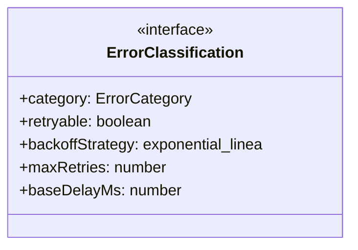
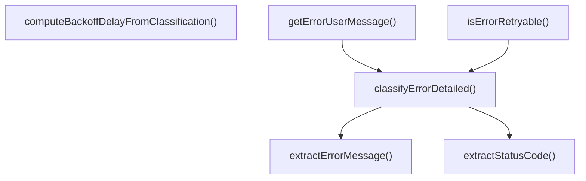

# error-classifier

## 概要

`error-classifier` モジュールのAPIリファレンス。

## エクスポート一覧

| 種別 | 名前 | 説明 |
|------|------|------|
| 関数 | `classifyErrorDetailed` | エラーを詳細に分類する |
| 関数 | `isErrorRetryable` | エラーがリトライ可能かどうかを判定する |
| 関数 | `getErrorUserMessage` | エラーのユーザー向けメッセージを取得する |
| 関数 | `computeBackoffDelayFromClassification` | バックオフ戦略に基づいて待機時間を計算する |
| インターフェース | `ErrorClassification` | エラー分類結果 |
| 型 | `ErrorCategory` | エラーカテゴリの詳細分類 |

## 図解

### クラス図



### 関数フロー



## 関数

### extractStatusCode

```typescript
extractStatusCode(error: unknown): number | undefined
```

HTTPステータスコードを抽出する

**パラメータ**

| 名前 | 型 | 必須 |
|------|-----|------|
| error | `unknown` | はい |

**戻り値**: `number | undefined`

### extractErrorMessage

```typescript
extractErrorMessage(error: unknown): string
```

エラーメッセージを抽出する

**パラメータ**

| 名前 | 型 | 必須 |
|------|-----|------|
| error | `unknown` | はい |

**戻り値**: `string`

### classifyErrorDetailed

```typescript
classifyErrorDetailed(error: unknown): ErrorClassification
```

エラーを詳細に分類する

**パラメータ**

| 名前 | 型 | 必須 |
|------|-----|------|
| error | `unknown` | はい |

**戻り値**: `ErrorClassification`

### isErrorRetryable

```typescript
isErrorRetryable(error: unknown): boolean
```

エラーがリトライ可能かどうかを判定する

**パラメータ**

| 名前 | 型 | 必須 |
|------|-----|------|
| error | `unknown` | はい |

**戻り値**: `boolean`

### getErrorUserMessage

```typescript
getErrorUserMessage(error: unknown): string
```

エラーのユーザー向けメッセージを取得する

**パラメータ**

| 名前 | 型 | 必須 |
|------|-----|------|
| error | `unknown` | はい |

**戻り値**: `string`

### computeBackoffDelayFromClassification

```typescript
computeBackoffDelayFromClassification(attempt: number, classification: ErrorClassification): number
```

バックオフ戦略に基づいて待機時間を計算する

**パラメータ**

| 名前 | 型 | 必須 |
|------|-----|------|
| attempt | `number` | はい |
| classification | `ErrorClassification` | はい |

**戻り値**: `number`

## インターフェース

### ErrorClassification

```typescript
interface ErrorClassification {
  category: ErrorCategory;
  retryable: boolean;
  backoffStrategy: "exponential" | "linear" | "fixed" | "none";
  maxRetries: number;
  baseDelayMs: number;
  userMessage: string;
}
```

エラー分類結果

## 型定義

### ErrorCategory

```typescript
type ErrorCategory = | "rate_limit"
  | "capacity"
  | "timeout"
  | "auth_error"
  | "network_transient"
  | "network_permanent"
  | "validation_error"
  | "logic_error"
  | "resource_exhausted"
  | "provider_error"
  | "unknown"
```

エラーカテゴリの詳細分類

---
*自動生成: 2026-02-24T17:08:02.674Z*
