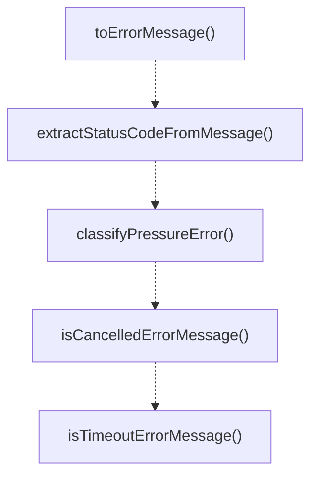

# error-utils

## 概要

`error-utils` モジュールのAPIリファレンス。

## エクスポート一覧

| 種別 | 名前 | 説明 |
|------|------|------|
| 関数 | `toErrorMessage` | Converts an unknown error to a string message. |
| 関数 | `extractStatusCodeFromMessage` | Extracts HTTP status code from an error message. |
| 関数 | `classifyPressureError` | Classifies an error into pressure-related categori |
| 関数 | `isCancelledErrorMessage` | Checks if an error message indicates cancellation. |
| 関数 | `isTimeoutErrorMessage` | Checks if an error message indicates a timeout. |
| 型 | `PressureErrorType` | Pressure error classification types. |

## 図解

### 関数フロー



## 関数

### toErrorMessage

```typescript
toErrorMessage(error: unknown): string
```

Converts an unknown error to a string message.

**パラメータ**

| 名前 | 型 | 必須 |
|------|-----|------|
| error | `unknown` | はい |

**戻り値**: `string`

### extractStatusCodeFromMessage

```typescript
extractStatusCodeFromMessage(error: unknown): number | undefined
```

Extracts HTTP status code from an error message.
Looks for 429 or 5xx status codes in the message.

**パラメータ**

| 名前 | 型 | 必須 |
|------|-----|------|
| error | `unknown` | はい |

**戻り値**: `number | undefined`

### classifyPressureError

```typescript
classifyPressureError(error: unknown): PressureErrorType
```

Classifies an error into pressure-related categories.

**パラメータ**

| 名前 | 型 | 必須 |
|------|-----|------|
| error | `unknown` | はい |

**戻り値**: `PressureErrorType`

### isCancelledErrorMessage

```typescript
isCancelledErrorMessage(error: unknown): boolean
```

Checks if an error message indicates cancellation.

**パラメータ**

| 名前 | 型 | 必須 |
|------|-----|------|
| error | `unknown` | はい |

**戻り値**: `boolean`

### isTimeoutErrorMessage

```typescript
isTimeoutErrorMessage(error: unknown): boolean
```

Checks if an error message indicates a timeout.

**パラメータ**

| 名前 | 型 | 必須 |
|------|-----|------|
| error | `unknown` | はい |

**戻り値**: `boolean`

## 型定義

### PressureErrorType

```typescript
type PressureErrorType = "rate_limit" | "timeout" | "capacity" | "other"
```

Pressure error classification types.

---
*自動生成: 2026-02-17T22:24:18.936Z*
