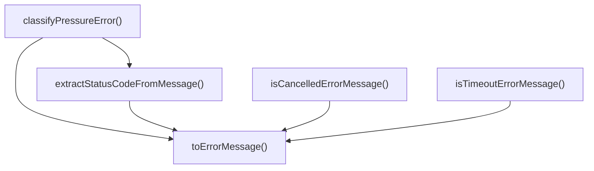

# error-utils

## 概要

`error-utils` モジュールのAPIリファレンス。

## エクスポート一覧

| 種別 | 名前 | 説明 |
|------|------|------|
| 関数 | `toErrorMessage` | エラーメッセージ取得 |
| 関数 | `extractStatusCodeFromMessage` | ステータスコード抽出 |
| 関数 | `classifyPressureError` | エラーを圧力関連のカテゴリに分類する |
| 関数 | `isCancelledErrorMessage` | キャンセル済みか判定 |
| 関数 | `isTimeoutErrorMessage` | タイムアウト判定 |
| 型 | `PressureErrorType` | 圧力エラーの分類型 |

## 図解

### 関数フロー



## 関数

### toErrorMessage

```typescript
toErrorMessage(error: unknown): string
```

エラーメッセージ取得

**パラメータ**

| 名前 | 型 | 必須 |
|------|-----|------|
| error | `unknown` | はい |

**戻り値**: `string`

### extractStatusCodeFromMessage

```typescript
extractStatusCodeFromMessage(error: unknown): number | undefined
```

ステータスコード抽出

**パラメータ**

| 名前 | 型 | 必須 |
|------|-----|------|
| error | `unknown` | はい |

**戻り値**: `number | undefined`

### classifyPressureError

```typescript
classifyPressureError(error: unknown): PressureErrorType
```

エラーを圧力関連のカテゴリに分類する

**パラメータ**

| 名前 | 型 | 必須 |
|------|-----|------|
| error | `unknown` | はい |

**戻り値**: `PressureErrorType`

### isCancelledErrorMessage

```typescript
isCancelledErrorMessage(error: unknown): boolean
```

キャンセル済みか判定

**パラメータ**

| 名前 | 型 | 必須 |
|------|-----|------|
| error | `unknown` | はい |

**戻り値**: `boolean`

### isTimeoutErrorMessage

```typescript
isTimeoutErrorMessage(error: unknown): boolean
```

タイムアウト判定

**パラメータ**

| 名前 | 型 | 必須 |
|------|-----|------|
| error | `unknown` | はい |

**戻り値**: `boolean`

## 型定義

### PressureErrorType

```typescript
type PressureErrorType = "rate_limit" | "timeout" | "capacity" | "other"
```

圧力エラーの分類型

---
*自動生成: 2026-02-24T17:08:02.674Z*
