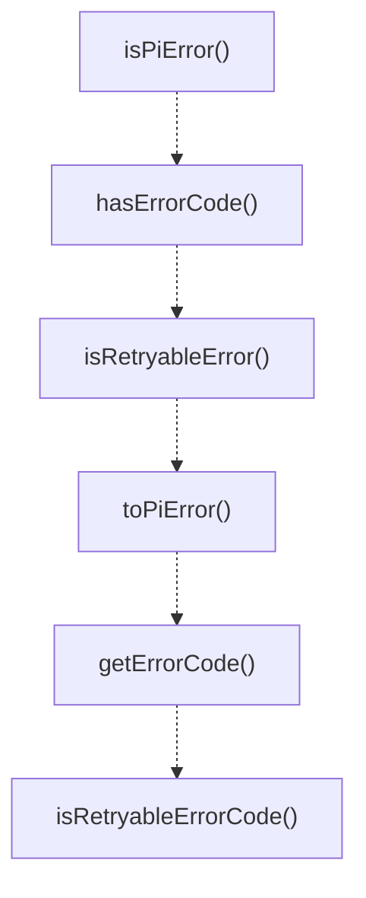

# errors

## 概要

`errors` モジュールのAPIリファレンス。

## エクスポート一覧

| 種別 | 名前 | 説明 |
|------|------|------|
| 関数 | `isPiError` | エラーがPiErrorまたはそのサブクラスかどうかを確認する。 |
| 関数 | `hasErrorCode` | エラーが特定のエラーコードを持っているかどうかを確認する。 |
| 関数 | `isRetryableError` | エラーが再試行可能かどうかを確認する。 |
| 関数 | `toPiError` | 任意のエラーをPiErrorに変換する。 |
| 関数 | `getErrorCode` | エラーからエラーコードを取得する。 |
| 関数 | `isRetryableErrorCode` | エラーコードが再試行可能な状態を示しているかどうかを確認する。 |
| クラス | `PiError` | pi固有エラーの基底クラス。 |
| クラス | `RuntimeLimitError` | ランタイム容量制限に達したときにスローされるエラー。 |
| クラス | `RuntimeQueueWaitError` | ランタイムキューでの待機がタイムアウトしたときにスローされるエラー。 |
| クラス | `SchemaValidationError` | 出力スキーマ検証が失敗したときにスローされるエラー。 |
| クラス | `ValidationError` | 一般的な検証が失敗したときにスローされるエラー。 |
| クラス | `TimeoutError` | 操作がタイムアウトしたときにスローされるエラー。 |
| クラス | `CancelledError` | 操作がキャンセルされたときにスローされるエラー。 |
| クラス | `RateLimitError` | レート制限に達したときにスローされるエラー。 |
| クラス | `CapacityError` | システム容量を超過したときにスローされるエラー。 |
| クラス | `ParsingError` | パースが失敗したときにスローされるエラー。 |
| クラス | `ExecutionError` | 実行操作中にスローされるエラー。 |
| クラス | `ConfigurationError` | 設定問題に対してスローされるエラー。 |
| クラス | `StorageError` | ストレージ操作に対してスローされるエラー。 |
| インターフェース | `ErrorContext` | エラーハンドリング用の追加コンテキスト。 |
| 型 | `PiErrorCode` | piエラーの標準化されたエラーコード。 |
| 型 | `ErrorSeverity` | エラー重要度レベル（分類用）。 |

## 図解

### クラス図


### 関数フロー



## 関数

### isPiError

```typescript
isPiError(error: unknown): error is PiError
```

エラーがPiErrorまたはそのサブクラスかどうかを確認する。

**パラメータ**

| 名前 | 型 | 必須 |
|------|-----|------|
| error | `unknown` | はい |

**戻り値**: `error is PiError`

### hasErrorCode

```typescript
hasErrorCode(error: unknown, code: PiErrorCode): boolean
```

エラーが特定のエラーコードを持っているかどうかを確認する。

**パラメータ**

| 名前 | 型 | 必須 |
|------|-----|------|
| error | `unknown` | はい |
| code | `PiErrorCode` | はい |

**戻り値**: `boolean`

### isRetryableError

```typescript
isRetryableError(error: unknown): boolean
```

エラーが再試行可能かどうかを確認する。
PiErrorでretryable=trueの場合はtrue、それ以外はfalseを返す。

**パラメータ**

| 名前 | 型 | 必須 |
|------|-----|------|
| error | `unknown` | はい |

**戻り値**: `boolean`

### toPiError

```typescript
toPiError(error: unknown): PiError
```

任意のエラーをPiErrorに変換する。
PiErrorインスタンスはそのまま保持し、それ以外は汎用PiErrorでラップする。

**パラメータ**

| 名前 | 型 | 必須 |
|------|-----|------|
| error | `unknown` | はい |

**戻り値**: `PiError`

### getErrorCode

```typescript
getErrorCode(error: unknown): PiErrorCode
```

エラーからエラーコードを取得する。
PiError以外のエラーの場合はUNKNOWN_ERRORを返す。

**パラメータ**

| 名前 | 型 | 必須 |
|------|-----|------|
| error | `unknown` | はい |

**戻り値**: `PiErrorCode`

### isRetryableErrorCode

```typescript
isRetryableErrorCode(code: PiErrorCode): boolean
```

エラーコードが再試行可能な状態を示しているかどうかを確認する。
エラーコードに基づくプログラム的な再試行判断に使用する。

**パラメータ**

| 名前 | 型 | 必須 |
|------|-----|------|
| code | `PiErrorCode` | はい |

**戻り値**: `boolean`

## クラス

### PiError

pi固有エラーの基底クラス。
コードと再試行ヒントを含む構造化されたエラー情報を提供する。

機能:
- プログラムによる処理のためのエラーコード
- 再試行ロジックのための再試行可能フラグ
- エラー追跡のための原因チェーン
- デバッグ用タイムスタンプ

**継承**: `Error`

**プロパティ**

| 名前 | 型 | 可視性 |
|------|-----|--------|
| code | `PiErrorCode` | public |
| retryable | `boolean` | public |
| cause | `Error` | public |
| timestamp | `number` | public |

**メソッド**

| 名前 | シグネチャ |
|------|------------|
| is | `is(code): boolean` |
| toJSON | `toJSON(): Record<string, unknown>` |

### RuntimeLimitError

ランタイム容量制限に達したときにスローされるエラー。
システムがこれ以上同時実行を受け入れられない場合に使用する。

このエラーは通常、即座には再試行できない -
呼び出し元は容量が利用可能になるまで待つ必要がある。

**継承**: `PiError`

**プロパティ**

| 名前 | 型 | 可視性 |
|------|-----|--------|
| currentCount | `number` | public |
| maxCount | `number` | public |

**メソッド**

| 名前 | シグネチャ |
|------|------------|
| toJSON | `toJSON(): Record<string, unknown>` |

### RuntimeQueueWaitError

ランタイムキューでの待機がタイムアウトしたときにスローされるエラー。
容量予約に時間がかかりすぎた場合に使用する。

このエラーは再試行可能 - キュー待機タイムアウトは一時的である可能性がある。

**継承**: `PiError`

**プロパティ**

| 名前 | 型 | 可視性 |
|------|-----|--------|
| waitTimeMs | `number` | public |
| maxWaitMs | `number` | public |

**メソッド**

| 名前 | シグネチャ |
|------|------------|
| toJSON | `toJSON(): Record<string, unknown>` |

### SchemaValidationError

出力スキーマ検証が失敗したときにスローされるエラー。
エージェント出力が期待される形式に準拠していない場合に使用する。

このエラーは再試行可能 - 異なるプロンプトで有効な出力が得られる可能性がある。

**継承**: `PiError`

**プロパティ**

| 名前 | 型 | 可視性 |
|------|-----|--------|
| violations | `string[]` | public |
| field | `string` | public |

**メソッド**

| 名前 | シグネチャ |
|------|------------|
| toJSON | `toJSON(): Record<string, unknown>` |

### ValidationError

一般的な検証が失敗したときにスローされるエラー。
入力検証と事前条件チェックに使用する。

このエラーは再試行不可 - 入力を修正する必要がある。

**継承**: `PiError`

**プロパティ**

| 名前 | 型 | 可視性 |
|------|-----|--------|
| field | `string` | public |
| expected | `string` | public |
| actual | `string` | public |

**メソッド**

| 名前 | シグネチャ |
|------|------------|
| toJSON | `toJSON(): Record<string, unknown>` |

### TimeoutError

操作がタイムアウトしたときにスローされるエラー。

このエラーは再試行可能 - タイムアウトは一時的である可能性がある。

**継承**: `PiError`

**プロパティ**

| 名前 | 型 | 可視性 |
|------|-----|--------|
| timeoutMs | `number` | public |

**メソッド**

| 名前 | シグネチャ |
|------|------------|
| toJSON | `toJSON(): Record<string, unknown>` |

### CancelledError

操作がキャンセルされたときにスローされるエラー。

このエラーは再試行不可 - キャンセルは意図的である。

**継承**: `PiError`

**プロパティ**

| 名前 | 型 | 可視性 |
|------|-----|--------|
| reason | `string` | public |

**メソッド**

| 名前 | シグネチャ |
|------|------------|
| toJSON | `toJSON(): Record<string, unknown>` |

### RateLimitError

レート制限に達したときにスローされるエラー。

待機後に再試行可能である可能性がある。

**継承**: `PiError`

**プロパティ**

| 名前 | 型 | 可視性 |
|------|-----|--------|
| retryAfterMs | `number` | public |

**メソッド**

| 名前 | シグネチャ |
|------|------------|
| toJSON | `toJSON(): Record<string, unknown>` |

### CapacityError

システム容量を超過したときにスローされるエラー。

このエラーは即座には再試行不可。

**継承**: `PiError`

**プロパティ**

| 名前 | 型 | 可視性 |
|------|-----|--------|
| resource | `string` | public |

**メソッド**

| 名前 | シグネチャ |
|------|------------|
| toJSON | `toJSON(): Record<string, unknown>` |

### ParsingError

パースが失敗したときにスローされるエラー。

このエラーは再試行可能 - 異なる出力ならパースに成功する可能性がある。

**継承**: `PiError`

**プロパティ**

| 名前 | 型 | 可視性 |
|------|-----|--------|
| content | `string` | public |
| position | `number` | public |

**メソッド**

| 名前 | シグネチャ |
|------|------------|
| toJSON | `toJSON(): Record<string, unknown>` |

### ExecutionError

実行操作中にスローされるエラー。
ランタイム実行の失敗に使用する。

**継承**: `PiError`

**プロパティ**

| 名前 | 型 | 可視性 |
|------|-----|--------|
| severity | `ErrorSeverity` | public |
| context | `ErrorContext` | public |

**メソッド**

| 名前 | シグネチャ |
|------|------------|
| toJSON | `toJSON(): Record<string, unknown>` |

### ConfigurationError

設定問題に対してスローされるエラー。
設定が無効または不足している場合に使用する。

**継承**: `PiError`

**プロパティ**

| 名前 | 型 | 可視性 |
|------|-----|--------|
| key | `string` | public |
| expected | `string` | public |

**メソッド**

| 名前 | シグネチャ |
|------|------------|
| toJSON | `toJSON(): Record<string, unknown>` |

### StorageError

ストレージ操作に対してスローされるエラー。
ファイルI/Oまたは永続化操作の失敗に使用する。

**継承**: `PiError`

**プロパティ**

| 名前 | 型 | 可視性 |
|------|-----|--------|
| path | `string` | public |
| operation | `"read" | "write" | "delete" | "lock"` | public |

**メソッド**

| 名前 | シグネチャ |
|------|------------|
| toJSON | `toJSON(): Record<string, unknown>` |

## インターフェース

### ErrorContext

```typescript
interface ErrorContext {
  operation?: string;
  component?: string;
  metadata?: Record<string, unknown>;
  timestamp?: number;
}
```

エラーハンドリング用の追加コンテキスト。

## 型定義

### PiErrorCode

```typescript
type PiErrorCode = | "UNKNOWN_ERROR"
  | "RUNTIME_LIMIT_REACHED"
  | "RUNTIME_QUEUE_WAIT"
  | "SCHEMA_VIOLATION"
  | "VALIDATION_ERROR"
  | "TIMEOUT_ERROR"
  | "CANCELLED_ERROR"
  | "RATE_LIMIT_ERROR"
  | "CAPACITY_ERROR"
  | "PARSING_ERROR"
```

piエラーの標準化されたエラーコード。
プログラムによるエラーハンドリングとロギングに使用する。

### ErrorSeverity

```typescript
type ErrorSeverity = "low" | "medium" | "high" | "critical"
```

エラー重要度レベル（分類用）。

---
*自動生成: 2026-02-18T00:15:35.720Z*
