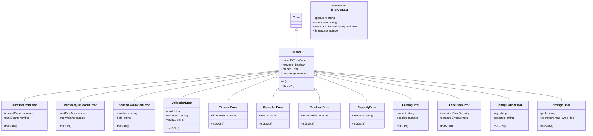
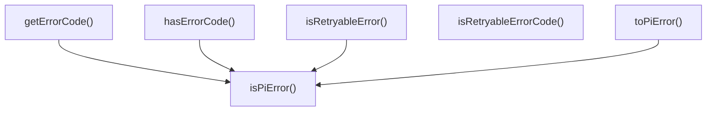

# errors

## 概要

`errors` モジュールのAPIリファレンス。

## エクスポート一覧

| 種別 | 名前 | 説明 |
|------|------|------|
| 関数 | `isPiError` | PiErrorかどうかを判定する |
| 関数 | `hasErrorCode` | エラーが特定のエラーコードを持つか確認する。 |
| 関数 | `isRetryableError` | エラーが再試行可能か判定する |
| 関数 | `toPiError` | 任意のエラーをPiErrorに変換する |
| 関数 | `getErrorCode` | エラーからエラーコードを取得する |
| 関数 | `isRetryableErrorCode` | エラーコードが再試行可能か判定する |
| クラス | `PiError` | pi固有エラーの基底クラス。 |
| クラス | `RuntimeLimitError` | ランタイム容量制限に達したエラー。 |
| クラス | `RuntimeQueueWaitError` | ランタイムキューでの待機タイムアウトエラー。 |
| クラス | `SchemaValidationError` | 出力スキーマ検証が失敗したときにスローされるエラー。 |
| クラス | `ValidationError` | 一般的な検証エラーを表すクラス。 |
| クラス | `TimeoutError` | 操作がタイムアウトしたときにスローされるエラー。 |
| クラス | `CancelledError` | 操作がキャンセルされたときにスローされるエラー |
| クラス | `RateLimitError` | レート制限エラー |
| クラス | `CapacityError` | 容量超過エラー |
| クラス | `ParsingError` | パース処理で発生したエラー |
| クラス | `ExecutionError` | 実行操作中にスローされるエラー。 |
| クラス | `ConfigurationError` | 設定エラーを表すクラス |
| クラス | `StorageError` | ストレージ操作に対してスローされるエラー |
| インターフェース | `ErrorContext` | エラーハンドリング用の追加コンテキスト。 |
| 型 | `PiErrorCode` | piエラーの標準化されたエラーコード。 |
| 型 | `ErrorSeverity` | エラー重要度レベル。 |

## 図解

### クラス図



### 関数フロー



## 関数

### isPiError

```typescript
isPiError(error: unknown): error is PiError
```

PiErrorかどうかを判定する

**パラメータ**

| 名前 | 型 | 必須 |
|------|-----|------|
| error | `unknown` | はい |

**戻り値**: `error is PiError`

### hasErrorCode

```typescript
hasErrorCode(error: unknown, code: PiErrorCode): boolean
```

エラーが特定のエラーコードを持つか確認する。

**パラメータ**

| 名前 | 型 | 必須 |
|------|-----|------|
| error | `unknown` | はい |
| code | `PiErrorCode` | はい |

**戻り値**: `boolean`

### isRetryableError

```typescript
isRetryableError(error: unknown): boolean
```

エラーが再試行可能か判定する

**パラメータ**

| 名前 | 型 | 必須 |
|------|-----|------|
| error | `unknown` | はい |

**戻り値**: `boolean`

### toPiError

```typescript
toPiError(error: unknown): PiError
```

任意のエラーをPiErrorに変換する

**パラメータ**

| 名前 | 型 | 必須 |
|------|-----|------|
| error | `unknown` | はい |

**戻り値**: `PiError`

### getErrorCode

```typescript
getErrorCode(error: unknown): PiErrorCode
```

エラーからエラーコードを取得する

**パラメータ**

| 名前 | 型 | 必須 |
|------|-----|------|
| error | `unknown` | はい |

**戻り値**: `PiErrorCode`

### isRetryableErrorCode

```typescript
isRetryableErrorCode(code: PiErrorCode): boolean
```

エラーコードが再試行可能か判定する

**パラメータ**

| 名前 | 型 | 必須 |
|------|-----|------|
| code | `PiErrorCode` | はい |

**戻り値**: `boolean`

## クラス

### PiError

pi固有エラーの基底クラス。

**継承**: `Error`

**プロパティ**

| 名前 | 型 | 可視性 |
|------|-----|--------|
| code | `PiErrorCode` | public |
| retryable | `boolean` | public |
| cause | `Error` | public |
| timestamp | `number` | public |

**メソッド**

| 名前 | シグネチャ |
|------|------------|
| is | `is(code): boolean` |
| toJSON | `toJSON(): Record<string, unknown>` |

### RuntimeLimitError

ランタイム容量制限に達したエラー。

**継承**: `PiError`

**プロパティ**

| 名前 | 型 | 可視性 |
|------|-----|--------|
| currentCount | `number` | public |
| maxCount | `number` | public |

**メソッド**

| 名前 | シグネチャ |
|------|------------|
| toJSON | `toJSON(): Record<string, unknown>` |

### RuntimeQueueWaitError

ランタイムキューでの待機タイムアウトエラー。

**継承**: `PiError`

**プロパティ**

| 名前 | 型 | 可視性 |
|------|-----|--------|
| waitTimeMs | `number` | public |
| maxWaitMs | `number` | public |

**メソッド**

| 名前 | シグネチャ |
|------|------------|
| toJSON | `toJSON(): Record<string, unknown>` |

### SchemaValidationError

出力スキーマ検証が失敗したときにスローされるエラー。

**継承**: `PiError`

**プロパティ**

| 名前 | 型 | 可視性 |
|------|-----|--------|
| violations | `string[]` | public |
| field | `string` | public |

**メソッド**

| 名前 | シグネチャ |
|------|------------|
| toJSON | `toJSON(): Record<string, unknown>` |

### ValidationError

一般的な検証エラーを表すクラス。

**継承**: `PiError`

**プロパティ**

| 名前 | 型 | 可視性 |
|------|-----|--------|
| field | `string` | public |
| expected | `string` | public |
| actual | `string` | public |

**メソッド**

| 名前 | シグネチャ |
|------|------------|
| toJSON | `toJSON(): Record<string, unknown>` |

### TimeoutError

操作がタイムアウトしたときにスローされるエラー。

**継承**: `PiError`

**プロパティ**

| 名前 | 型 | 可視性 |
|------|-----|--------|
| timeoutMs | `number` | public |

**メソッド**

| 名前 | シグネチャ |
|------|------------|
| toJSON | `toJSON(): Record<string, unknown>` |

### CancelledError

操作がキャンセルされたときにスローされるエラー

**継承**: `PiError`

**プロパティ**

| 名前 | 型 | 可視性 |
|------|-----|--------|
| reason | `string` | public |

**メソッド**

| 名前 | シグネチャ |
|------|------------|
| toJSON | `toJSON(): Record<string, unknown>` |

### RateLimitError

レート制限エラー

**継承**: `PiError`

**プロパティ**

| 名前 | 型 | 可視性 |
|------|-----|--------|
| retryAfterMs | `number` | public |

**メソッド**

| 名前 | シグネチャ |
|------|------------|
| toJSON | `toJSON(): Record<string, unknown>` |

### CapacityError

容量超過エラー

**継承**: `PiError`

**プロパティ**

| 名前 | 型 | 可視性 |
|------|-----|--------|
| resource | `string` | public |

**メソッド**

| 名前 | シグネチャ |
|------|------------|
| toJSON | `toJSON(): Record<string, unknown>` |

### ParsingError

パース処理で発生したエラー

**継承**: `PiError`

**プロパティ**

| 名前 | 型 | 可視性 |
|------|-----|--------|
| content | `string` | public |
| position | `number` | public |

**メソッド**

| 名前 | シグネチャ |
|------|------------|
| toJSON | `toJSON(): Record<string, unknown>` |

### ExecutionError

実行操作中にスローされるエラー。

**継承**: `PiError`

**プロパティ**

| 名前 | 型 | 可視性 |
|------|-----|--------|
| severity | `ErrorSeverity` | public |
| context | `ErrorContext` | public |

**メソッド**

| 名前 | シグネチャ |
|------|------------|
| toJSON | `toJSON(): Record<string, unknown>` |

### ConfigurationError

設定エラーを表すクラス

**継承**: `PiError`

**プロパティ**

| 名前 | 型 | 可視性 |
|------|-----|--------|
| key | `string` | public |
| expected | `string` | public |

**メソッド**

| 名前 | シグネチャ |
|------|------------|
| toJSON | `toJSON(): Record<string, unknown>` |

### StorageError

ストレージ操作に対してスローされるエラー

**継承**: `PiError`

**プロパティ**

| 名前 | 型 | 可視性 |
|------|-----|--------|
| path | `string` | public |
| operation | `"read" | "write" | "delete" | "lock"` | public |

**メソッド**

| 名前 | シグネチャ |
|------|------------|
| toJSON | `toJSON(): Record<string, unknown>` |

## インターフェース

### ErrorContext

```typescript
interface ErrorContext {
  operation?: string;
  component?: string;
  metadata?: Record<string, unknown>;
  timestamp?: number;
}
```

エラーハンドリング用の追加コンテキスト。

## 型定義

### PiErrorCode

```typescript
type PiErrorCode = | "UNKNOWN_ERROR"
  | "RUNTIME_LIMIT_REACHED"
  | "RUNTIME_QUEUE_WAIT"
  | "SCHEMA_VIOLATION"
  | "VALIDATION_ERROR"
  | "TIMEOUT_ERROR"
  | "CANCELLED_ERROR"
  | "RATE_LIMIT_ERROR"
  | "CAPACITY_ERROR"
  | "PARSING_ERROR"
```

piエラーの標準化されたエラーコード。

### ErrorSeverity

```typescript
type ErrorSeverity = "low" | "medium" | "high" | "critical"
```

エラー重要度レベル。

---
*自動生成: 2026-02-18T14:31:30.990Z*
