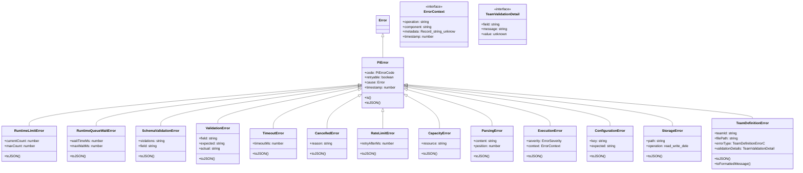

# errors

## 概要

`errors` モジュールのAPIリファレンス。

## エクスポート一覧

| 種別 | 名前 | 説明 |
|------|------|------|
| 関数 | `isPiError` | PiErrorか判定 |
| 関数 | `hasErrorCode` | エラーコードを確認 |
| 関数 | `isTeamDefinitionError` | チーム定義エラーか判定 |
| 関数 | `isPiErrorRetryable` | PiErrorベースでリトライ可能か判定 |
| 関数 | `toPiError` | Piエラー変換 |
| 関数 | `getErrorCode` | エラーコード取得 |
| 関数 | `isRetryableErrorCode` | リトライ可否判定 |
| クラス | `PiError` | pi固有エラーを生成 |
| クラス | `RuntimeLimitError` | ランタイム容量制限エラー |
| クラス | `RuntimeQueueWaitError` | キュー待機タイムアウト |
| クラス | `SchemaValidationError` | スキーマ検証エラー |
| クラス | `ValidationError` | 検証エラー |
| クラス | `TimeoutError` | タイムアウトエラー |
| クラス | `CancelledError` | - |
| クラス | `RateLimitError` | - |
| クラス | `CapacityError` | キャパシティ超過時のエラーを表すクラス |
| クラス | `ParsingError` | パース処理中に発生したエラーを表すクラス |
| クラス | `ExecutionError` | 実行エラーを生成 |
| クラス | `ConfigurationError` | 設定エラーを表す |
| クラス | `StorageError` | ストレージエラー |
| クラス | `TeamDefinitionError` | チーム定義関連エラー |
| インターフェース | `ErrorContext` | エラーハンドリング用の追加コンテキスト |
| インターフェース | `TeamValidationDetail` | チーム定義の検証エラー詳細 |
| 型 | `PiErrorCode` | pi標準エラーコード |
| 型 | `ErrorSeverity` | エラー深刻度を表す型定義 |
| 型 | `TeamDefinitionErrorCode` | チーム定義エラーの種別 |

## 図解

### クラス図



### 関数フロー


## 関数

### isPiError

```typescript
isPiError(error: unknown): error is PiError
```

PiErrorか判定

**パラメータ**

| 名前 | 型 | 必須 |
|------|-----|------|
| error | `unknown` | はい |

**戻り値**: `error is PiError`

### hasErrorCode

```typescript
hasErrorCode(error: unknown, code: PiErrorCode): boolean
```

エラーコードを確認

**パラメータ**

| 名前 | 型 | 必須 |
|------|-----|------|
| error | `unknown` | はい |
| code | `PiErrorCode` | はい |

**戻り値**: `boolean`

### isTeamDefinitionError

```typescript
isTeamDefinitionError(error: unknown): error is TeamDefinitionError
```

チーム定義エラーか判定

**パラメータ**

| 名前 | 型 | 必須 |
|------|-----|------|
| error | `unknown` | はい |

**戻り値**: `error is TeamDefinitionError`

### isPiErrorRetryable

```typescript
isPiErrorRetryable(error: unknown): boolean
```

PiErrorベースでリトライ可能か判定

**パラメータ**

| 名前 | 型 | 必須 |
|------|-----|------|
| error | `unknown` | はい |

**戻り値**: `boolean`

### toPiError

```typescript
toPiError(error: unknown): PiError
```

Piエラー変換

**パラメータ**

| 名前 | 型 | 必須 |
|------|-----|------|
| error | `unknown` | はい |

**戻り値**: `PiError`

### getErrorCode

```typescript
getErrorCode(error: unknown): PiErrorCode
```

エラーコード取得

**パラメータ**

| 名前 | 型 | 必須 |
|------|-----|------|
| error | `unknown` | はい |

**戻り値**: `PiErrorCode`

### isRetryableErrorCode

```typescript
isRetryableErrorCode(code: PiErrorCode): boolean
```

リトライ可否判定

**パラメータ**

| 名前 | 型 | 必須 |
|------|-----|------|
| code | `PiErrorCode` | はい |

**戻り値**: `boolean`

## クラス

### PiError

pi固有エラーを生成

**継承**: `Error`

**プロパティ**

| 名前 | 型 | 可視性 |
|------|-----|--------|
| code | `PiErrorCode` | public |
| retryable | `boolean` | public |
| cause | `Error` | public |
| timestamp | `number` | public |

**メソッド**

| 名前 | シグネチャ |
|------|------------|
| is | `is(code): boolean` |
| toJSON | `toJSON(): Record<string, unknown>` |

### RuntimeLimitError

ランタイム容量制限エラー

**継承**: `PiError`

**プロパティ**

| 名前 | 型 | 可視性 |
|------|-----|--------|
| currentCount | `number` | public |
| maxCount | `number` | public |

**メソッド**

| 名前 | シグネチャ |
|------|------------|
| toJSON | `toJSON(): Record<string, unknown>` |

### RuntimeQueueWaitError

キュー待機タイムアウト

**継承**: `PiError`

**プロパティ**

| 名前 | 型 | 可視性 |
|------|-----|--------|
| waitTimeMs | `number` | public |
| maxWaitMs | `number` | public |

**メソッド**

| 名前 | シグネチャ |
|------|------------|
| toJSON | `toJSON(): Record<string, unknown>` |

### SchemaValidationError

スキーマ検証エラー

**継承**: `PiError`

**プロパティ**

| 名前 | 型 | 可視性 |
|------|-----|--------|
| violations | `string[]` | public |
| field | `string` | public |

**メソッド**

| 名前 | シグネチャ |
|------|------------|
| toJSON | `toJSON(): Record<string, unknown>` |

### ValidationError

検証エラー

**継承**: `PiError`

**プロパティ**

| 名前 | 型 | 可視性 |
|------|-----|--------|
| field | `string` | public |
| expected | `string` | public |
| actual | `string` | public |

**メソッド**

| 名前 | シグネチャ |
|------|------------|
| toJSON | `toJSON(): Record<string, unknown>` |

### TimeoutError

タイムアウトエラー

**継承**: `PiError`

**プロパティ**

| 名前 | 型 | 可視性 |
|------|-----|--------|
| timeoutMs | `number` | public |

**メソッド**

| 名前 | シグネチャ |
|------|------------|
| toJSON | `toJSON(): Record<string, unknown>` |

### CancelledError

**継承**: `PiError`

**プロパティ**

| 名前 | 型 | 可視性 |
|------|-----|--------|
| reason | `string` | public |

**メソッド**

| 名前 | シグネチャ |
|------|------------|
| toJSON | `toJSON(): Record<string, unknown>` |

### RateLimitError

**継承**: `PiError`

**プロパティ**

| 名前 | 型 | 可視性 |
|------|-----|--------|
| retryAfterMs | `number` | public |

**メソッド**

| 名前 | シグネチャ |
|------|------------|
| toJSON | `toJSON(): Record<string, unknown>` |

### CapacityError

キャパシティ超過時のエラーを表すクラス

**継承**: `PiError`

**プロパティ**

| 名前 | 型 | 可視性 |
|------|-----|--------|
| resource | `string` | public |

**メソッド**

| 名前 | シグネチャ |
|------|------------|
| toJSON | `toJSON(): Record<string, unknown>` |

### ParsingError

パース処理中に発生したエラーを表すクラス

**継承**: `PiError`

**プロパティ**

| 名前 | 型 | 可視性 |
|------|-----|--------|
| content | `string` | public |
| position | `number` | public |

**メソッド**

| 名前 | シグネチャ |
|------|------------|
| toJSON | `toJSON(): Record<string, unknown>` |

### ExecutionError

実行エラーを生成

**継承**: `PiError`

**プロパティ**

| 名前 | 型 | 可視性 |
|------|-----|--------|
| severity | `ErrorSeverity` | public |
| context | `ErrorContext` | public |

**メソッド**

| 名前 | シグネチャ |
|------|------------|
| toJSON | `toJSON(): Record<string, unknown>` |

### ConfigurationError

設定エラーを表す

**継承**: `PiError`

**プロパティ**

| 名前 | 型 | 可視性 |
|------|-----|--------|
| key | `string` | public |
| expected | `string` | public |

**メソッド**

| 名前 | シグネチャ |
|------|------------|
| toJSON | `toJSON(): Record<string, unknown>` |

### StorageError

ストレージエラー

**継承**: `PiError`

**プロパティ**

| 名前 | 型 | 可視性 |
|------|-----|--------|
| path | `string` | public |
| operation | `"read" | "write" | "delete" | "lock"` | public |

**メソッド**

| 名前 | シグネチャ |
|------|------------|
| toJSON | `toJSON(): Record<string, unknown>` |

### TeamDefinitionError

チーム定義関連エラー

**継承**: `PiError`

**プロパティ**

| 名前 | 型 | 可視性 |
|------|-----|--------|
| teamId | `string` | public |
| filePath | `string` | public |
| errorType | `TeamDefinitionErrorCode` | public |
| validationDetails | `TeamValidationDetail[]` | public |

**メソッド**

| 名前 | シグネチャ |
|------|------------|
| toJSON | `toJSON(): Record<string, unknown>` |
| toFormattedMessage | `toFormattedMessage(): string` |

## インターフェース

### ErrorContext

```typescript
interface ErrorContext {
  operation?: string;
  component?: string;
  metadata?: Record<string, unknown>;
  timestamp?: number;
}
```

エラーハンドリング用の追加コンテキスト

### TeamValidationDetail

```typescript
interface TeamValidationDetail {
  field: string;
  message: string;
  value?: unknown;
}
```

チーム定義の検証エラー詳細

## 型定義

### PiErrorCode

```typescript
type PiErrorCode = | "UNKNOWN_ERROR"
  | "RUNTIME_LIMIT_REACHED"
  | "RUNTIME_QUEUE_WAIT"
  | "SCHEMA_VIOLATION"
  | "VALIDATION_ERROR"
  | "TIMEOUT_ERROR"
  | "CANCELLED_ERROR"
  | "RATE_LIMIT_ERROR"
  | "CAPACITY_ERROR"
  | "PARSING_ERROR"
```

pi標準エラーコード

### ErrorSeverity

```typescript
type ErrorSeverity = "low" | "medium" | "high" | "critical"
```

エラー深刻度を表す型定義

### TeamDefinitionErrorCode

```typescript
type TeamDefinitionErrorCode = | "TEAM_DEFINITION_NOT_FOUND"
  | "TEAM_DEFINITION_PARSE_ERROR"
  | "TEAM_DEFINITION_VALIDATION_ERROR"
  | "TEAM_MEMBER_VALIDATION_ERROR"
  | "TEAM_PHASE_RESOLUTION_ERROR"
```

チーム定義エラーの種別

---
*自動生成: 2026-02-22T19:27:00.620Z*
