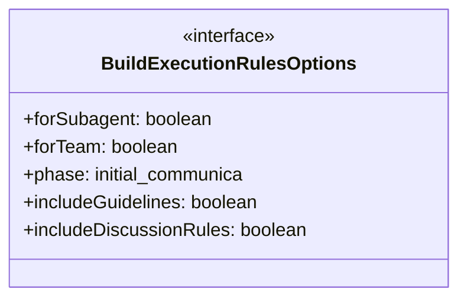
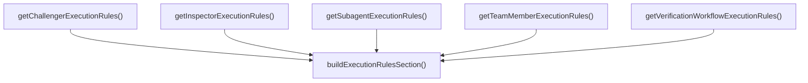

# execution-rules

## 概要

`execution-rules` モジュールのAPIリファレンス。

## エクスポート一覧

| 種別 | 名前 | 説明 |
|------|------|------|
| 関数 | `buildExecutionRulesSection` | 実行ルールセクションを構築 |
| 関数 | `getSubagentExecutionRules` | サブエージェントルールを取得 |
| 関数 | `getTeamMemberExecutionRules` | チームメンバールールを取得 |
| 関数 | `getChallengerExecutionRules` | チャレンジャールールを取得 |
| 関数 | `getInspectorExecutionRules` | - |
| 関数 | `getVerificationWorkflowExecutionRules` | - |
| インターフェース | `BuildExecutionRulesOptions` | 実行ルールの構築オプション |

## 図解

### クラス図



### 関数フロー



## 関数

### buildExecutionRulesSection

```typescript
buildExecutionRulesSection(options: BuildExecutionRulesOptions): string
```

実行ルールセクションを構築

**パラメータ**

| 名前 | 型 | 必須 |
|------|-----|------|
| options | `BuildExecutionRulesOptions` | はい |

**戻り値**: `string`

### getSubagentExecutionRules

```typescript
getSubagentExecutionRules(includeGuidelines: any): string
```

サブエージェントルールを取得

**パラメータ**

| 名前 | 型 | 必須 |
|------|-----|------|
| includeGuidelines | `any` | はい |

**戻り値**: `string`

### getTeamMemberExecutionRules

```typescript
getTeamMemberExecutionRules(phase: "initial" | "communication", includeGuidelines: any): string
```

チームメンバールールを取得

**パラメータ**

| 名前 | 型 | 必須 |
|------|-----|------|
| phase | `"initial" | "communication"` | はい |
| includeGuidelines | `any` | はい |

**戻り値**: `string`

### getChallengerExecutionRules

```typescript
getChallengerExecutionRules(includeGuidelines: any): string
```

チャレンジャールールを取得

**パラメータ**

| 名前 | 型 | 必須 |
|------|-----|------|
| includeGuidelines | `any` | はい |

**戻り値**: `string`

### getInspectorExecutionRules

```typescript
getInspectorExecutionRules(includeGuidelines: any): string
```

**パラメータ**

| 名前 | 型 | 必須 |
|------|-----|------|
| includeGuidelines | `any` | はい |

**戻り値**: `string`

### getVerificationWorkflowExecutionRules

```typescript
getVerificationWorkflowExecutionRules(phase: "inspector" | "challenger" | "both", includeGuidelines: any): string
```

**パラメータ**

| 名前 | 型 | 必須 |
|------|-----|------|
| phase | `"inspector" | "challenger" | "both"` | はい |
| includeGuidelines | `any` | はい |

**戻り値**: `string`

## インターフェース

### BuildExecutionRulesOptions

```typescript
interface BuildExecutionRulesOptions {
  forSubagent?: boolean;
  forTeam?: boolean;
  phase?: "initial" | "communication";
  includeGuidelines?: boolean;
  includeDiscussionRules?: boolean;
  includeCognitiveBiasCountermeasures?: boolean;
  includeSelfVerification?: boolean;
  includeWorkingMemoryGuidelines?: boolean;
  includeTerminationCheck?: boolean;
  includeCompositionalInference?: boolean;
  includeChallengeRules?: boolean;
  includeInspectionRules?: boolean;
  includeVerificationWorkflow?: boolean;
}
```

実行ルールの構築オプション

---
*自動生成: 2026-02-18T15:54:41.484Z*
