# experience-replay

## 概要

`experience-replay` モジュールのAPIリファレンス。

## インポート

```typescript
// from './thinking-process': ThinkingMode, ThinkingPhase, ThinkingContext, ...
// from './aporia-handler': AporiaDetection, AporiaResolution
// from './belief-updater': Distribution, createPrior, calculateEntropy, ...
// from './learnable-mode-selector': ModeSelectionResult
```

## エクスポート一覧

| 種別 | 名前 | 説明 |
|------|------|------|
| 関数 | `createExperienceReplay` | - |
| 関数 | `store` | - |
| 関数 | `retrieve` | - |
| 関数 | `learn` | - |
| 関数 | `findApplicablePatterns` | - |
| 関数 | `generateRecommendations` | - |
| 関数 | `generateSessionId` | - |
| 関数 | `createThinkingSession` | - |
| 関数 | `addStepToSession` | - |
| 関数 | `completeSession` | - |
| 関数 | `summarizeExperienceReplay` | - |
| インターフェース | `ThinkingSession` | 思考セッション |
| インターフェース | `SessionOutcome` | セッションの結果 |
| インターフェース | `SessionMetadata` | セッションメタデータ |
| インターフェース | `SimilarExperience` | 類似経験 |
| インターフェース | `LearnedPattern` | 学習済みパターン |
| インターフェース | `PatternCondition` | パターン条件 |
| インターフェース | `RecommendedAction` | 推奨アクション |
| インターフェース | `ExperienceReplay` | 経験再生システム |
| インターフェース | `ExperienceIndexes` | 経験インデックス |
| インターフェース | `ExperienceReplayConfig` | 設定 |
| インターフェース | `ExperienceStats` | 統計 |
| 型 | `PatternType` | パターンタイプ |

## 図解

### クラス図

```mermaid
classDiagram
  class ThinkingSession {
    <<interface>>
    +id: string
    +context: ThinkingContext
    +steps: ThinkingStep
    +modeSelections: ModeSelectionResult
    +aporias: AporiaDetection
  }
  class SessionOutcome {
    <<interface>>
    +status: success_failure
    +effectiveness: number
    +lessonsLearned: string
    +nextSteps: string
    +reviewedAt: Date
  }
  class SessionMetadata {
    <<interface>>
    +createdAt: Date
    +completedAt: Date
    +duration: number
    +tags: string
    +taskType: string
  }
  class SimilarExperience {
    <<interface>>
    +session: ThinkingSession
    +similarity: number
    +matchingFeatures: string
    +relevantSteps: ThinkingStep
    +applicability: high_medium_low
  }
  class LearnedPattern {
    <<interface>>
    +patternId: string
    +patternType: PatternType
    +conditions: PatternCondition
    +recommendedAction: RecommendedAction
    +confidence: number
  }
  class PatternCondition {
    <<interface>>
    +type: context_phase_m
    +value: string
    +weight: number
  }
  class RecommendedAction {
    <<interface>>
    +type: select_mode_trans
    +target: string
    +rationale: string
    +expectedOutcome: string
  }
  class ExperienceReplay {
    <<interface>>
    +sessions: Map_string_ThinkingS
    +patterns: Map_string_LearnedPa
    +indexes: ExperienceIndexes
    +config: ExperienceReplayConf
    +stats: ExperienceStats
  }
  class ExperienceIndexes {
    <<interface>>
    +byTaskType: Map_string_Set_strin
    +byPhase: Map_ThinkingPhase_Se
    +byMode: Map_ThinkingMode_Set
    +byTag: Map_string_Set_strin
    +keywordIndex: Map_string_Set_strin
  }
  class ExperienceReplayConfig {
    <<interface>>
    +maxSessions: number
    +similarityThreshold: number
    +patternConfidenceThreshold: number
    +learningInterval: number
    +maxAge: number
  }
  class ExperienceStats {
    <<interface>>
    +totalSessions: number
    +successfulSessions: number
    +failedSessions: number
    +patternsLearned: number
    +patternsApplied: number
  }
```



### 依存関係図


### 関数フロー


### シーケンス図


## 関数

### createExperienceReplay

```typescript
createExperienceReplay(config: Partial<ExperienceReplayConfig>): ExperienceReplay
```

**パラメータ**

| 名前 | 型 | 必須 |
|------|-----|------|
| config | `Partial<ExperienceReplayConfig>` | はい |

**戻り値**: `ExperienceReplay`

### store

```typescript
store(replay: ExperienceReplay, session: ThinkingSession): ExperienceReplay
```

**パラメータ**

| 名前 | 型 | 必須 |
|------|-----|------|
| replay | `ExperienceReplay` | はい |
| session | `ThinkingSession` | はい |

**戻り値**: `ExperienceReplay`

### retrieve

```typescript
retrieve(replay: ExperienceReplay, context: ThinkingContext, options: {
    maxResults?: number;
    minSimilarity?: number;
    includeFailed?: boolean;
  }): SimilarExperience[]
```

**パラメータ**

| 名前 | 型 | 必須 |
|------|-----|------|
| replay | `ExperienceReplay` | はい |
| context | `ThinkingContext` | はい |
| options | `object` | はい |
| &nbsp;&nbsp;↳ maxResults | `number` | いいえ |
| &nbsp;&nbsp;↳ minSimilarity | `number` | いいえ |
| &nbsp;&nbsp;↳ includeFailed | `boolean` | いいえ |

**戻り値**: `SimilarExperience[]`

### learn

```typescript
learn(replay: ExperienceReplay): {
  patterns: Map<string, LearnedPattern>;
  newPatterns: LearnedPattern[];
  updatedPatterns: LearnedPattern[];
  replay: ExperienceReplay;
}
```

**パラメータ**

| 名前 | 型 | 必須 |
|------|-----|------|
| replay | `ExperienceReplay` | はい |

**戻り値**: `{
  patterns: Map<string, LearnedPattern>;
  newPatterns: LearnedPattern[];
  updatedPatterns: LearnedPattern[];
  replay: ExperienceReplay;
}`

### findApplicablePatterns

```typescript
findApplicablePatterns(replay: ExperienceReplay, context: ThinkingContext): LearnedPattern[]
```

**パラメータ**

| 名前 | 型 | 必須 |
|------|-----|------|
| replay | `ExperienceReplay` | はい |
| context | `ThinkingContext` | はい |

**戻り値**: `LearnedPattern[]`

### generateRecommendations

```typescript
generateRecommendations(patterns: LearnedPattern[], context: ThinkingContext): string[]
```

**パラメータ**

| 名前 | 型 | 必須 |
|------|-----|------|
| patterns | `LearnedPattern[]` | はい |
| context | `ThinkingContext` | はい |

**戻り値**: `string[]`

### generateSessionId

```typescript
generateSessionId(): string
```

**戻り値**: `string`

### createThinkingSession

```typescript
createThinkingSession(task: string, options: {
    phase?: ThinkingPhase;
    mode?: ThinkingMode;
    taskType?: string;
    complexity?: 'low' | 'medium' | 'high';
    priority?: 'low' | 'medium' | 'high';
    tags?: string[];
  }): ThinkingSession
```

**パラメータ**

| 名前 | 型 | 必須 |
|------|-----|------|
| task | `string` | はい |
| options | `object` | はい |
| &nbsp;&nbsp;↳ phase | `ThinkingPhase` | いいえ |
| &nbsp;&nbsp;↳ mode | `ThinkingMode` | いいえ |
| &nbsp;&nbsp;↳ taskType | `string` | いいえ |
| &nbsp;&nbsp;↳ complexity | `'low' | 'medium' | 'high'` | いいえ |
| &nbsp;&nbsp;↳ priority | `'low' | 'medium' | 'high'` | いいえ |
| &nbsp;&nbsp;↳ tags | `string[]` | いいえ |

**戻り値**: `ThinkingSession`

### addStepToSession

```typescript
addStepToSession(session: ThinkingSession, step: ThinkingStep): ThinkingSession
```

**パラメータ**

| 名前 | 型 | 必須 |
|------|-----|------|
| session | `ThinkingSession` | はい |
| step | `ThinkingStep` | はい |

**戻り値**: `ThinkingSession`

### completeSession

```typescript
completeSession(session: ThinkingSession, outcome: Partial<SessionOutcome>): ThinkingSession
```

**パラメータ**

| 名前 | 型 | 必須 |
|------|-----|------|
| session | `ThinkingSession` | はい |
| outcome | `Partial<SessionOutcome>` | はい |

**戻り値**: `ThinkingSession`

### summarizeExperienceReplay

```typescript
summarizeExperienceReplay(replay: ExperienceReplay): string
```

**パラメータ**

| 名前 | 型 | 必須 |
|------|-----|------|
| replay | `ExperienceReplay` | はい |

**戻り値**: `string`

### updateIndexes

```typescript
updateIndexes(indexes: ExperienceIndexes, session: ThinkingSession): ExperienceIndexes
```

インデックスを更新

**パラメータ**

| 名前 | 型 | 必須 |
|------|-----|------|
| indexes | `ExperienceIndexes` | はい |
| session | `ThinkingSession` | はい |

**戻り値**: `ExperienceIndexes`

### updateStats

```typescript
updateStats(stats: ExperienceStats, session: ThinkingSession): ExperienceStats
```

統計を更新

**パラメータ**

| 名前 | 型 | 必須 |
|------|-----|------|
| stats | `ExperienceStats` | はい |
| session | `ThinkingSession` | はい |

**戻り値**: `ExperienceStats`

### trimOldSessions

```typescript
trimOldSessions(sessions: Map<string, ThinkingSession>, maxSessions: number): Map<string, ThinkingSession>
```

古いセッションを削除

**パラメータ**

| 名前 | 型 | 必須 |
|------|-----|------|
| sessions | `Map<string, ThinkingSession>` | はい |
| maxSessions | `number` | はい |

**戻り値**: `Map<string, ThinkingSession>`

### runLearning

```typescript
runLearning(sessions: Map<string, ThinkingSession>, existingPatterns: Map<string, LearnedPattern>, config: ExperienceReplayConfig): {
  patterns: Map<string, LearnedPattern>;
  newPatterns: LearnedPattern[];
  updatedPatterns: LearnedPattern[];
}
```

学習を実行

**パラメータ**

| 名前 | 型 | 必須 |
|------|-----|------|
| sessions | `Map<string, ThinkingSession>` | はい |
| existingPatterns | `Map<string, LearnedPattern>` | はい |
| config | `ExperienceReplayConfig` | はい |

**戻り値**: `{
  patterns: Map<string, LearnedPattern>;
  newPatterns: LearnedPattern[];
  updatedPatterns: LearnedPattern[];
}`

### collectCandidates

```typescript
collectCandidates(replay: ExperienceReplay, context: ThinkingContext): Set<string>
```

候補セッションを収集

**パラメータ**

| 名前 | 型 | 必須 |
|------|-----|------|
| replay | `ExperienceReplay` | はい |
| context | `ThinkingContext` | はい |

**戻り値**: `Set<string>`

### calculateSimilarity

```typescript
calculateSimilarity(sessionContext: ThinkingContext, currentContext: ThinkingContext): number
```

類似度を計算

**パラメータ**

| 名前 | 型 | 必須 |
|------|-----|------|
| sessionContext | `ThinkingContext` | はい |
| currentContext | `ThinkingContext` | はい |

**戻り値**: `number`

### calculateTaskSimilarity

```typescript
calculateTaskSimilarity(task1: string, task2: string): number
```

タスク類似度を計算

**パラメータ**

| 名前 | 型 | 必須 |
|------|-----|------|
| task1 | `string` | はい |
| task2 | `string` | はい |

**戻り値**: `number`

### calculateConstraintOverlap

```typescript
calculateConstraintOverlap(constraints1: string[], constraints2: string[]): number
```

制約の重なりを計算

**パラメータ**

| 名前 | 型 | 必須 |
|------|-----|------|
| constraints1 | `string[]` | はい |
| constraints2 | `string[]` | はい |

**戻り値**: `number`

### findMatchingFeatures

```typescript
findMatchingFeatures(sessionContext: ThinkingContext, currentContext: ThinkingContext): string[]
```

一致する特徴量を見つける

**パラメータ**

| 名前 | 型 | 必須 |
|------|-----|------|
| sessionContext | `ThinkingContext` | はい |
| currentContext | `ThinkingContext` | はい |

**戻り値**: `string[]`

### findRelevantSteps

```typescript
findRelevantSteps(steps: ThinkingStep[], _context: ThinkingContext): ThinkingStep[]
```

関連するステップを見つける

**パラメータ**

| 名前 | 型 | 必須 |
|------|-----|------|
| steps | `ThinkingStep[]` | はい |
| _context | `ThinkingContext` | はい |

**戻り値**: `ThinkingStep[]`

### determineApplicability

```typescript
determineApplicability(similarity: number, effectiveness: number): 'high' | 'medium' | 'low'
```

適用可能性を判定

**パラメータ**

| 名前 | 型 | 必須 |
|------|-----|------|
| similarity | `number` | はい |
| effectiveness | `number` | はい |

**戻り値**: `'high' | 'medium' | 'low'`

### extractKeywords

```typescript
extractKeywords(text: string): Set<string>
```

キーワードを抽出

**パラメータ**

| 名前 | 型 | 必須 |
|------|-----|------|
| text | `string` | はい |

**戻り値**: `Set<string>`

### findCommonKeywords

```typescript
findCommonKeywords(text1: string, text2: string): string[]
```

共通キーワードを見つける

**パラメータ**

| 名前 | 型 | 必須 |
|------|-----|------|
| text1 | `string` | はい |
| text2 | `string` | はい |

**戻り値**: `string[]`

### evaluatePatternConditions

```typescript
evaluatePatternConditions(pattern: LearnedPattern, context: ThinkingContext): number
```

パターン条件を評価

**パラメータ**

| 名前 | 型 | 必須 |
|------|-----|------|
| pattern | `LearnedPattern` | はい |
| context | `ThinkingContext` | はい |

**戻り値**: `number`

### extractModeSelectionPatterns

```typescript
extractModeSelectionPatterns(sessions: ThinkingSession[]): LearnedPattern[]
```

モード選択パターンを抽出

**パラメータ**

| 名前 | 型 | 必須 |
|------|-----|------|
| sessions | `ThinkingSession[]` | はい |

**戻り値**: `LearnedPattern[]`

### extractPhaseTransitionPatterns

```typescript
extractPhaseTransitionPatterns(sessions: ThinkingSession[]): LearnedPattern[]
```

フェーズ遷移パターンを抽出

**パラメータ**

| 名前 | 型 | 必須 |
|------|-----|------|
| sessions | `ThinkingSession[]` | はい |

**戻り値**: `LearnedPattern[]`

### findSimilarPattern

```typescript
findSimilarPattern(patterns: Map<string, LearnedPattern>, newPattern: LearnedPattern): LearnedPattern | undefined
```

類似パターンを検索

**パラメータ**

| 名前 | 型 | 必須 |
|------|-----|------|
| patterns | `Map<string, LearnedPattern>` | はい |
| newPattern | `LearnedPattern` | はい |

**戻り値**: `LearnedPattern | undefined`

### updatePattern

```typescript
updatePattern(existing: LearnedPattern, newEvidence: LearnedPattern): LearnedPattern
```

パターンを更新

**パラメータ**

| 名前 | 型 | 必須 |
|------|-----|------|
| existing | `LearnedPattern` | はい |
| newEvidence | `LearnedPattern` | はい |

**戻り値**: `LearnedPattern`

## インターフェース

### ThinkingSession

```typescript
interface ThinkingSession {
  id: string;
  context: ThinkingContext;
  steps: ThinkingStep[];
  modeSelections: ModeSelectionResult[];
  aporias: AporiaDetection[];
  aporiaResolutions: AporiaResolution[];
  outcome: SessionOutcome;
  metadata: SessionMetadata;
}
```

思考セッション

### SessionOutcome

```typescript
interface SessionOutcome {
  status: 'success' | 'failure' | 'partial' | 'abandoned';
  effectiveness: number;
  lessonsLearned: string[];
  nextSteps?: string[];
  reviewedAt?: Date;
}
```

セッションの結果

### SessionMetadata

```typescript
interface SessionMetadata {
  createdAt: Date;
  completedAt?: Date;
  duration: number;
  tags: string[];
  taskType: string;
  complexity: 'low' | 'medium' | 'high';
  priority: 'low' | 'medium' | 'high';
}
```

セッションメタデータ

### SimilarExperience

```typescript
interface SimilarExperience {
  session: ThinkingSession;
  similarity: number;
  matchingFeatures: string[];
  relevantSteps: ThinkingStep[];
  applicability: 'high' | 'medium' | 'low';
}
```

類似経験

### LearnedPattern

```typescript
interface LearnedPattern {
  patternId: string;
  patternType: PatternType;
  conditions: PatternCondition[];
  recommendedAction: RecommendedAction;
  confidence: number;
  supportingEvidence: string[];
  counterEvidence: string[];
  lastUpdated: Date;
  usageCount: number;
  successRate: number;
}
```

学習済みパターン

### PatternCondition

```typescript
interface PatternCondition {
  type: 'context' | 'phase' | 'mode' | 'keyword' | 'complexity';
  value: string;
  weight: number;
}
```

パターン条件

### RecommendedAction

```typescript
interface RecommendedAction {
  type: 'select-mode' | 'transition-phase' | 'apply-strategy' | 'avoid-action';
  target: string;
  rationale: string;
  expectedOutcome: string;
}
```

推奨アクション

### ExperienceReplay

```typescript
interface ExperienceReplay {
  sessions: Map<string, ThinkingSession>;
  patterns: Map<string, LearnedPattern>;
  indexes: ExperienceIndexes;
  config: ExperienceReplayConfig;
  stats: ExperienceStats;
}
```

経験再生システム

### ExperienceIndexes

```typescript
interface ExperienceIndexes {
  byTaskType: Map<string, Set<string>>;
  byPhase: Map<ThinkingPhase, Set<string>>;
  byMode: Map<ThinkingMode, Set<string>>;
  byTag: Map<string, Set<string>>;
  keywordIndex: Map<string, Set<string>>;
}
```

経験インデックス

### ExperienceReplayConfig

```typescript
interface ExperienceReplayConfig {
  maxSessions: number;
  similarityThreshold: number;
  patternConfidenceThreshold: number;
  learningInterval: number;
  maxAge: number;
}
```

設定

### ExperienceStats

```typescript
interface ExperienceStats {
  totalSessions: number;
  successfulSessions: number;
  failedSessions: number;
  patternsLearned: number;
  patternsApplied: number;
  lastLearningAt?: Date;
  avgSessionEffectiveness: number;
}
```

統計

## 型定義

### PatternType

```typescript
type PatternType = | 'mode-selection'        // モード選択パターン
  | 'phase-transition'      // フェーズ遷移パターン
  | 'aporia-resolution'     // アポリア対処パターン
  | 'problem-solving'       // 問題解決パターン
  | 'error-recovery'
```

パターンタイプ

---
*自動生成: 2026-02-23T06:29:42.335Z*
