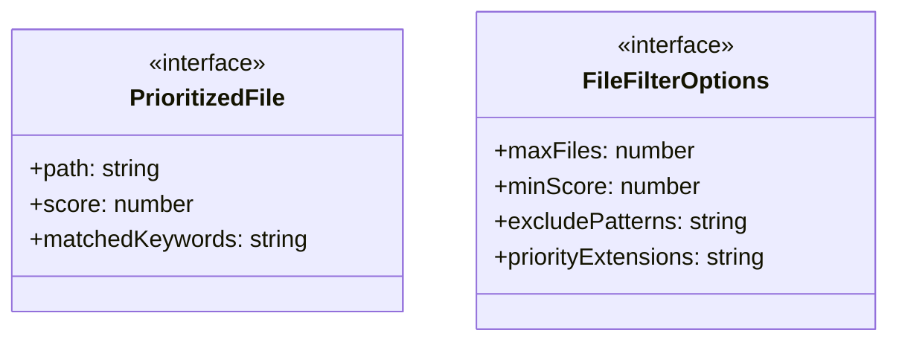
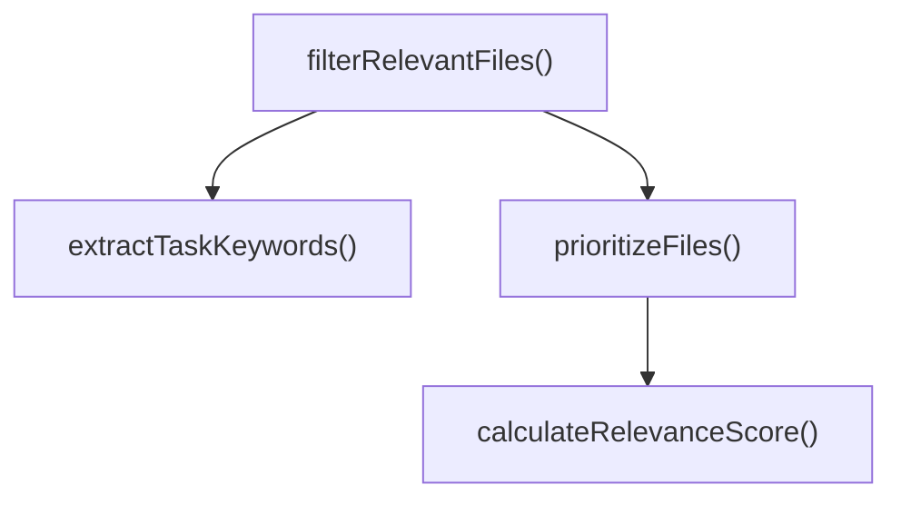

# file-filter

## 概要

`file-filter` モジュールのAPIリファレンス。

## エクスポート一覧

| 種別 | 名前 | 説明 |
|------|------|------|
| 関数 | `extractTaskKeywords` | タスクからキーワードを抽出 |
| 関数 | `prioritizeFiles` | ファイルを優先度順にソート |
| 関数 | `filterRelevantFiles` | 関連ファイルのみをフィルタリング |
| インターフェース | `PrioritizedFile` | 優先度付きファイル情報 |
| インターフェース | `FileFilterOptions` | ファイルフィルタリングオプション |

## 図解

### クラス図



### 関数フロー



## 関数

### extractTaskKeywords

```typescript
extractTaskKeywords(task: string): string[]
```

タスクからキーワードを抽出

**パラメータ**

| 名前 | 型 | 必須 |
|------|-----|------|
| task | `string` | はい |

**戻り値**: `string[]`

### calculateRelevanceScore

```typescript
calculateRelevanceScore(filePath: string, keywords: string[]): { score: number; matchedKeywords: string[] }
```

ファイルパスとキーワードの関連度スコアを計算

**パラメータ**

| 名前 | 型 | 必須 |
|------|-----|------|
| filePath | `string` | はい |
| keywords | `string[]` | はい |

**戻り値**: `{ score: number; matchedKeywords: string[] }`

### prioritizeFiles

```typescript
prioritizeFiles(filePaths: string[], keywords: string[], options: FileFilterOptions): PrioritizedFile[]
```

ファイルを優先度順にソート

**パラメータ**

| 名前 | 型 | 必須 |
|------|-----|------|
| filePaths | `string[]` | はい |
| keywords | `string[]` | はい |
| options | `FileFilterOptions` | はい |

**戻り値**: `PrioritizedFile[]`

### filterRelevantFiles

```typescript
filterRelevantFiles(task: string, filePaths: string[], options: FileFilterOptions): string[]
```

関連ファイルのみをフィルタリング

**パラメータ**

| 名前 | 型 | 必須 |
|------|-----|------|
| task | `string` | はい |
| filePaths | `string[]` | はい |
| options | `FileFilterOptions` | はい |

**戻り値**: `string[]`

## インターフェース

### PrioritizedFile

```typescript
interface PrioritizedFile {
  path: string;
  score: number;
  matchedKeywords: string[];
}
```

優先度付きファイル情報

### FileFilterOptions

```typescript
interface FileFilterOptions {
  maxFiles?: number;
  minScore?: number;
  excludePatterns?: string[];
  priorityExtensions?: string[];
}
```

ファイルフィルタリングオプション

---
*自動生成: 2026-02-24T17:08:02.691Z*
