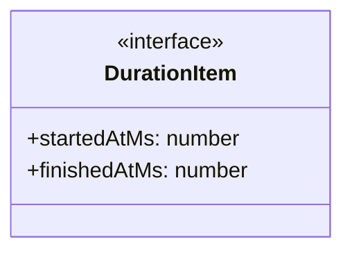
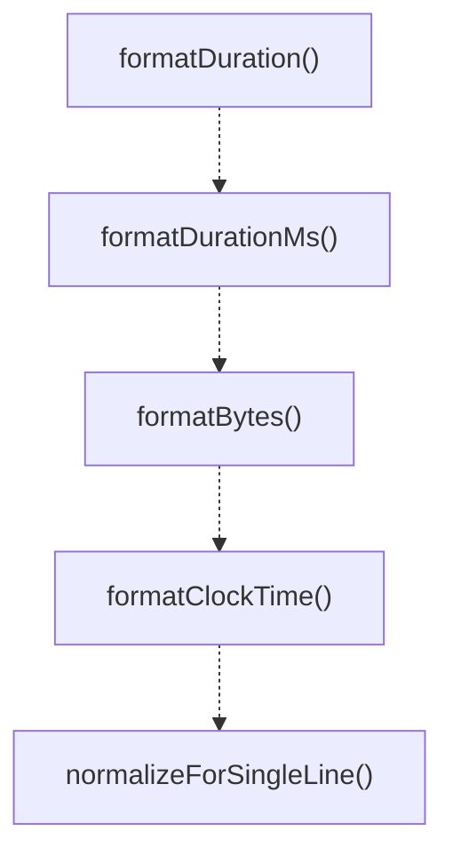

# format-utils

## 概要

`format-utils` モジュールのAPIリファレンス。

## エクスポート一覧

| 種別 | 名前 | 説明 |
|------|------|------|
| 関数 | `formatDuration` | ミリ秒を読みやすい文字列に変換 |
| 関数 | `formatDurationMs` | ミリ秒単位の持続時間を文字列化 |
| 関数 | `formatBytes` | バイト数を人間が読める形式に変換 |
| 関数 | `formatClockTime` | タイムスタンプを時刻に変換 |
| 関数 | `normalizeForSingleLine` | テキストを単一行用に正規化する |

## 図解

### クラス図



### 関数フロー



## 関数

### formatDuration

```typescript
formatDuration(ms: number): string
```

ミリ秒を読みやすい文字列に変換

**パラメータ**

| 名前 | 型 | 必須 |
|------|-----|------|
| ms | `number` | はい |

**戻り値**: `string`

### formatDurationMs

```typescript
formatDurationMs(item: DurationItem): string
```

ミリ秒単位の持続時間を文字列化

**パラメータ**

| 名前 | 型 | 必須 |
|------|-----|------|
| item | `DurationItem` | はい |

**戻り値**: `string`

### formatBytes

```typescript
formatBytes(value: number): string
```

バイト数を人間が読める形式に変換

**パラメータ**

| 名前 | 型 | 必須 |
|------|-----|------|
| value | `number` | はい |

**戻り値**: `string`

### formatClockTime

```typescript
formatClockTime(value?: number): string
```

タイムスタンプを時刻に変換

**パラメータ**

| 名前 | 型 | 必須 |
|------|-----|------|
| value | `number` | いいえ |

**戻り値**: `string`

### normalizeForSingleLine

```typescript
normalizeForSingleLine(input: string, maxLength: any): string
```

テキストを単一行用に正規化する

**パラメータ**

| 名前 | 型 | 必須 |
|------|-----|------|
| input | `string` | はい |
| maxLength | `any` | はい |

**戻り値**: `string`

## インターフェース

### DurationItem

```typescript
interface DurationItem {
  startedAtMs?: number;
  finishedAtMs?: number;
}
```

Item with start and finish timestamps for duration calculation.

---
*自動生成: 2026-02-18T07:48:44.983Z*
