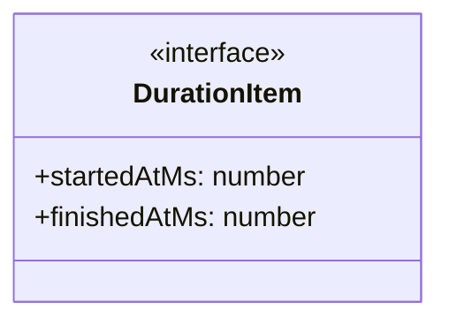
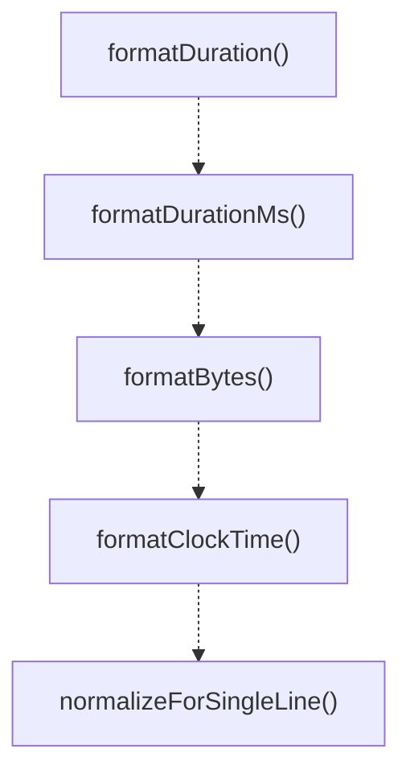

# format-utils

## 概要

`format-utils` モジュールのAPIリファレンス。

## エクスポート一覧

| 種別 | 名前 | 説明 |
|------|------|------|
| 関数 | `formatDuration` | Formats a duration in milliseconds to a human-read |
| 関数 | `formatDurationMs` | Formats duration from an item with start and optio |
| 関数 | `formatBytes` | Formats a byte count to a human-readable string. |
| 関数 | `formatClockTime` | Formats a timestamp to clock time (HH:MM:SS). |
| 関数 | `normalizeForSingleLine` | - |

## 図解

### クラス図



### 関数フロー



## 関数

### formatDuration

```typescript
formatDuration(ms: number): string
```

Formats a duration in milliseconds to a human-readable string.

**パラメータ**

| 名前 | 型 | 必須 |
|------|-----|------|
| ms | `number` | はい |

**戻り値**: `string`

### formatDurationMs

```typescript
formatDurationMs(item: DurationItem): string
```

Formats duration from an item with start and optional finish timestamps.
If not finished, uses current time.

**パラメータ**

| 名前 | 型 | 必須 |
|------|-----|------|
| item | `DurationItem` | はい |

**戻り値**: `string`

### formatBytes

```typescript
formatBytes(value: number): string
```

Formats a byte count to a human-readable string.

**パラメータ**

| 名前 | 型 | 必須 |
|------|-----|------|
| value | `number` | はい |

**戻り値**: `string`

### formatClockTime

```typescript
formatClockTime(value?: number): string
```

Formats a timestamp to clock time (HH:MM:SS).

**パラメータ**

| 名前 | 型 | 必須 |
|------|-----|------|
| value | `number` | いいえ |

**戻り値**: `string`

### normalizeForSingleLine

```typescript
normalizeForSingleLine(input: string, maxLength: any): string
```

**パラメータ**

| 名前 | 型 | 必須 |
|------|-----|------|
| input | `string` | はい |
| maxLength | `any` | はい |

**戻り値**: `string`

## インターフェース

### DurationItem

```typescript
interface DurationItem {
  startedAtMs?: number;
  finishedAtMs?: number;
}
```

Item with start and finish timestamps for duration calculation.

---
*自動生成: 2026-02-18T00:15:35.724Z*
