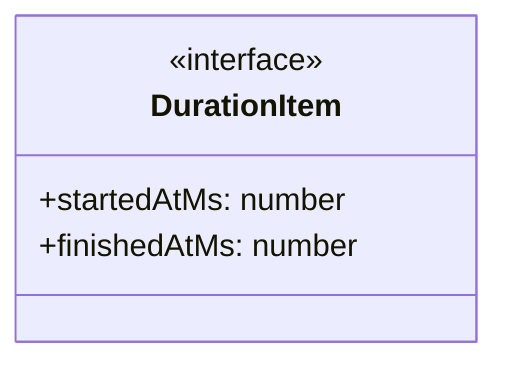

# format-utils

## 概要

`format-utils` モジュールのAPIリファレンス。

## エクスポート一覧

| 種別 | 名前 | 説明 |
|------|------|------|
| 関数 | `formatDuration` | ミリ秒を時間文字列へ |
| 関数 | `formatDurationMs` | 継続時間をフォーマット |
| 関数 | `formatElapsedClock` | 継続時間を HH:mm:ss 形式でフォーマット |
| 関数 | `formatBytes` | バイト数をフォーマット |
| 関数 | `formatClockTime` | 時刻をフォーマット |
| 関数 | `normalizeForSingleLine` | 単一行文字列を正規化 |

## 図解

### クラス図



## 関数

### formatDuration

```typescript
formatDuration(ms: number): string
```

ミリ秒を時間文字列へ

**パラメータ**

| 名前 | 型 | 必須 |
|------|-----|------|
| ms | `number` | はい |

**戻り値**: `string`

### formatDurationMs

```typescript
formatDurationMs(item: DurationItem): string
```

継続時間をフォーマット

**パラメータ**

| 名前 | 型 | 必須 |
|------|-----|------|
| item | `DurationItem` | はい |

**戻り値**: `string`

### formatElapsedClock

```typescript
formatElapsedClock(item: DurationItem): string
```

継続時間を HH:mm:ss 形式でフォーマット

**パラメータ**

| 名前 | 型 | 必須 |
|------|-----|------|
| item | `DurationItem` | はい |

**戻り値**: `string`

### formatBytes

```typescript
formatBytes(value: number): string
```

バイト数をフォーマット

**パラメータ**

| 名前 | 型 | 必須 |
|------|-----|------|
| value | `number` | はい |

**戻り値**: `string`

### formatClockTime

```typescript
formatClockTime(value?: number): string
```

時刻をフォーマット

**パラメータ**

| 名前 | 型 | 必須 |
|------|-----|------|
| value | `number` | いいえ |

**戻り値**: `string`

### normalizeForSingleLine

```typescript
normalizeForSingleLine(input: string, maxLength: any): string
```

単一行文字列を正規化

**パラメータ**

| 名前 | 型 | 必須 |
|------|-----|------|
| input | `string` | はい |
| maxLength | `any` | はい |

**戻り値**: `string`

## インターフェース

### DurationItem

```typescript
interface DurationItem {
  startedAtMs?: number;
  finishedAtMs?: number;
}
```

Item with start and finish timestamps for duration calculation.

---
*自動生成: 2026-02-24T17:08:02.692Z*
